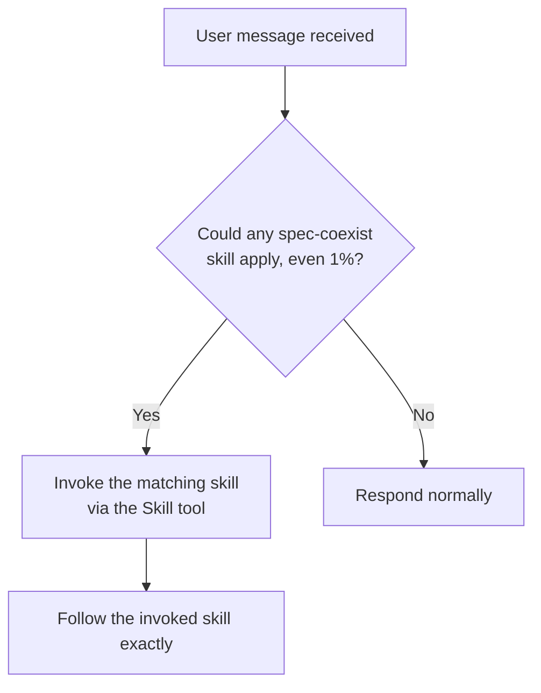

# using-spec-coexist

Conformance keywords follow [RFC 2119](https://www.rfc-editor.org/rfc/rfc2119) / [RFC 8174](https://www.rfc-editor.org/rfc/rfc8174).

## Purpose

Trigger skill for the `spec-coexist` suite. Apply the **1% rule** (see `references/1pct-rule.md`) to every incoming user message.

## Skill Inventory

| Skill | When to invoke |
|-------|----------------|
| `spec-coexist:creating-requirements` | Create a new requirements document. |
| `spec-coexist:creating-basic-design` | Create a new basic design document. |
| `spec-coexist:implementing-from-spec` | Implement code from existing requirements + basic design. |
| `spec-coexist:revising-spec` | Revise existing requirements or basic design. |
| `spec-coexist:revising-implementation` | Update implementation after a spec change. |
| `spec-coexist:systematic-debugging` | Any bug, test failure, or unexpected behavior. |
| `spec-coexist:authoring-spec-coexist-skill` | Create, modify, or refactor any skill inside this suite. |

## Flow

## References

- `references/1pct-rule.md` — the 1% rule: when to invoke, why it is non-negotiable, examples.
- `references/instruction-priority.md` — how user instructions, suite skills, and defaults are ranked.
- `references/independence.md` — why this suite must not delegate to `superpowers:*` at runtime.
