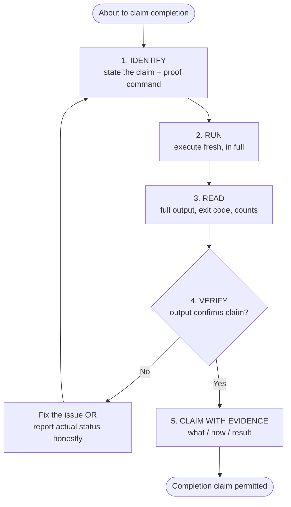

# verification-before-completion

## Conformance Keywords

The key words **MUST**, **MUST NOT**, **REQUIRED**, **SHALL**, **SHALL NOT**, **SHOULD**, **SHOULD NOT**, **RECOMMENDED**, **MAY**, and **OPTIONAL** in this document are to be interpreted as described in [RFC 2119](https://www.rfc-editor.org/rfc/rfc2119) and [RFC 8174](https://www.rfc-editor.org/rfc/rfc8174) when, and only when, they appear in all capitals, as shown here.

## Independence

This skill **MUST NOT** invoke or delegate to any `superpowers:*` skill. It is a project-local gate and is fully self-contained.

## The Iron Law

> **No completion claim may be made without fresh verification evidence.**

"Fresh" means: executed *now*, in the current state of the tree, after the last change that the claim depends on. Evidence from five minutes ago — before the final edit — is **NOT** fresh. Evidence recalled from memory or inferred from "it should work" is **NOT** evidence at all.

The reason for this rule: the single most common failure mode in multi-step coding work is declaring victory based on what the agent *expected* to happen rather than what actually happened. Expected outcomes and observed outcomes diverge constantly — a typo, a stale cache, an unsaved file, a shadowed import, a test that was skipped rather than passing. Each of those looks like success from the inside and only reveals itself when someone runs the verification. This skill exists so that "someone" is always the agent, before the user ever sees the claim.

## When this skill is invoked

Any of the following count as a "completion claim" and therefore **MUST** be preceded by this skill's gate:

- "Done", "完了", "実装できました", "fixed", "ready", "all green", "tests pass".
- Reporting the end of a skill (e.g. `implementing-from-spec` returning to the user).
- Committing, opening a PR, or asking for merge.
- Handing control back to the user with an implicit "over to you".

Satisfaction expressed *before* the gate runs ("OK I think that's it" followed by no verification) is itself a red flag — the skill **MUST** treat such phrasing as a trigger to run the gate, not as a license to skip it.

## The Gate (5 steps)

The agent **MUST** execute all five steps in order. Skipping any step invalidates the completion claim.

### 1. IDENTIFY

State, explicitly, what claim is about to be made and what command or observation would prove it. Examples:

- Claim: "the unit tests pass" → Proof: `pytest -q` exits 0 with no failures.
- Claim: "the lint is clean" → Proof: `ruff check .` exits 0.
- Claim: "the new doc exists and follows the template" → Proof: file exists, frontmatter matches, every template section present, no unresolved `TBD` markers.
- Claim: "the bug is fixed" → Proof: the original repro case no longer triggers the bug **and** a regression test exercising it passes.

If no command or observation can prove the claim, the claim is not verifiable and **MUST NOT** be made.

### 2. RUN

Run the command — in full, freshly, against the current tree. Partial runs (`-k one_test`), cached runs, and remembered runs do **NOT** count. For document-oriented claims, re-read the file from disk and check it against the template; do not rely on what was "just written".

### 3. READ

Read the *full* output. Check the exit code. Count the failures, errors, warnings, and skipped items. Do not skim. A green-looking summary at the bottom of a log that contains red lines above it is not a pass.

### 4. VERIFY

Compare the observed output to the claim from step 1.

- If the output confirms the claim → proceed to step 5.
- If the output contradicts the claim → the claim is false. The agent **MUST** either (a) fix the underlying issue and restart the gate, or (b) report the actual status honestly ("3 tests still failing, here is the output") and **MUST NOT** report completion.

Partial matches ("most things pass") are **NOT** confirmation. The claim must be made precise enough that the output either confirms it exactly or does not.

### 5. CLAIM WITH EVIDENCE

Only now may the completion claim be made — and it **MUST** be made *with* the evidence attached. The final report **MUST** include:

- **What was verified** — the specific claim.
- **How** — the command(s) run or the checks performed.
- **Result** — the relevant output snippet (exit code, pass/fail counts, or the concrete observation).

A bare "done" without these three things does not satisfy the gate.

## Verification modes

Different skills produce different artifacts; "verification" therefore looks different in each case. The steps above are the same — only the *proof* differs.

### Code mode (implementing-from-spec, revising-implementation, systematic-debugging)

The agent **MUST** run, at minimum:

1. The project's test suite (or the relevant subset, if a full run is infeasible and the user has accepted that — document this explicitly).
2. Type checks, if the project uses them.
3. Linters / formatters, if the project uses them.
4. For `systematic-debugging` specifically, the original reproduction case **MUST** be re-run and **MUST** no longer trigger the bug, and a regression test **MUST** exist and pass.

If any of these are absent from the project, the agent **MUST** say so explicitly rather than silently skip them.

### Document mode (creating-requirements, creating-basic-design, revising-spec)

The agent **MUST** verify:

1. The target file exists at the expected path (use `check_doc_exists.sh`).
2. The document conforms to the bundled template: every required section is present, section order matches, frontmatter matches.
3. No unresolved placeholders remain — no stray `TBD`, `TODO`, `???`, `<fill in>`, or empty bullet list.
4. For `revising-spec`: when a revision touches both the requirements doc and the basic design doc, both **MUST** be re-read from disk and the lockstep consistency **MUST** be confirmed.
5. For `creating-basic-design` and `revising-spec`: every requirement in scope is traceable to at least one design element.

Document mode verification is performed *before* the separate mandatory `requesting-code-review` step (where applicable). Verification catches mechanical defects; review catches judgment defects. Both are required.

## Anti-patterns

- "It should work." — Not evidence. Run it.
- "I just ran the tests a minute ago." — Not fresh. Run them again after the last edit.
- "The relevant tests pass." — Which ones? Show the output.
- "Lint passes (I didn't change anything it would care about)." — Run it anyway; you may be wrong about what it cares about.
- "I'll fix the remaining warnings later." — Fine, but then the claim is "implemented with 3 known warnings listed below", not "done".
- Reporting completion and *then* running verification in the next turn — the gate runs **before** the claim, not after.

## Rationalizations that do NOT excuse skipping the gate

None of the following are valid reasons to bypass any step:

- "The change is trivial."
- "I'm confident it works."
- "The user is waiting."
- "Just this once."
- "I already ran it earlier in the session."
- "Running the full suite is slow."

If the full suite is genuinely too slow, the correct response is to tell the user and agree on a reduced scope in advance — not to silently skip verification.

## Flow

## Procedure

1. Before any completion-style report, pause and state the claim you are about to make.
2. Identify the command or observation that would prove it.
3. Run it now, against the current tree, in full.
4. Read the full output. Check exit codes and counts.
5. Compare observed to expected. If they disagree, do **NOT** claim completion — fix or report honestly and re-run the gate.
6. When and only when they agree, make the claim and attach the evidence (what / how / result) to the final report.
