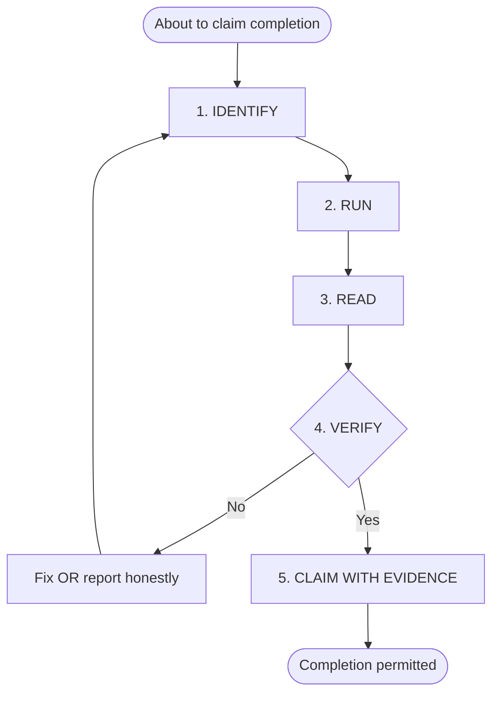

# Gate Steps — verification-before-completion

## The Iron Law — Rationale

The gate exists because the single most common failure mode in multi-step coding work is declaring victory based on what the agent *expected* to happen rather than what actually happened. Expected and observed outcomes diverge constantly — a typo, a stale cache, an unsaved file, a shadowed import, a test that was skipped rather than passing. Each looks like success from the inside and only reveals itself when someone runs the verification. This skill ensures that "someone" is always the agent, before the user ever sees the claim.

## Step 1 — IDENTIFY

State, explicitly, what claim is about to be made and what command or observation would prove it. Examples:

- Claim: "the unit tests pass" → Proof: `pytest -q` exits 0 with no failures.
- Claim: "the lint is clean" → Proof: `ruff check .` exits 0.
- Claim: "the new doc exists and follows the template" → Proof: file exists, frontmatter matches, every template section present, no `TBD` markers.
- Claim: "the bug is fixed" → Proof: the original repro case no longer triggers the bug **and** a regression test exercising it passes.

If no command or observation can prove the claim, the claim is not verifiable and **MUST NOT** be made.

## Step 2 — RUN

Run the command — in full, freshly, against the current tree. Partial runs (`-k one_test`), cached runs, and remembered runs do **NOT** count. For document-oriented claims, re-read the file from disk.

## Step 3 — READ

Read the full output. Check exit code. Count failures, errors, warnings, skipped items. Do not skim.

## Step 4 — VERIFY

Compare observed output to the claim from step 1.

- Confirms claim → step 5.
- Contradicts claim → the claim is false. Either (a) fix the underlying issue and restart the gate, or (b) report actual status honestly.

Partial matches are **NOT** confirmation.

## Step 5 — CLAIM WITH EVIDENCE

The completion claim **MUST** include:

- **What was verified** — the specific claim.
- **How** — the command(s) run.
- **Result** — the relevant output snippet.

## Flow Diagram

