# Superpowers スキル フロー分析レポート

Superpowers プラグイン (v5.0.7) に含まれる 14 個のスキルについて、それぞれの目的・トリガー・ワークフローを Mermaid フローチャートで可視化する。

巨大化を避けるため、`systematic-debugging` / `subagent-driven-development` / `writing-skills` 等は複数図に分割している。

凡例 (全図共通):

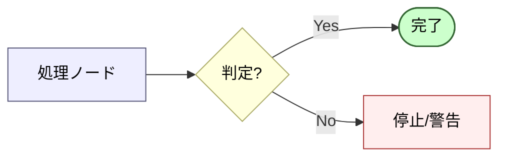

---

## 1. using-superpowers

**目的**: 会話開始時に必ず関連スキルを呼び出し、応答の前にスキル駆動の規律を確立する。
**トリガー**: ユーザのメッセージを受信した直後 (clarifying question を返す前であっても)。

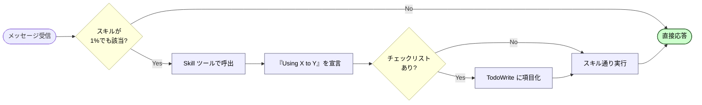

---

## 2. brainstorming

**目的**: 実装前にユーザの意図・要件・設計を対話で引き出し、承認済み仕様に到達する。
**トリガー**: 機能追加・新規作成・挙動変更などの創造的作業の開始時。

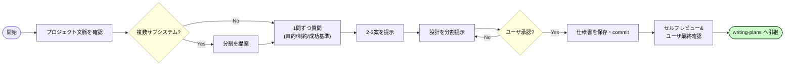

---

## 3. writing-plans

**目的**: 仕様から実行可能な詳細実装計画を作成する。
**トリガー**: 仕様/要件があり、コードに触れる前。

```mermaid
flowchart LR
    classDef proc fill:#eef,stroke:#557,color:#000;
    classDef decide fill:#ffd,stroke:#aa6,color:#000;
    classDef done fill:#cfc,stroke:#363,stroke-width:1.5px,color:#000;

    start([開始]) --> scope{"複数<br/>サブシステム?"}:::decide
    scope -- Yes --> suggestSplit["計画分割を提案"]:::proc
    scope -- No --> mapFiles
    suggestSplit --> mapFiles["ファイル構成を設計"]:::proc
    mapFiles --> header["ヘッダを記述<br/>(Goal/Arch/Stack)"]:::proc
    header --> tasks["タスク分解<br/>(2-5分粒度のステップ)"]:::proc
    tasks --> selfReview["セルフレビュー<br/>(網羅/プレースホルダ)"]:::proc
    selfReview --> ok{"問題なし?"}:::decide
    ok -- No --> tasks
    ok -- Yes --> save["plans/ に保存・commit"]:::proc
    save --> offer{"実行方式選択"}:::decide
    offer -- Subagent --> sdd([subagent-driven-development]):::done
    offer -- Inline --> exec([executing-plans]):::done
```

---

## 4. executing-plans

**目的**: 書かれた実装計画を順次実行する (インラインモード)。
**トリガー**: 実行対象の plan ファイルがある時。

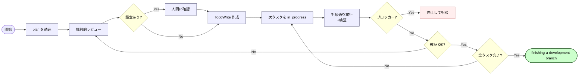

---

## 5. subagent-driven-development

**目的**: 計画タスクごとに実装/レビュー subagent を派遣し、二段レビューで品質を担保する。
**トリガー**: 現セッション内で計画を実行する時。

### 5-1. 全体ループ

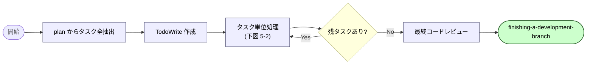

### 5-2. タスク単位サブフロー

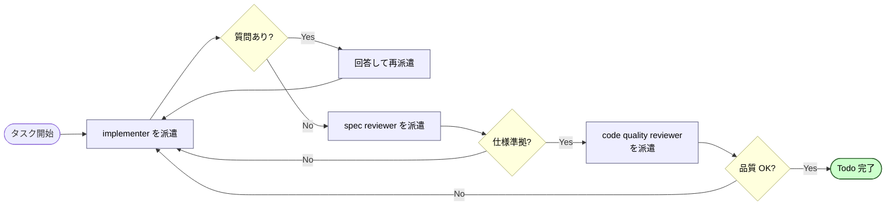

---

## 6. test-driven-development

**目的**: Red→Green→Refactor のサイクルで実装を進める。
**トリガー**: 機能追加・バグ修正・リファクタリングなど挙動変更を伴う作業。

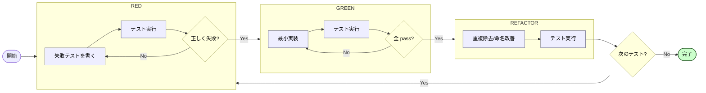

---

## 7. systematic-debugging

**目的**: 症状ではなく根本原因を体系的に調査・修正する。
**トリガー**: バグ・テスト失敗・予期せぬ挙動に直面した時。

### 7-1. Phase 1〜2: 調査・パターン分析

### 7-2. Phase 3〜4: 仮説検証・実装

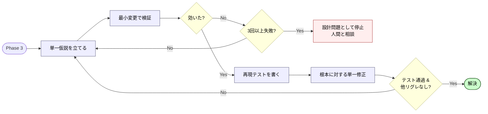

---

## 8. dispatching-parallel-agents

**目的**: 独立した複数問題を専門 subagent に並行で割り当て、効率的に解決する。
**トリガー**: 共有状態のない独立タスクが 2 件以上ある時。

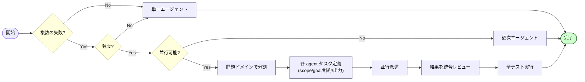

---

## 9. requesting-code-review

**目的**: 実装直後にコードレビュー subagent を派遣し、問題を早期に捕捉する。
**トリガー**: タスク完了時・主要機能実装後・マージ前。

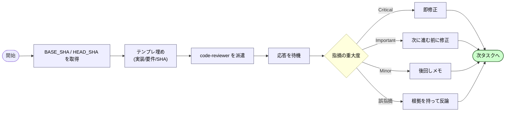

---

## 10. receiving-code-review

**目的**: レビュー指摘を機械的に同意せず、技術的検証と理由のある判断で処理する。
**トリガー**: コードレビューのフィードバック受領時。

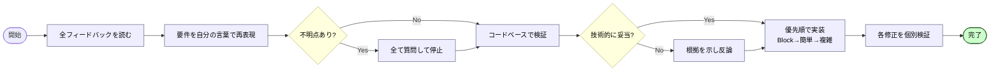

---

## 11. verification-before-completion

**目的**: 「完了」「修正済み」と主張する前に、検証コマンドを実行し出力で裏付ける。
**トリガー**: 完了/成功/合格を主張する直前。

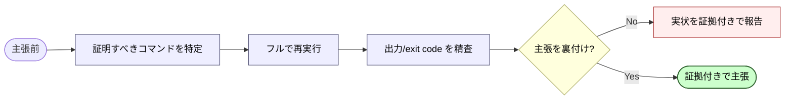

---

## 12. using-git-worktrees

**目的**: 作業を隔離した git worktree を作成し、安全な並行作業を実現する。
**トリガー**: 機能開発/計画実行の前に隔離環境が必要な時。

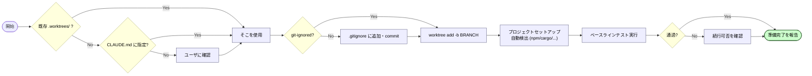

---

## 13. finishing-a-development-branch

**目的**: 実装完了後にブランチをどう統合・整理するかを 4 択で扱う。
**トリガー**: 実装完了 + テスト通過後。

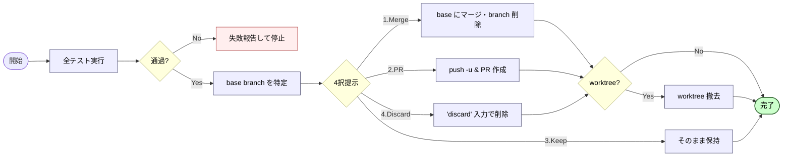

---

## 14. writing-skills

**目的**: TDD 原則をスキル文書化に適用し、エージェントの失敗パターンを潰すスキルを書く。
**トリガー**: 新規スキル作成・既存スキル編集・展開前検証。

### 14-1. RED → GREEN → REFACTOR

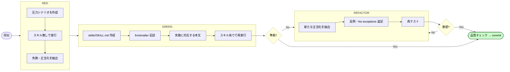

### 14-2. 品質チェックリスト (要約)

```mermaid
flowchart LR
    classDef proc fill:#eef,stroke:#557,color:#000;
    classDef done fill:#cfc,stroke:#363,stroke-width:1.5px,color:#000;

    start([commit 前]) --> a["決定が非自明な場合のみ図"]:::proc
    a --> b["クイックリファレンス表"]:::proc
    b --> c["Common mistakes 章"]:::proc
    c --> d["キーワード網羅"]:::proc
    d --> e["トークン上限を遵守"]:::proc
    e --> f["優れた例 1 つ"]:::proc
    f --> done([commit & 必要なら PR]):::done
```

---

## 統合フローチャート (全スキル完全分解 / TD)

14 スキルの内部ステップをすべて inline 展開し、エンドツーエンドの実作業手順として 1 枚に結合したもの。各 subgraph が 1 スキルに対応する。巨大なため通常は分割推奨だが、ユーザ要求により完全分解版として提示する。

```mermaid
flowchart TD
    classDef proc fill:#eef,stroke:#557,color:#000;
    classDef decide fill:#ffd,stroke:#aa6,color:#000;
    classDef danger fill:#fee,stroke:#a33,color:#000;
    classDef done fill:#cfc,stroke:#363,stroke-width:1.5px,color:#000;

    start([ユーザ要求]) --> us_check{"スキル該当?"}:::decide
    us_check -- No --> respond_direct([直接応答]):::done
    us_check -- Yes --> us_invoke["Skill 呼出"]:::proc
    us_invoke --> us_announce["『Using X to Y』宣言"]:::proc
    us_announce --> us_todo["TodoWrite 化"]:::proc
    us_todo --> br_ctx

    subgraph br["brainstorming"]
        direction TB
        br_ctx["プロジェクト文脈確認"]:::proc --> br_scope{"複数<br/>サブシステム?"}:::decide
        br_scope -- Yes --> br_split["分割提案"]:::proc --> br_ask
        br_scope -- No --> br_ask["1問ずつ質問"]:::proc
        br_ask --> br_propose["2-3案を提示"]:::proc
        br_propose --> br_design["設計を分割提示"]:::proc
        br_design --> br_approve{"ユーザ承認?"}:::decide
        br_approve -- No --> br_design
        br_approve -- Yes --> br_save["仕様書を保存・commit"]:::proc
    end

    br_save --> wp_scope

    subgraph wp["writing-plans"]
        direction TB
        wp_scope{"複数<br/>サブシステム?"}:::decide -- Yes --> wp_split["計画分割提案"]:::proc --> wp_map
        wp_scope -- No --> wp_map["ファイル構成設計"]:::proc
        wp_map --> wp_header["Goal/Arch/Stack 記述"]:::proc
        wp_header --> wp_tasks["タスク分解<br/>(2-5分粒度)"]:::proc
        wp_tasks --> wp_review["セルフレビュー"]:::proc
        wp_review --> wp_ok{"問題なし?"}:::decide
        wp_ok -- No --> wp_tasks
        wp_ok -- Yes --> wp_persist["plans/ に保存・commit"]:::proc
    end

    wp_persist --> wt_dir

    subgraph wt["using-git-worktrees"]
        direction TB
        wt_dir{"既存<br/>.worktrees/?"}:::decide -- Yes --> wt_use["そこを使用"]:::proc
        wt_dir -- No --> wt_claude{"CLAUDE.md<br/>指定?"}:::decide
        wt_claude -- Yes --> wt_use
        wt_claude -- No --> wt_ask["ユーザ確認"]:::proc --> wt_use
        wt_use --> wt_ign{"git-ignored?"}:::decide
        wt_ign -- No --> wt_addign[".gitignore 更新"]:::proc --> wt_create
        wt_ign -- Yes --> wt_create["worktree add -b"]:::proc
        wt_create --> wt_setup["依存導入<br/>(npm/cargo/...)"]:::proc
        wt_setup --> wt_base["ベースラインテスト"]:::proc
        wt_base --> wt_pass{"通過?"}:::decide
        wt_pass -- No --> wt_confirm["続行可否を確認"]:::proc --> wt_ready
        wt_pass -- Yes --> wt_ready["準備完了報告"]:::proc
    end

    wt_ready --> mode{"実行モード?"}:::decide

    mode -- Inline --> ep_load
    mode -- Subagent --> sdd_read

    subgraph ep["executing-plans"]
        direction TB
        ep_load["plan を読込"]:::proc --> ep_critique["批判的レビュー"]:::proc
        ep_critique --> ep_concern{"懸念あり?"}:::decide
        ep_concern -- Yes --> ep_raise["人間に相談"]:::proc --> ep_todo
        ep_concern -- No --> ep_todo["TodoWrite"]:::proc
        ep_todo --> ep_task["次タスク in_progress"]:::proc
    end

    subgraph sdd["subagent-driven-development"]
        direction TB
        sdd_read["タスク全抽出"]:::proc --> sdd_todo["TodoWrite"]:::proc
        sdd_todo --> sdd_impl["implementer 派遣"]:::proc
        sdd_impl --> sdd_q{"質問?"}:::decide
        sdd_q -- Yes --> sdd_ans["回答・再派遣"]:::proc --> sdd_impl
        sdd_q -- No --> sdd_specrev["spec reviewer"]:::proc
        sdd_specrev --> sdd_specok{"仕様準拠?"}:::decide
        sdd_specok -- No --> sdd_impl
        sdd_specok -- Yes --> sdd_qrev["code quality reviewer"]:::proc
        sdd_qrev --> sdd_qok{"品質 OK?"}:::decide
        sdd_qok -- No --> sdd_impl
        sdd_qok -- Yes --> sdd_mark["Todo 完了"]:::proc
    end

    ep_task --> tdd_red
    sdd_mark --> sdd_more{"残タスク?"}:::decide
    sdd_more -- Yes --> sdd_impl
    sdd_more -- No --> tdd_red

    subgraph tdd["test-driven-development"]
        direction TB
        tdd_red["RED: 失敗テスト記述"]:::proc --> tdd_run1["テスト実行"]:::proc
        tdd_run1 --> tdd_failok{"正しく失敗?"}:::decide
        tdd_failok -- No --> tdd_red
        tdd_failok -- Yes --> tdd_green["GREEN: 最小実装"]:::proc
        tdd_green --> tdd_run2["テスト実行"]:::proc
        tdd_run2 --> tdd_passok{"全 pass?"}:::decide
        tdd_passok -- No --> tdd_green
        tdd_passok -- Yes --> tdd_refac["REFACTOR: 整理"]:::proc
        tdd_refac --> tdd_run3["テスト実行"]:::proc
    end

    tdd_run3 --> bug{"バグ/失敗?"}:::decide
    bug -- Yes --> dbg_read

    subgraph dbg["systematic-debugging"]
        direction TB
        dbg_read["エラー精読"]:::proc --> dbg_repro["再現手順確立"]:::proc
        dbg_repro --> dbg_recent["最近の変更確認"]:::proc
        dbg_recent --> dbg_evidence["境界で証拠収集"]:::proc
        dbg_evidence --> dbg_trace["データフロー追跡"]:::proc
        dbg_trace --> dbg_findex["動く類例を探す"]:::proc
        dbg_findex --> dbg_diff["差分列挙"]:::proc
        dbg_diff --> dbg_hypo["単一仮説"]:::proc
        dbg_hypo --> dbg_min["最小変更で検証"]:::proc
        dbg_min --> dbg_worked{"効いた?"}:::decide
        dbg_worked -- No --> dbg_count{"3回以上失敗?"}:::decide
        dbg_count -- No --> dbg_hypo
        dbg_count -- Yes --> dbg_arch["設計問題として停止"]:::danger
        dbg_worked -- Yes --> dbg_failtest["再現テスト記述"]:::proc
        dbg_failtest --> dbg_fix["根本に対する単一修正"]:::proc
    end

    dbg_fix --> multi{"独立失敗<br/>複数?"}:::decide
    multi -- Yes --> dpa_group

    subgraph dpa["dispatching-parallel-agents"]
        direction TB
        dpa_group["問題ドメインで分割"]:::proc --> dpa_task["各 agent タスク定義"]:::proc
        dpa_task --> dpa_dispatch["並行派遣"]:::proc
        dpa_dispatch --> dpa_review["結果統合レビュー"]:::proc
        dpa_review --> dpa_verify["全テスト実行"]:::proc
    end

    dpa_verify --> tdd_red
    multi -- No --> tdd_red
    bug -- No --> rcr_sha

    subgraph rcr["requesting-code-review"]
        direction TB
        rcr_sha["BASE/HEAD SHA 取得"]:::proc --> rcr_tmpl["テンプレ埋め"]:::proc
        rcr_tmpl --> rcr_dispatch["code-reviewer 派遣"]:::proc
        rcr_dispatch --> rcr_wait["応答待機"]:::proc
    end

    rcr_wait --> recv_read

    subgraph recv["receiving-code-review"]
        direction TB
        recv_read["全フィードバック読了"]:::proc --> recv_understand["要件を再表現"]:::proc
        recv_understand --> recv_clear{"不明点?"}:::decide
        recv_clear -- Yes --> recv_ask["全て質問"]:::proc --> recv_verify
        recv_clear -- No --> recv_verify["コードベースで検証"]:::proc
        recv_verify --> recv_sound{"妥当?"}:::decide
        recv_sound -- No --> recv_push["根拠を示し反論"]:::proc --> recv_order
        recv_sound -- Yes --> recv_order["優先順で実装"]:::proc
        recv_order --> recv_each["各修正を個別検証"]:::proc
    end

    recv_each --> ver_id

    subgraph ver["verification-before-completion"]
        direction TB
        ver_id["証明コマンドを特定"]:::proc --> ver_run["フル再実行"]:::proc
        ver_run --> ver_read["出力/exit code 精査"]:::proc
        ver_read --> ver_ok{"主張を裏付け?"}:::decide
        ver_ok -- No --> ver_actual["実状を証拠付き報告"]:::danger
    end

    ver_actual --> tdd_red
    ver_ok -- Yes --> fin_test

    subgraph fin["finishing-a-development-branch"]
        direction TB
        fin_test["全テスト実行"]:::proc --> fin_pass{"通過?"}:::decide
        fin_pass -- No --> fin_stop["失敗報告で停止"]:::danger
        fin_pass -- Yes --> fin_base["base branch 特定"]:::proc
        fin_base --> fin_choose{"4択"}:::decide
        fin_choose -- 1.Merge --> fin_merge["base にマージ"]:::proc
        fin_choose -- 2.PR --> fin_pr["push -u & PR"]:::proc
        fin_choose -- 3.Keep --> fin_keep["保持"]:::proc
        fin_choose -- 4.Discard --> fin_disc["'discard' 入力で削除"]:::proc
        fin_merge --> fin_wt{"worktree?"}:::decide
        fin_pr --> fin_wt
        fin_disc --> fin_wt
        fin_wt -- Yes --> fin_rm["worktree 撤去"]:::proc
    end

    fin_rm --> done([完了]):::done
    fin_keep --> done
    fin_wt -- No --> done
    fin_stop --> done

    ws_meta["writing-skills<br/>(メタ: スキル自体を改善)"]:::proc -.-> us_invoke
```

---

## 付録: スキル相互関係

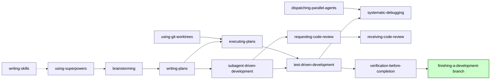
