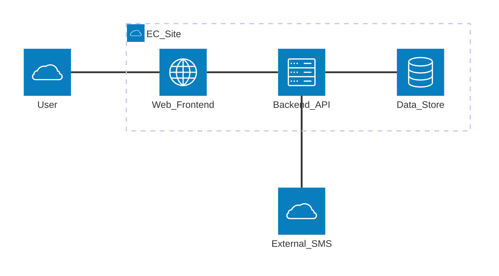
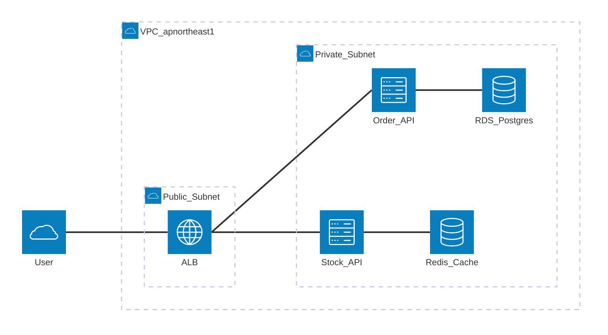
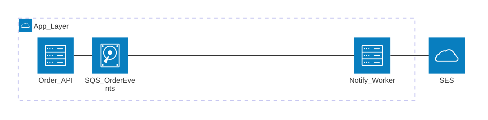

# 美しい Mermaid Architecture 図のルール

本ドキュメントは、日本語の設計書において `architecture-beta` 構文を用いてシステム構成・クラウドサービス配置を可視化する際の原則をまとめたものである。Mermaid 公式 (mermaid.js.org) の architecture diagram 仕様と、C4 モデル / クラウドアーキテクチャの一般的なベストプラクティスを統合している。

---

## 1. 概要と用途

`architecture-beta` は、システム間・サービス間の構成関係を表現するための Mermaid ダイアグラムである。主に以下の用途で用いる。

- **クラウドサービス配置図**: AWS / GCP / Azure 等のリソース配置の可視化
- **システム構成図**: マイクロサービス・コンテナ・データストアの関係性
- **論理アーキテクチャ図**: サブシステム間の責務分担と通信経路
- **デプロイメント図**: VPC / リージョン / アベイラビリティゾーンを跨ぐ構成

シーケンス図やフローチャートが「振る舞い」を表すのに対し、architecture 図は「静的な構造と境界」を表すことに徹する。時系列やロジック分岐は描かない。

---

## 2. group によるグルーピング

`group` は論理的・物理的な境界を表現する最重要要素である。以下の単位でグループ化する。

| グループ単位 | 用途例 |
|---|---|
| クラウドアカウント / リージョン | `group prod_apne1(cloud)[Prod_apnortheast1]` |
| VPC / ネットワーク境界 | `group vpc(cloud)[VPC_10_0_0_0_16]` |
| サブネット (Public/Private) | `group public_sn(cloud)[Public_Subnet]` |
| サブシステム / バウンデッドコンテキスト | `group order_ctx(server)[Order_Context]` |
| 物理的設備 (オンプレ DC など) | `group dc1(server)[DC_Tokyo]` |

**原則**: グループは入れ子可能 (`in parent_group`) だが、ネストは **3 階層まで**に抑える。それ以上は別図に分割する。

---

## 3. service の命名とアイコン選択

### 命名規則

- サービス ID は英小文字 + アンダースコア (`order_api`, `user_db`)
- 表示ラベル (`[...]`) は **ASCII のみ** を使用し、単語区切りはアンダースコア (`[Order_API]`, `[RDS_Postgres]`)
- 同種のサービスは命名を揃える: `*_api`, `*_db`, `*_queue`

### ラベル表記の重要な制約 (v11 系)

`architecture-beta` のパーサは、ラベル `[...]` 内における以下を**許容しない**。違反するとパースエラーになる。

- **CJK 文字 (日本語・中国語・韓国語)** — 例: `[注文API]` はエラー
- **半角スペース** — 例: `[Order API]` はエラー
- **記号 `/` `.` `-` `:` 等** — 例: `[10.0.0.0/16]`, `[ap-northeast-1]` はエラー

対処:
- 和名や長い説明は**図の外** (キャプション・前提・解説文) に書く
- ラベルはアンダースコア区切りの ASCII に統一する (`VPC_apnortheast1`, `RDS_Postgres`, `S3_Images`)
- どうしても日本語ラベルが必要な構成図は `flowchart` で代替する (subgraph + classDef でクラウド風の見た目を再現可能)

グループ ID / サービス ID 自体も英小文字 + アンダースコア限定。予約語 (`in` 等) と衝突しない命名にする (`public` は可だが `public_sn` の方が安全)。

### アイコン (iconify) の選択指針

`architecture-beta` は iconify のアイコンセットを利用できる (`logos:`, `mdi:`, `carbon:` 等)。

- **クラウドネイティブ**: ベンダー公式アイコンを使う (`logos:aws-lambda`, `logos:google-cloud`)
- **汎用コンポーネント**: 組み込みの `cloud` / `database` / `disk` / `internet` / `server` を優先
- **アイコンセットを混ぜない**: 1 つの図内では `logos:*` または `mdi:*` のいずれかに統一
- 独自アイコンの導入は最小限。意味が伝わらないアイコンより組み込みアイコンの方が良い

---

## 4. edge の書き方と方向

### 構文

```
service_a:R -- L:service_b
```

`L`/`R`/`T`/`B` で接続点 (左/右/上/下) を指定する。これにより矢印の引き出し位置を制御できる。

### 方向統一の原則

- **データフローの主方向を一定にする**: 例「左から右へリクエスト」「上から下へ書き込み」
- ユーザーリクエスト系は **L → R**、永続化系は **T → B** が読みやすい
- 双方向通信は `service_a:R <--> L:service_b` で 1 本にまとめる
- ラベルは矢印に必須ではないが、プロトコル / 用途を 1 〜 3 語で添える: `HTTPS`, `gRPC`, `JDBC`, `Kafka`

---

## 5. 抽象度を揃える (レベル設計)

1 枚の図には**同じ抽象度の要素のみ**を配置する。Mermaid architecture 図では C4 モデルを参考に以下のレベルで描き分ける。

| レベル | 内容 | 図の例 |
|---|---|---|
| **L1: System Context** | 自システムと外部システム / アクター | 「決済システム」「顧客」「外部 SMS 業者」 |
| **L2: Container** | デプロイ単位 (API, SPA, DB, Queue) | 「注文 API」「PostgreSQL」「Redis」 |
| **L3: Component** | コンテナ内部の主要モジュール | 「OrderService」「PaymentClient」 |

L1 と L3 を 1 枚に混ぜない。「ALB」と「DDD のドメインサービス」を同じ図に並べない。

---

## 6. C4 モデルとの対応付け

Mermaid `architecture-beta` は厳密な C4 ではないが、以下の対応付けで運用すると整理しやすい。

- **Person / External System** → 図の最外周に `service` として配置 (`cloud` アイコン)
- **System Boundary** → 最上位 `group`
- **Container** → `group` 内の `service`
- **Component** → 別図 (L3) を作成
- **Code レベル (L4)** → architecture 図では描かない (クラス図を使う)

設計書中では「L1: コンテキスト図」「L2: コンテナ図」と見出しを明示し、複数枚に分割する。

---

## 7. ラベルの簡潔さとプロトコル明示

- サービスラベル: 名詞のみ。「〜する API」のような動詞表現は避ける
- エッジラベル: `プロトコル + 用途` の形式 (`HTTPS / 注文登録`, `gRPC / 在庫照会`)
- 同じ意味のラベルは図内で表記を統一 (`HTTPS` と `https` を混在させない)
- 日本語と英語を混ぜる場合は、固有名詞 (AWS, Kubernetes) のみ英語、その他は日本語

---

## 8. 大規模化への対処

要素数が増えると一気に可読性が落ちる。**1 枚あたり 15 ノード程度**を上限とする。

- **レベル分割**: L1 / L2 / L3 で別図にする (前述)
- **サブシステム別分割**: 「注文サブシステム構成図」「会員サブシステム構成図」のように責務ごとに分ける
- **関心事別分割**: 「同期通信図」「非同期通信図」「監視・運用図」を分けて描く
- **ズーム階層**: L1 で全体俯瞰 → 注目部分を L2 で詳細化、というドリルダウン構成

---

## 9. アンチパターン

| アンチパターン | 問題点 | 対処 |
|---|---|---|
| 抽象度混在 | ALB と「ドメインサービスクラス」が同列に並ぶ | レベル別に図を分ける |
| 矢印方向バラバラ | 視線がジグザグして読みにくい | 主方向を L→R か T→B に統一 |
| 全要素を 1 枚に詰め込む | ノード 50 個超で読解不能 | サブシステム / レベル分割 |
| アイコン乱用 | 装飾的アイコンで意味が不明瞭 | 1 セットに統一・組み込み優先 |
| グループのネスト過多 | 4 階層以上の入れ子で構造把握困難 | 3 階層まで、超えたら別図 |
| ラベル長文 | 「ユーザーが注文を登録するための API サーバー」 | 「注文 API」に短縮 |
| プロトコル省略 | 全部矢印だけで通信種別が不明 | エッジに `HTTPS` 等を必ず添える |

---

## 10. Good / Bad の具体例

### 例 1: L1 システムコンテキスト図

#### Bad (抽象度混在 + アイコン乱用)


問題: L1 (利用者) と L3 (クラス) が同居。アイコンセットも `mdi` / `logos` 混在。

#### Good (L1 に徹する)



---

### 例 2: L2 コンテナ図 (AWS)

#### Bad (グループなし・方向バラバラ)


問題: VPC 境界が見えない。矢印方向が四方八方。

#### Good (VPC グルーピング + 方向統一)



ポイント: ユーザーリクエストは L→R で統一。VPC / Subnet 境界が明示。ラベルは ASCII のアンダースコア区切りに統一し、リージョン名は VPC ラベルに織り込んでネストを 2 階層に抑えている。

---

### 例 3: 非同期通信を別図化

#### Good (同期図と分離)



同期 API 経路 (例 2) と非同期イベント経路 (例 3) を分けることで、各図がシンプルに保たれる。

---

## 11. チェックリスト

設計書レビュー時、以下を確認する。

- [ ] 図のレベル (L1/L2/L3) が見出しで明示されているか
- [ ] 1 枚あたりノード数が 15 以下か
- [ ] グループのネストが 3 階層以下か
- [ ] アイコンセットが 1 種類に統一されているか
- [ ] エッジにプロトコル / 用途ラベルが付いているか
- [ ] データフローの主方向が統一されているか
- [ ] 抽象度の異なる要素が混在していないか
- [ ] 外部システム / アクターが明示されているか
- [ ] サブシステム単位で図が分割されているか (大規模時)
- [ ] ラベル `[...]` が ASCII のみ (CJK / 空白 / `/` `.` `-` 無し) で構成されているか
- [ ] サービス ID / グループ ID が予約語 (`in` 等) と衝突していないか
