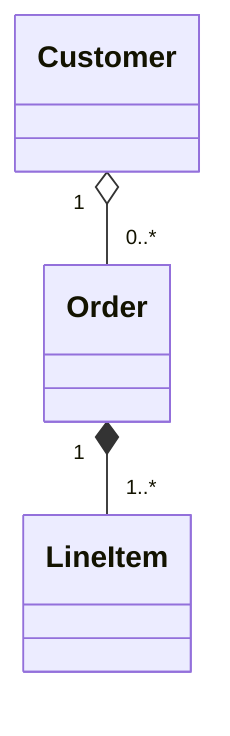
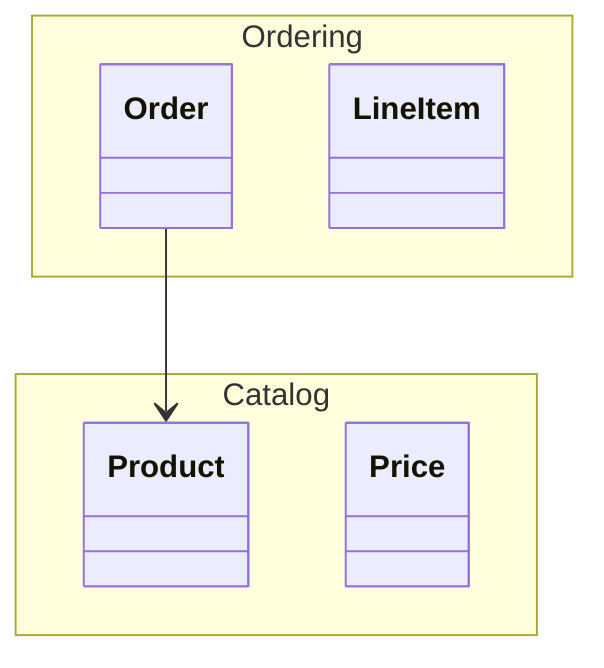
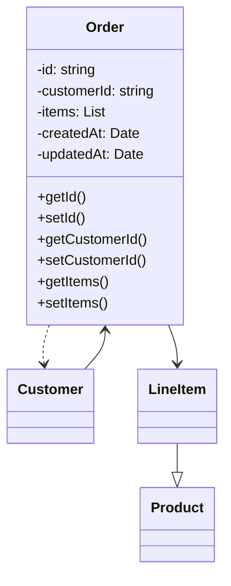
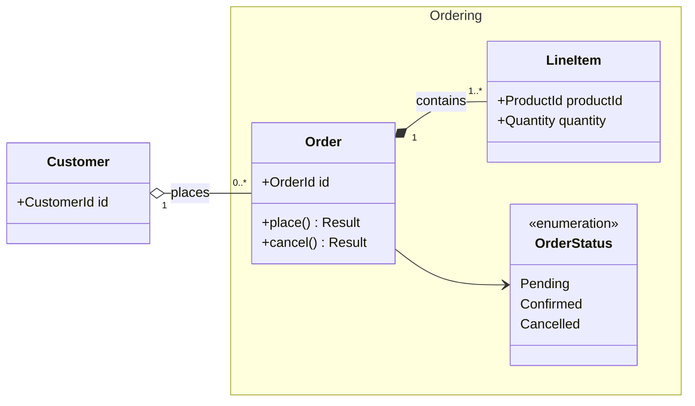
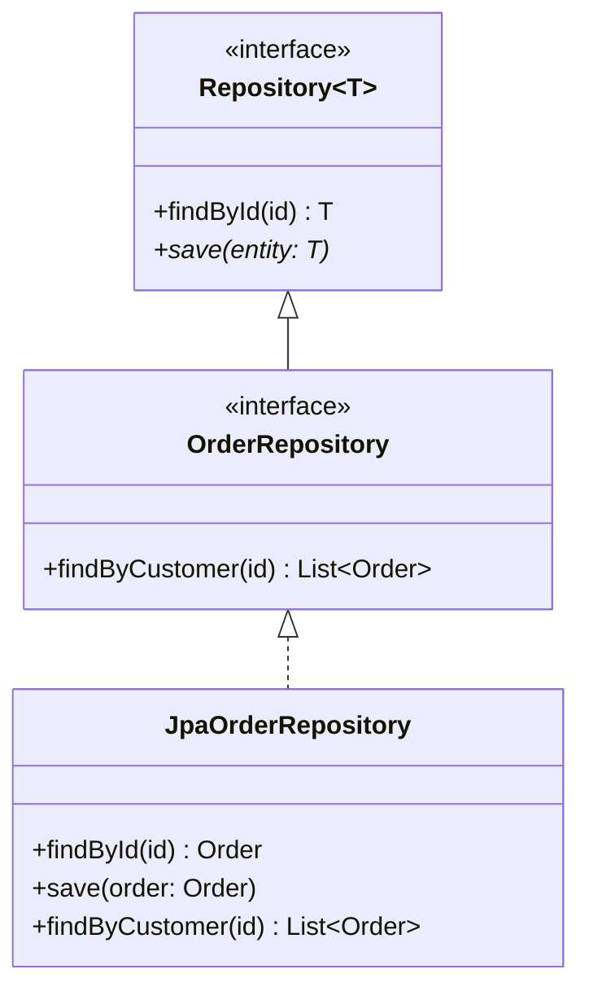
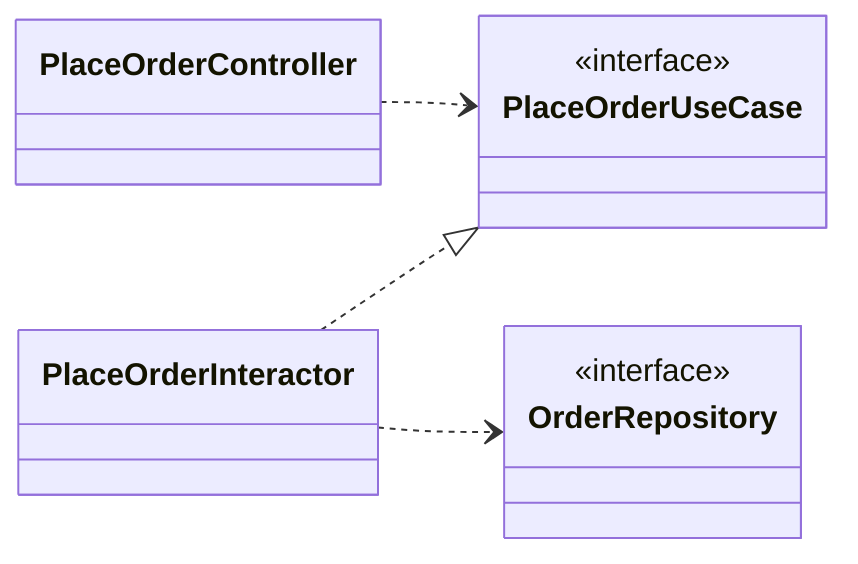

# 美しい Mermaid クラス図のルール

本ドキュメントは、設計ドキュメント上で **Mermaid のクラス図 (Class Diagram)** を「読みやすく・スケールしても破綻しない」状態で書くための指針をまとめたものである。Mermaid 公式ドキュメント (mermaid.js.org) と UML クラス図の一般的なベストプラクティスを踏まえている。

---

## 1. 概要と用途

クラス図は、システムを構成する **型 (クラス・インタフェース・値オブジェクト)** とそれらの **静的な関係** を表現するための図である。設計ドキュメントでは主に次の用途で使用する。

- ドメインモデルの構造を共有する (DDD のドメインモデル図)
- 公開 API / SPI のインタフェース契約を示す
- レイヤ間 (Controller / UseCase / Repository など) の依存関係を示す
- リファクタリング前後の構造比較

**向かない用途**: 実行時の振る舞い (シーケンス図を使う)、状態遷移 (状態図を使う)、デプロイ構成 (コンポーネント図/フローチャートを使う)。クラス図に「処理の流れ」を書き込み始めたら設計を見直すサイン。

---

## 2. クラス配置と direction のガイドライン

- **デフォルトは `direction LR`** (左→右) を推奨。継承階層が浅く、依存の流れが横方向のときに最も読みやすい。
- 継承ツリーが主役の図 (e.g. ドメインの分類体系) では `direction TB` (上→下) を選び、**スーパークラスを上に**置く。
- 1 図あたりのクラス数は **7 ± 2** を目安。20 を超えたら必ず分割する (§8 参照)。
- 関連するクラスは隣接させる。Mermaid は宣言順がレイアウトに影響するので、**論理的に近いものから順に宣言**する。

---

## 3. メンバー記述

### 3.1 可視性記号

| 記号 | 意味 |
|------|------|
| `+` | public |
| `-` | private |
| `#` | protected |
| `~` | package / internal |

設計ドキュメントでは原則 **public (`+`) のみ表示** すれば十分。private を載せるのは「不変条件の議論で重要な属性」だけに留める。

### 3.2 型記法

Mermaid の型記法は `属性名 型` または `メソッド名(引数) 戻り値型` の形式。Java/TypeScript 風に揃えると読み手の負担が減る。

```
+orderId: OrderId
+place(items: List~LineItem~): Result~Order, Error~
```

ジェネリクスは `List~T~` (チルダ) で表記する。`<>` は HTML エスケープが必要なので避ける。

### 3.3 static / abstract

- `static`: メンバー末尾に `$` を付ける (例: `+create()$`)
- `abstract`: メンバー末尾に `*` を付ける (例: `+execute()*`)
- クラス自体を抽象化する場合はステレオタイプ `<<abstract>>` または `<<interface>>` を使う。

---

## 4. 関係線の使い分け

| 構文 | 関係 | 使いどころ |
|------|------|-----------|
| `<|--` | 継承 (extends) | クラス→スーパークラスの is-a |
| `<|..` | 実現 (implements) | クラス→インタフェース |
| `*--`  | コンポジション | 親が消えたら子も消える強い所有 |
| `o--`  | 集約 | 親が消えても子は残る弱い所有 |
| `-->`  | 関連 (参照を保持) | フィールドとして他クラスを持つ |
| `..>`  | 依存 | 引数/戻り値/一時的に使用するだけ |

**読み取り方向のルール**: Mermaid では `A <|-- B` は「**B が A を継承**」という意味。矢の頭が向いている側が「親 (抽象側)」になる。図全体で **矢の頭の向きを必ず統一** する (混在は最悪のアンチパターン)。

---

## 5. 多重度の付け方

両端にダブルクォートで多重度を書く。



| 表記 | 意味 |
|------|------|
| `1` | ちょうど 1 |
| `0..1` | 0 または 1 (Optional) |
| `1..*` | 1 以上 |
| `*` | 0 以上 (任意の数) |
| `n..m` | n 以上 m 以下 |

ドメイン上の制約 (例: 注文には必ず 1 件以上の明細) は **必ず多重度として明示** する。コメントで補うのではなく、図で表現できるものは図で表現する。

---

## 6. namespace によるグルーピング

ドメイン境界やパッケージは `namespace` ブロックで囲む。視覚的に枠が付き、責務境界が一目で分かる。



namespace をまたぐ依存は「境界を越えた依存」であり、レビュー時の議論ポイントとなる。**意図的に少なくする** こと。

---

## 7. 表示するメンバーの取捨選択

クラス図は「設計の意図」を伝える図であり、ソースコードのコピーではない。次の方針で取捨選択する。

- **公開 API のみ**: private フィールドや内部ヘルパは載せない。
- **ドメイン上重要な属性のみ**: ID と主要不変条件に関わる属性のみ。`createdAt` などのメタは省略。
- **getter/setter は載せない**: 言語機能でしかなく設計情報を持たない。
- **メソッドは「外から呼ぶ操作」のみ**: 内部リファクタリング由来の private メソッドは載せない。

迷ったら「**この図を 6 か月後の自分が見て、何が知りたいか**」を基準にする。

---

## 8. 大規模化への対処

クラス数が増えたら、**1 枚に詰め込まない**。次の軸で分割する。

1. **ドメイン別に分割**: Ordering 図、Catalog 図、Billing 図などサブドメイン単位。
2. **抽象層別に分割**: ドメイン層図 / アプリケーション層図 / インフラ層図。
3. **ユースケース別に分割**: 「注文確定」フローに登場するクラスだけを抜き出した図。
4. **継承階層と協調関係を別図に**: 継承ツリー専用図と、コラボレーション図を分ける。

各図には冒頭にコメントで「**何を示し、何を示さないか**」を 1 行記載する。

---

## 9. アンチパターン

- 全クラスを 1 枚に詰め込む (50 クラス×線が交差したスパゲッティ図)
- getter/setter を律儀に羅列する
- 矢印方向が混在 (`A <|-- B` と `B --|> A` を併用)
- 関連と依存を区別せず全部 `-->` で済ませる
- 多重度を書かないので `1:N` か `N:N` か分からない
- private フィールドまで全部載せて型情報の海になっている
- ステレオタイプ (`<<interface>>` / `<<abstract>>`) を付けず、インタフェースが実装と区別できない

---

## 10. Good / Bad の具体例

### 10.1 Bad: 全部入り・矢印不統一・多重度なし



問題点: getter/setter 羅列、`LineItem --|> Product` という誤った継承、矢印方向の不統一、多重度なし、ステレオタイプなし。

### 10.2 Good: ドメインモデル図 (Ordering 文脈)



ポイント: namespace で境界を明示、コンポジション/集約を区別、多重度を全関連に付与、ラベルで意味を補足、メンバーは公開操作と ID のみ。

### 10.3 Good: インタフェース実現と継承



ポイント: `<<interface>>` ステレオタイプを明示、継承 (`<|--`) と実現 (`<|..`) を正しく使い分け、ジェネリクスは `~T~`、矢の頭は常に「抽象側」。

### 10.4 Good: レイヤ依存図 (依存関係のみ)



ポイント: メンバーを完全に省き、**依存の方向だけ** にフォーカス。クリーンアーキテクチャの依存逆転が一目で確認できる。

---

## 11. チェックリスト

図をコミットする前に次を確認する。

- [ ] クラス数は 15 以下か
- [ ] `direction` を明示したか
- [ ] 矢の頭の向きは図全体で統一されているか
- [ ] 継承 / 実現 / 集約 / コンポジション / 関連 / 依存を正しく使い分けているか
- [ ] 全ての関連に多重度が付いているか
- [ ] インタフェース・抽象クラスにステレオタイプを付けたか
- [ ] getter/setter を載せていないか
- [ ] namespace でドメイン境界を表現したか
- [ ] 図の意図を 1 行コメントで添えたか
