# 美しい Mermaid ER 図 (Entity Relationship Diagram) の作法

## 概要と用途

Entity Relationship Diagram (ER 図) は、システムが扱うデータの構造を「エンティティ (実体)」「属性」「リレーション (関連)」の 3 要素で表現する図である。Mermaid の `erDiagram` を用いると、設計ドキュメントやレビュー資料の中で、SQL DDL を書く前にデータモデルの全体像と業務上の制約を可視化できる。

主な用途:

- 基本設計書におけるデータモデル定義 (論理 ER 図)
- 既存テーブル間の依存関係の俯瞰 (リバース ER 図)
- ドメインモデリングのワーキング資料 (会話の足場)
- マイグレーション・データ移行設計時の影響範囲確認

ER 図は「人間が読んで業務制約を理解するための図」である。テーブル定義書と同じ情報量を詰め込もうとすると破綻する。**何を載せ何を省くか**を意識するのが、美しい ER 図への第一歩である。

---

## エンティティ命名規則

### 単数形 / 複数形の統一

エンティティ名は **単数形 + PascalCase** を推奨する。1 つのエンティティは「1 行 (1 インスタンス)」を表すからである。プロジェクト内では必ずどちらかに統一し、混在させない。

| 区分 | 推奨 | 非推奨 |
|------|------|--------|
| エンティティ名 | `Customer`, `OrderLine`, `ShippingAddress` | `customers`, `order_lines`, `shipping-addresses` |
| 物理テーブル名 (併記する場合) | `customer`, `order_line` (snake_case) | `Customer_TBL` |

論理名 (日本語) を併記する場合は、コメント属性または別途凡例で示す。

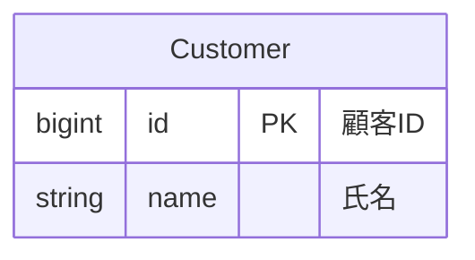

### 略語と一貫性

- 略語 (`Qty`, `Amt`, `No`) を使うなら、プロジェクト内で辞書を 1 つ定める
- ID 列は `id` (PK) と `customer_id` (FK) のように一貫した命名にする
- 中間テーブルは `OrderItem`, `UserRole` のように両側のエンティティ名を結合する

---

## 属性の記述

Mermaid の属性記述は `型 名前 キー "コメント"` の順で書く。情報過多を避けるため、**論理 ER 図では業務上意味のある属性のみ**を載せる。

### キー記号

| 記号 | 意味 |
|------|------|
| `PK` | 主キー (Primary Key) |
| `FK` | 外部キー (Foreign Key) |
| `UK` | 一意キー (Unique Key) |

NOT NULL や DEFAULT 値などの物理制約はコメント文字列で表現する (Mermaid に専用記法は無いため)。

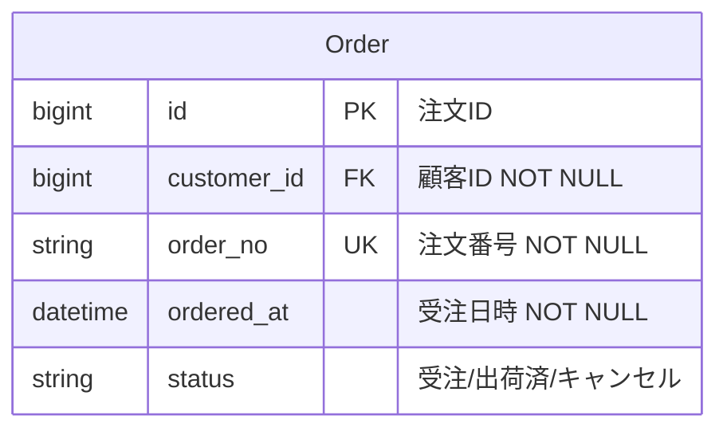

ポイント:

- 型は SQL 型 (`bigint`, `varchar`, `decimal`) かドメイン型 (`Money`, `Email`) で統一
- コメントには「業務的な意味」と「制約」を 1 行で書く
- 監査列 (`created_at`, `updated_at`, `deleted_at`) は冗長なので、論理 ER 図では原則省略する

---

## リレーションの記法 (Crow's Foot)

Mermaid は Crow's Foot 記法を採用している。線の両端 2 文字で **最小値・最大値** を表す (外側 = 最大、内側 = 最小)。

### 多重度の読み方表

| 記法 (左端) | 記法 (右端) | 意味 | 読み |
|------------|------------|------|------|
| `\|\|` | `\|\|` | 1 対 1 | ちょうど 1 |
| `\|\|` | `o\|` | 1 対 0..1 | 0 または 1 |
| `\|\|` | `o{` | 1 対 0..多 | 0 以上の多 |
| `\|\|` | `\|{` | 1 対 1..多 | 1 以上の多 |
| `}o` | `o{` | 多 対 多 | 任意 |

線種:

- 実線 `--` : 識別関係 (子は親なしに存在し得ない)
- 破線 `..` : 非識別関係 (子は独立して存在し得る)

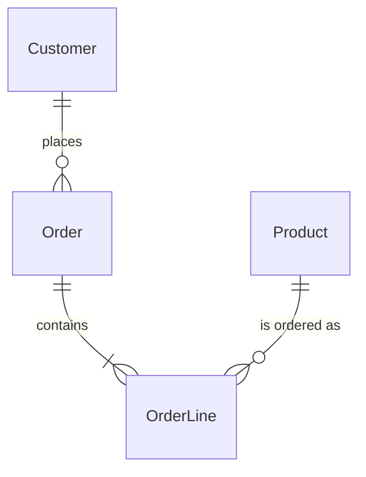

---

## 関係ラベルの付け方

- **動詞句** で書く (`places`, `contains`, `belongs to`)
- 左 → 右 で読んで自然になるよう主語を左に置く
- 可能なら両方向から読める表現を選ぶ (`Customer places Order` / `Order is placed by Customer`)
- 単なる "has" "of" は意味が薄いので避ける
- 日本語ドキュメントでは `"発注する"` `"明細を持つ"` のように動詞で書く

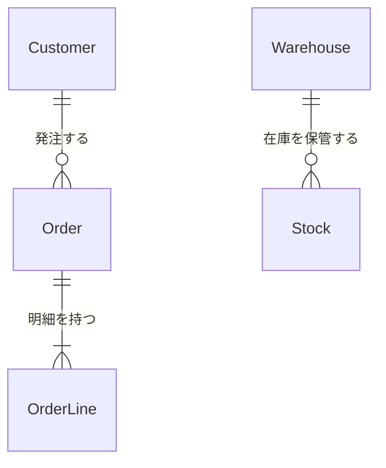

ラベルが無い線は「読者に推測を強いる」ことになるため、レビュー資料では原則必須とする。

---

## レイアウト原則

Mermaid の ER 図は自動レイアウトだが、`direction` と宣言順で誘導できる。

- **中心エンティティを中央に**: 主要な集約ルート (例: `Order`) を最初に宣言する
- **依存方向を揃える**: 「親 → 子」を上 → 下、または左 → 右に揃えると追いやすい
- **直交させる**: 縦方向に集約、横方向にマスタ参照、のように軸を分ける
- **`direction LR`** を基本にし、横長のスライドや A4 横向きに収める

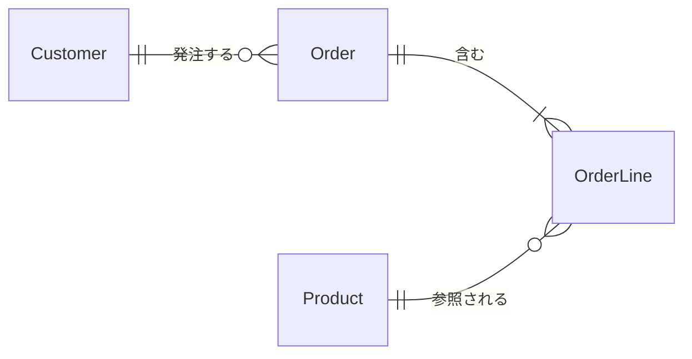

---

## 属性表示の取捨選択

| 用途 | 載せる属性 |
|------|-----------|
| 概念 ER 図 (会話用) | エンティティ名のみ。属性ブロックは省略 |
| 論理 ER 図 (設計書) | PK, FK, 業務的に重要な属性 5〜8 個まで |
| 物理 ER 図 (DDL 直前) | 全属性 + 型 + 制約 (ただしテーブル数を絞る) |

1 枚の図に「全エンティティ × 全属性」を載せると、線が交差し読めなくなる。ドキュメントでは **概念 / 論理 / 物理を別図** として階層化するのが定石である。

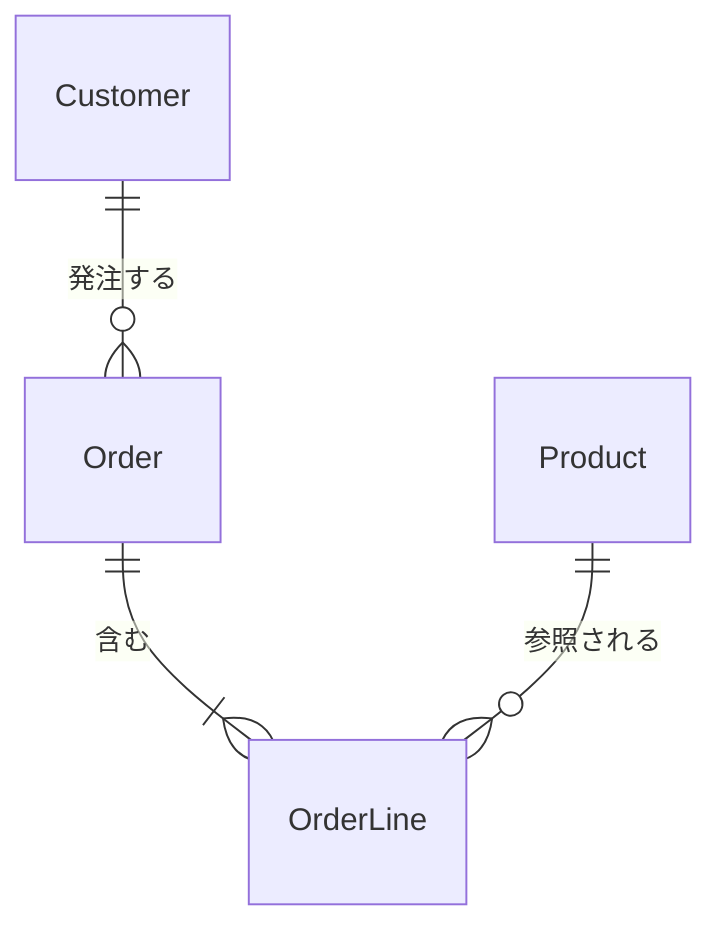

(概念図では属性ブロックを空にしてエンティティと関連だけに集中させる)

---

## 大規模化への対処

エンティティが 20 を超えたら、1 枚に収めず分割する。

1. **サブジェクトエリア別に分割**: 「販売管理」「在庫管理」「会計」のようにドメインで切る
2. **集約ビュー (コンテキストマップ)**: サブジェクトエリア同士の関係だけを 1 枚にまとめる
3. **共有エンティティの再掲**: 複数の図に登場するマスタ (`Customer`, `Product`) は、各図で再掲して良い (代わりに「マスタ図に詳細あり」と注記)
4. **章ごとに ER 図を貼る**: 設計書の各機能章にスコープを絞った ER 図を置く

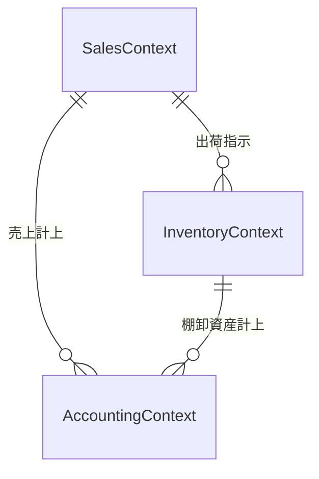

---

## アンチパターン

| アンチパターン | 問題 | 対処 |
|---------------|------|------|
| 全テーブル 1 枚図 | 線が交差して読めない | サブジェクトエリア分割 |
| 関係ラベル欠落 | 業務的な意味が伝わらない | 動詞句ラベル必須 |
| 多重度不明 (`--`だけ) | 0/1/多の制約が読めない | Crow's Foot を必ず使う |
| 監査列まで全部記載 | ノイズで本質が埋もれる | 論理 ER 図では省略 |
| 単数/複数の混在 | 命名規則が崩壊 | 単数形 PascalCase に統一 |
| 中間テーブルだけ浮遊 | 多対多の意味が見えない | 両端を `\|{` で接続しラベルを付ける |

---

## Good / Bad の具体例

### Bad 1: ラベルなし、多重度不明、属性過多

```mermaid
erDiagram
  customers {
    int id
    string name
    string email
    string tel
    string address1
    string address2
    datetime created_at
    datetime updated_at
    datetime deleted_at
  }
  orders {
    int id
    int cid
    datetime created_at
    datetime updated_at
  }
  customers -- orders
```

問題点: 命名が複数形 snake_case、関係ラベルなし、多重度不明、監査列が混入、FK 表記なし。

### Good 1: 命名統一・多重度明示・必要属性のみ

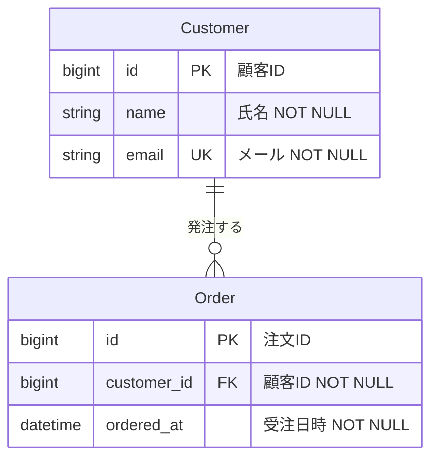

### Bad 2: 多対多の中間エンティティが暗黙

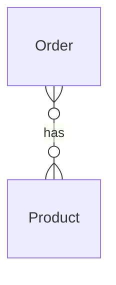

問題点: 中間テーブルが見えず、明細属性 (数量・単価) を表現できない。ラベル `has` も曖昧。

### Good 2: 中間エンティティを明示

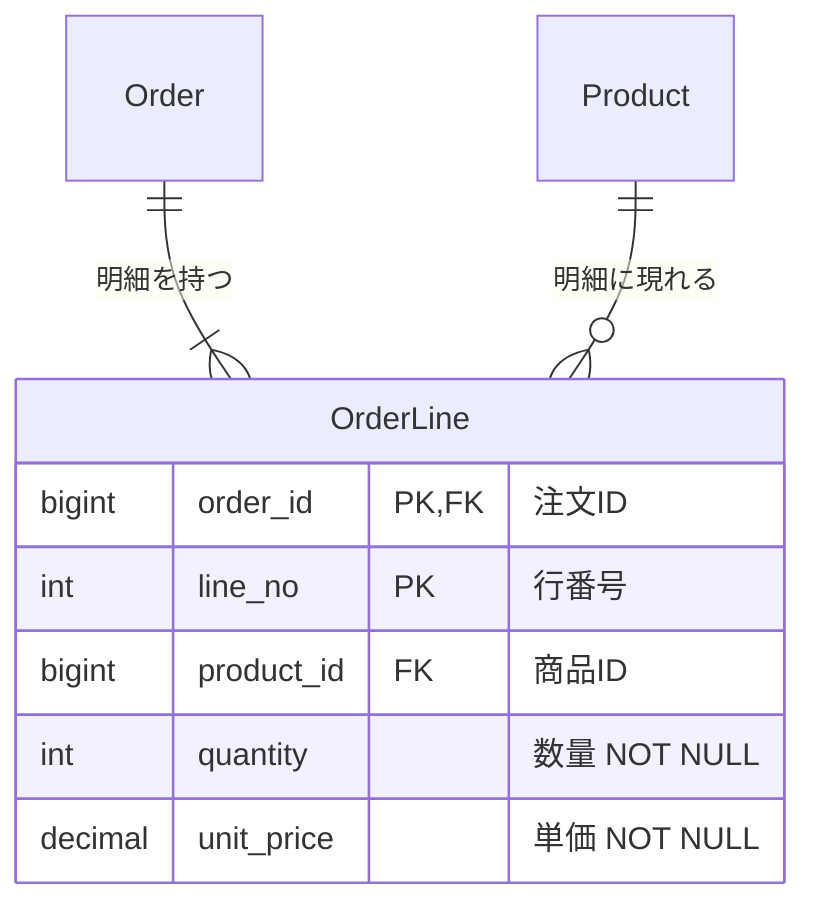

### Bad 3: 全エンティティを 1 枚に詰め込む

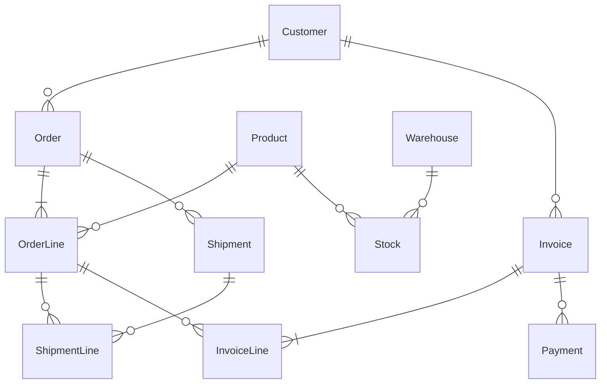

問題点: 12 関係 / 9 エンティティで線が交差、ラベルが空、サブジェクトエリアが混在。

### Good 3: サブジェクトエリアで分割 (販売エリア)

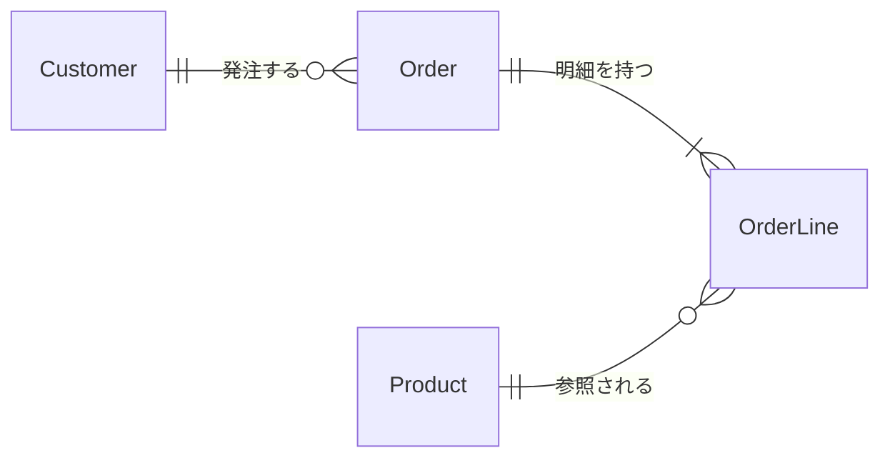

(在庫・請求は別図に分離し、コンテキストマップで全体関係を別途示す)

---

## チェックリスト

- [ ] エンティティ名は単数形 PascalCase で統一されている
- [ ] PK / FK / UK が全エンティティで明示されている
- [ ] すべての関係に Crow's Foot 多重度と動詞句ラベルが付いている
- [ ] 監査列など本質でない属性は省かれている
- [ ] 1 枚あたりエンティティ数は概ね 10 以下に収まっている
- [ ] 図の用途 (概念/論理/物理) が明示されている
- [ ] 大規模時はサブジェクトエリア分割 + コンテキストマップが用意されている
