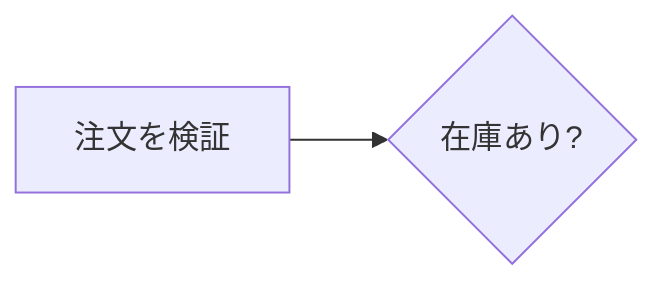
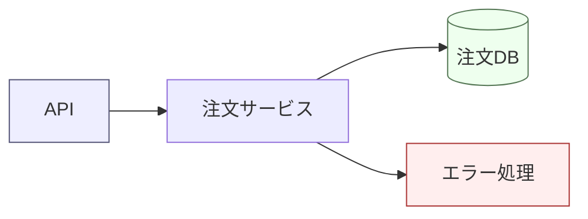
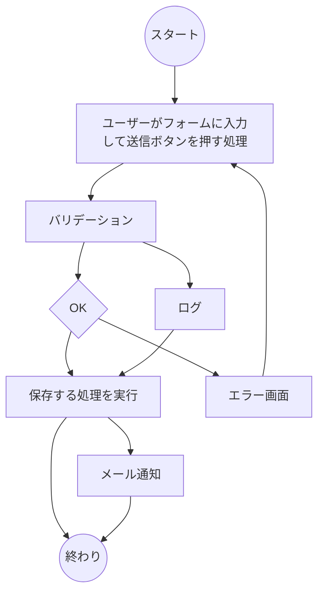
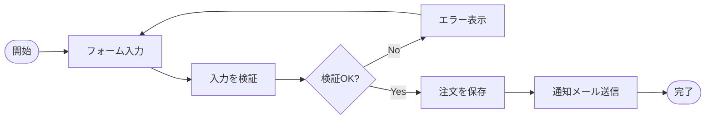
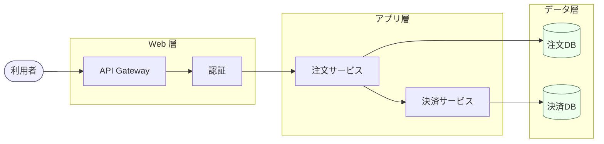

# Mermaid Flowchart 美しく書くためのルール

要件定義書・設計書で Mermaid の **Flowchart** を使うときに、読みやすく・スケールしても破綻しない図を書くための原則とベストプラクティスをまとめる。

## 概要

Flowchart は「処理の流れ」「分岐を含む手続き」「コンポーネント間のデータフロー」「意思決定のロジック」などを表現するのに向いている。

向いているもの:

- バッチ処理やリクエスト処理のフロー
- ユーザー操作の分岐 (Yes/No, 成功/失敗)
- システム構成の俯瞰 (粗いブロック図)
- 状態を持たない手続きの可視化

向いていないもの:

- 状態遷移そのもの → `stateDiagram-v2` を使う
- 時系列のやり取り → `sequenceDiagram` を使う
- 純粋なクラス構造 → `classDiagram` を使う
- 巨大な ER 関係 → `erDiagram` を使う

「迷ったら Flowchart」ではなく、**目的に合った図種を選ぶことが最初の美しさ**である。

---

## レイアウト原則

### 方向 (TD / LR) の選び方

- **TD (Top-Down)**: 階層・分岐・意思決定木。上から下に「進む」イメージのものはこちら。
- **LR (Left-Right)**: パイプライン・データフロー・ETL・状態遷移風の処理列。横長画面・スライド・ドキュメント本文には基本 LR が読みやすい。
- ノード数が 10 を超えるあたりからは LR の方が縦スクロールが少なく済むことが多い。
- BT/RL は原則として使わない (読み手の認知負荷が高い)。

### subgraph によるグループ化

- 関連ノードは必ず `subgraph` で囲み、責務の境界を視覚化する。
- subgraph のタイトルは「層」「サービス名」「フェーズ」など、**名詞で短く**。
- subgraph の中でだけ方向を変えたい場合は `direction LR` を内部に書く。
- ネストは 2 階層までに留める。3 階層を超えたら図を分割する。

### ノード間隔と交差の回避

- 1 ノードから出るエッジは原則 4 本まで。それ以上は中継ノード (集約ノード) を置く。
- 線の交差は読みやすさを大きく損なう。**交差が増えてきたら方向 (TD↔LR) を変える**か、ノードの順序を入れ替える。
- 「逆向きの矢印」(右→左、下→上) を作らない。ループはなるべく明示的に右側から戻す。

---

## 命名・ラベル規則

- ラベルは **15 文字以内** を目安にする。長くなる場合は ` ` で改行するか、図の外に注釈を書く。
- スタイルを統一する。例:
  - 処理ノード: 体言止め or 「動詞 + 目的語」 (例: 「注文を検証」)
  - 判定ノード: 疑問形 (例: 「在庫あり?」)
  - 状態ノード: 形容詞句 / 名詞 (例: 「処理中」)
- 同じ図の中で「動詞止め」と「体言止め」を混ぜない。
- ノード ID は英数字 (`validateOrder`) にし、ラベルだけ日本語にすると差分管理しやすい。

---

## ノード形状の使い分け

形状には **意味** を持たせる。図の中で一貫していることが重要。

| 形状 | 構文 | 用途 |
| --- | --- | --- |
| 長方形 `[ ]` | `A[処理]` | 通常の処理・アクション |
| 角丸 `( )` | `A(開始/終了)` | 開始・終了・端点 |
| スタジアム `([ ])` | `A([イベント])` | イベント・トリガー |
| ひし形 `{ }` | `A{条件?}` | 分岐・判定 |
| 円 `(( ))` | `A((集約点))` | 合流・接続点 |
| 円柱 `[( )]` | `A[(DB)]` | データストア・DB |
| 六角形 `{{ }}` | `A{{外部}}` | 外部システム・準備処理 |
| 平行四辺形 `[/ /]` | `A[/入力/]` | 入出力 |

ルール:

- **判定はひし形のみ**。長方形に「?」を書いて判定に使うと混乱する。
- DB やキューは円柱で揃える。
- 開始/終了は 1 つの図に最大 1 組までが理想。

---

## エッジ / 矢印のガイドライン

- ラベル付きエッジ `A -->|成功| B` は分岐の出口で必ず使う。
- 矢印の種類は意味で使い分ける:
  - `-->` 通常の制御フロー
  - `-.->`  非同期・イベント・補助的な参照
  - `==>` 主経路・ハッピーパス強調
  - `---` 単なる関連 (向きなし)
- 1 本のエッジに長い文章を載せない。長くなるなら中継ノードを置く。
- ループバック (戻り矢印) は左右どちらかに統一して、ジグザグさせない。
- 矢印長 (`-->` vs `---->`) を使うとレイヤを揃えやすい。

---

## 色・スタイルの指針

- 色は **意味の差異** を表すときだけ使う (成功/失敗、内部/外部、同期/非同期など)。
- **3〜4 色まで**。それ以上はカラフルなだけで意味が読み取れない。
- 個別 `style` ではなく、`classDef` で **クラスとして定義** し再利用する。
- ダーク/ライト両モードで読める中間トーンを選ぶ (純赤・純青は避ける)。
- 太字・極太枠線・濃い塗りつぶしの併用は避ける (装飾の重ねがけは禁物)。

---

## 大規模化への対処

ノード数が 20 を超え始めたら、**1 枚の図で表現することを諦める**。

戦略:

1. **subgraph で分割**: まずは責務ごとに subgraph に押し込む。
2. **複数図への分割**: 「俯瞰図」と「詳細図」に分ける。俯瞰図にはサービス単位のブロックだけを置き、詳細図はサービスごとに別の Flowchart として作る。
3. **階層化**: ドキュメントの章立てに合わせ、章の冒頭に俯瞰図、節の中に詳細図を置く。
4. **凡例の固定化**: 大きな図の集合では、凡例 (legend) を別 mermaid ブロックとして冒頭に出す。
5. **ノード ID の名前空間化**: `order_validate`, `payment_validate` のように prefix を付けると検索性が上がる。

目安: **1 図あたりノード 15、subgraph 4、エッジ 25 まで**。これを超えたら分割する。

---

## アンチパターン

- 何でもかんでも長方形 (形状の意味付けが消える)
- 1 図に開始ノードが複数あり、どこから読むか分からない
- ひし形から 3 本以上の出口が出ていて、ラベルもない
- 戻り矢印が縦横無尽に交差している
- `style` を全ノードに直書きし、色が全部違う
- 日本語ラベルが長文で、ノードが画面幅いっぱいに伸びている
- subgraph のタイトルが動詞句で、グループの意味が分からない
- TD と LR を 1 図の中で頻繁に切り替える (subgraph 内 direction の乱用)
- 凡例なしで色を多用する

---

## Good / Bad の例

### Bad: 形状もラベルも統一されていない / 交差が多い

問題点:

- ラベルが長文・スタイル不統一 (体言止めと動詞句が混在)
- 判定ノード `D{OK}` の出口にラベルが無く、Yes/No が不明
- ループバック `F --> B` が他の線と交差する
- ノード ID が `A,B,C...` で意味を持たない

### Good: 同じ内容を整理した版

改善点:

- LR 方向で横に流れ、戻り矢印が短い
- ノード ID に意味があり、ラベルは短く統一
- 判定ノードに Yes/No ラベル
- 開始/終了が 1 組のみ

### Good: subgraph と classDef による中規模システム図

ポイント:

- 3 つの subgraph で層を表現
- 外部利用者とデータストアを classDef で区別
- 主フローが左から右へ一方向に流れる

### Bad: 巨大化した 1 枚図

ノード 30、subgraph 5、戻り矢印多数 ─ こうなったら **必ず分割する**。俯瞰図 (subgraph をブラックボックス化) と、各 subgraph の詳細図に分け、ドキュメントの章立てと対応させること。

---

## チェックリスト

図を書き終えたら次を確認する。

- [ ] 方向 (TD/LR) は内容に合っているか
- [ ] 開始/終了が明確で 1 組か
- [ ] 判定はひし形か / 出口に Yes/No ラベルがあるか
- [ ] ノード形状が意味的に一貫しているか
- [ ] ラベルのスタイル (体言/動詞) が統一されているか
- [ ] 色は意味を持っていて 4 色以内か
- [ ] 線の交差は最小化されているか
- [ ] ノード数 15 / subgraph 4 / エッジ 25 を超えていないか
- [ ] subgraph のネストは 2 階層以内か
- [ ] 凡例なしで色の意味が伝わるか (伝わらないなら凡例を付ける)
