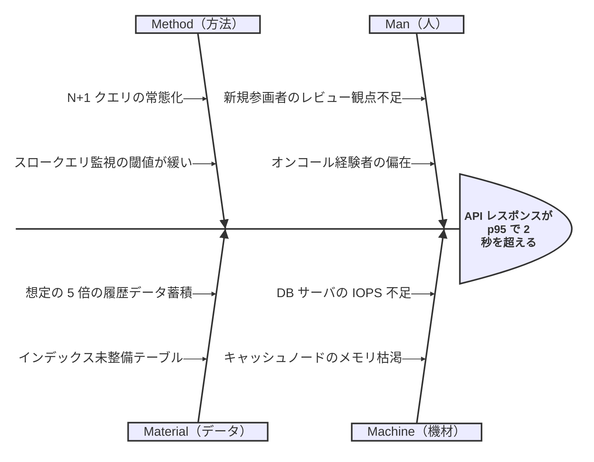
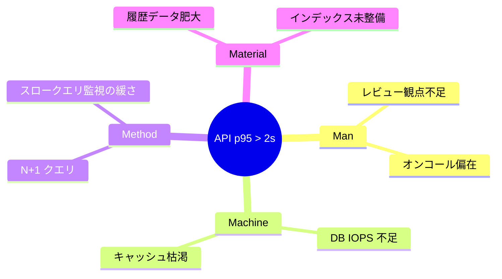
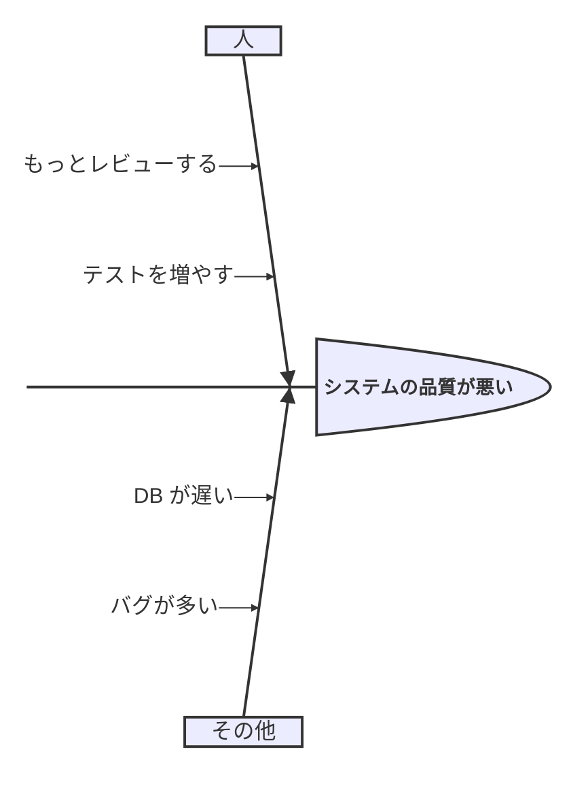
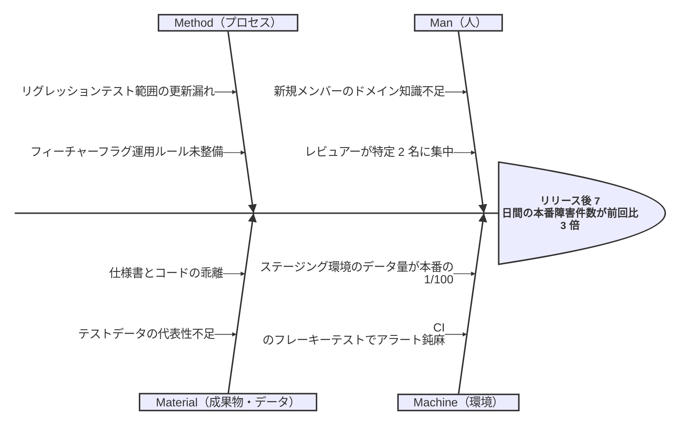
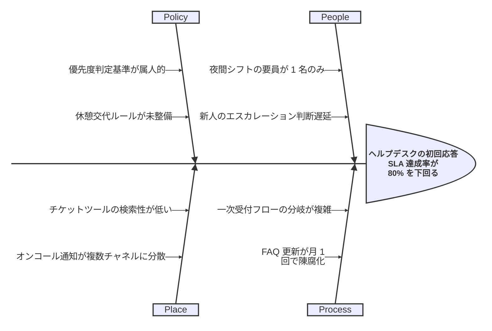
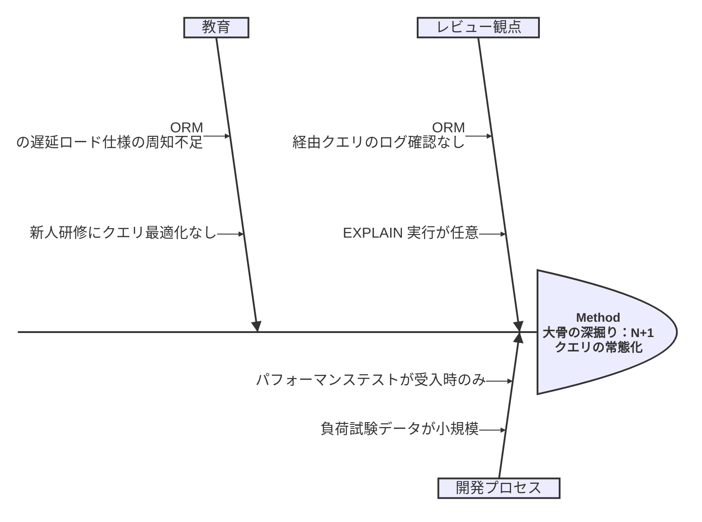

# 美しい Mermaid Ishikawa（特性要因図 / フィッシュボーン）図のルール

本ドキュメントは、日本語の要件定義書・設計書・品質レビュー資料において、Mermaid で **Ishikawa 図（特性要因図、フィッシュボーン図、魚の骨図）** を読みやすく描くための原則をまとめたものである。

---

## 1. 概要と用途

Ishikawa 図は、石川馨氏により提唱された **原因分析・品質管理のための可視化手法** である。ある「特性（effect / 問題・結果）」に対して、その要因（cause）を魚の骨のように分類・階層化して洗い出す。

主な用途:

- **根本原因分析（RCA）**: 障害・不良・クレームの原因を多面的に列挙
- **品質管理（QC）**: 製造・サービス品質のばらつき要因の整理
- **要件定義のリスク分析**: 「なぜ要件が満たせない可能性があるか」の洗い出し
- **設計レビュー**: 非機能要件（性能・可用性）が達成できないリスクの分類
- **ふりかえり / ポストモーテム**: チーム全員での原因のブレインストーミング

「解決策を出す前に、まず原因を MECE に網羅する」ことが目的であり、解決策やアクションを書く図ではない点に注意。

---

## 2. 問題（特性 / effect）の明確な記述

魚の頭にあたる「特性」は、図全体の焦点を決定する最重要要素である。曖昧な特性は、議論を発散させる。

良い特性の書き方:

- **観測可能・測定可能**: 「品質が悪い」ではなく「結合テストでの不具合検出率が前リリース比 2 倍」
- **1 つに絞る**: 1 つの図 = 1 つの特性。複数の問題を 1 図に混ぜない
- **症状ベース**: 原因を含めない（「DB が遅いからレスポンスが遅い」ではなく「API レスポンスが p95 で 2 秒を超える」）
- **時制・対象を明示**: 「いつ」「どのシステムで」「どの程度」

---

## 3. 大骨（カテゴリー）の選定と統一

大骨は要因の分類軸であり、**同じ図内ではフレームワークを統一する**こと。代表的な分類軸:

| フレームワーク | 大骨 | 適用領域 |
|---|---|---|
| **4M** | Man / Machine / Material / Method | 製造業の基本 |
| **5M** | 4M + Measurement | 計測を含む品質管理 |
| **5M+1E** | 5M + Environment | 環境要因が大きい現場 |
| **6M** | 5M+1E + Management | マネジメント要因も含める |
| **7M** | 6M + Money | コスト要因も含める |
| **4P（サービス業）** | People / Process / Policy / Place | サービス・接客 |
| **4S（IT 系）** | Surroundings / Suppliers / Systems / Skills | IT 運用 |
| **PEMPEM** | People / Equipment / Material / Process / Environment / Measurement | 汎用版 |

ソフトウェア開発では、**人 / プロセス / ツール / 環境 / データ / 仕様** のような独自軸を定義するのも良い。ただし、**選んだフレームワークは図のタイトル等に明記**する。

---

## 4. 中骨・小骨への分解（粒度）

階層は **「大骨 → 中骨 → 小骨」の 2〜3 階層** にとどめるのが読みやすさの目安。これは「なぜなぜ分析」を 2〜3 回繰り返した深さに相当する。

- **大骨（第 1 階層）**: カテゴリー（4M 等）
- **中骨（第 2 階層）**: そのカテゴリー内の主要要因
- **小骨（第 3 階層）**: 中骨の具体化（必要時のみ）

4 階層以上に深掘りしたくなった場合は、**その大骨だけを別図に切り出す** ことを検討する。

---

## 5. Mermaid での表現方法

Mermaid は **v11.12.3 以降で `ishikawa` 専用構文** をサポートしている（[公式ドキュメント](https://mermaid.js.org/syntax/ishikawa.html)）。それ以前のバージョンや一部レンダラでは、`mindmap` で代用するのが現実的。

### 5.1 専用 ishikawa 構文（推奨、v11.12.3+）

1 行目が特性（effect / 問題）、以降はインデントで階層を表現する。

### 5.2 mindmap による代用（古いバージョン互換）

mindmap で代用する場合も、**root を「特性」として、第 1 階層を必ずカテゴリーに統一する** ルールを守ること。

---

## 6. カテゴリー間の独立性（MECE 志向）

大骨は **MECE（漏れなく・ダブりなく）** に近づけるのが理想。完全な MECE は難しくても、以下を意識する:

- **同じ要因を 2 つの大骨に書かない**: 「人手不足」が Man と Method の両方にあるなら、どちらかに寄せる
- **大骨の粒度を揃える**: 「Man」と「ある特定ツールのバグ」を同列に置かない
- **重複が多発するなら分類軸が間違っている**: フレームワーク自体を見直す

---

## 7. 大規模化への対処

骨が増えすぎた図は、もはや分析ツールではなく単なる落書きになる。次のいずれかで対処する。

1. **カテゴリー別に図を分割**: 1 大骨 = 1 図にして、親図ではカテゴリーのみ示す
2. **重要骨の強調**: 影響度・確からしさが高い骨だけを別図に抜き出す（Pareto 的アプローチ）
3. **小骨の集約**: 似た小骨は親の中骨にマージ
4. **「保留」骨の削除**: 議論の結果、明確に却下された要因は図から消す（議事録には残す）

目安として、**1 図の総骨数は 20〜30 本以内**、深さは 3 階層以内に収める。

---

## 8. アンチパターン

| アンチパターン | 問題 | 対処 |
|---|---|---|
| **原因と症状の混同** | 「レスポンスが遅い」を骨に書く（それは特性側） | 「なぜ遅いか」を書く |
| **カテゴリー不統一** | 4M と独自軸を混ぜる | 1 図 1 フレームワーク |
| **骨が多すぎ** | 50 本以上で読めない | 分割・集約 |
| **解決策を骨に書く** | 「キャッシュを導入する」と書く | それは対策表へ |
| **粒度バラバラ** | 「人」と「特定 SQL の where 句」が同階層 | 階層を揃える |
| **特性が曖昧** | 「品質が悪い」 | 測定可能に書き直す |
| **1 図に複数特性** | 頭が複数ある魚 | 図を分ける |
| **時系列の混入** | 「最初に〜、次に〜」と書く | Ishikawa は因果図、時系列は別図 |

---

## 9. Good / Bad の例

### 9.1 Bad: 特性が曖昧、解決策と原因が混在

問題点: 特性が測定不能、解決策（「もっとレビューする」）が骨にある、「その他」という大骨は MECE 違反、「バグが多い」は症状であって原因ではない。

### 9.2 Good: 特性が明確、4M で統一、原因のみ記述

### 9.3 Good: サービス業 4P の例

### 9.4 Good: 大骨を 1 つに絞った深掘り図（分割例）

---

## 10. レビュー時のチェックリスト

- [ ] 特性が 1 つで、測定可能に書かれているか
- [ ] 大骨が単一フレームワーク（4M / 5M+1E / 4P 等）で統一されているか
- [ ] 骨に「解決策」が混入していないか
- [ ] 階層が 3 階層以内に収まっているか
- [ ] 同じ要因が複数の大骨に重複していないか
- [ ] 骨の総数が 30 本を超えていないか
- [ ] 「症状の言い換え」ではなく「原因」が書かれているか
- [ ] Mermaid バージョンが ishikawa 構文（v11.12.3+）に対応しているか、未対応なら mindmap 代替か

---

## 参考

- [Mermaid 公式: Ishikawa diagram](https://mermaid.js.org/syntax/ishikawa.html)
- [Mermaid GitHub Issue #4784: Ishikawa diagram](https://github.com/mermaid-js/mermaid/issues/4784)
- [Mermaid Diagram Syntax Reference](https://mermaid.js.org/intro/syntax-reference.html)
