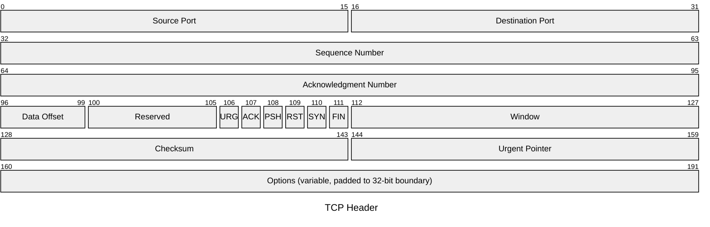
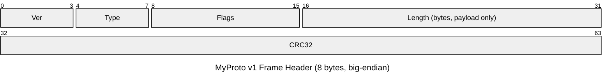
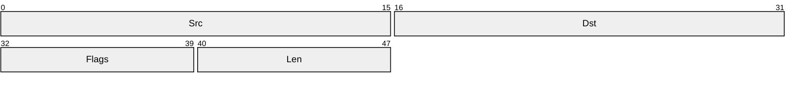
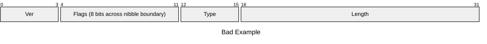

# 美しい Mermaid Packet 図の作法

## 概要と用途

Mermaid の **Packet 図** (`packet`) は、ネットワークプロトコルのヘッダや、バイナリフォーマット (ファイルフォーマット、レジスタマップ、シリアル通信のフレーム等) における **ビット/バイト単位のフィールド配置** を、RFC 風の図として描画するための比較的新しい図種である。設計ドキュメントでは、以下の用途で特に有効である。

- 自作プロトコル / バイナリフォーマットの仕様提示
- 既存プロトコル (TCP/UDP/IP/独自 RPC ヘッダ等) の解説と差分提示
- レジスタマップ・フラグビットの可視化
- ディスクオンメモリ構造体 (mmap される構造体、ファイルヘッダ) のレイアウト合意

文章だけで「上位 4bit が version、続く 4bit が IHL、…」と書くより、図で示した方が境界の誤読が圧倒的に減る。設計レビューでは **必ず図と表を併置する** こと。

## 基本構文

```
packet
title TCP Header
0-15: "Source Port"
16-31: "Destination Port"
32-63: "Sequence Number"
```

- 1 行 1 フィールド。`開始bit-終了bit: "ラベル"` で表現する。
- 単一ビットは `7: "URG"` のように 1 つの数値で書ける。
- v11.7.0 以降は `+<bit数>: "..."` という相対指定も可能で、途中挿入での再採番を避けられる。**新規作成時は相対指定推奨**、既存プロトコルの引き写しは絶対指定が読みやすい。

## ビット範囲指定の規則

1. 範囲は **0 始まり** で、最上位ビット (MSB) を 0 とする RFC 流儀に揃える。
2. 終端は **inclusive** (0-15 は 16bit)。off-by-one を避けるため、図の下に「= N bit」をコメントで併記してもよい。
3. 範囲が行 (通常 32bit) を跨ぐ場合は、Mermaid 側がよしなに折り返してくれるが、**人間が読み下す際の混乱要因** になるため、可能なら 32bit 境界で区切れるようにフィールド設計を見直す。

## フィールド命名規則

- **PascalCase か snake_case を文書内で統一**。混在は厳禁。
- 略語 (SYN, ACK, MSS, CRC, IHL 等) は許容するが、**図の直後の表で正式名称を必ず展開** する。
- 単位を含むフィールドは `Length (bytes)` のように単位を併記。bit 長 / byte 長の取り違えは典型的バグ源。
- Reserved は `Reserved` または `Rsv` で統一し、「未使用」「Padding」と混ぜない。

## 行の幅 (Row Width) の統一

- **既定は 32bit/行**。ネットワークプロトコルのほとんどは 32bit 行で書かれており、読み手の認知コストが最小になる。
- 8bit デバイスのレジスタなど、明らかに 32bit が過剰な場合のみ 8bit/16bit に変更する。1 つの設計ドキュメント内で **行幅を混在させない**。
- 行幅は `---` フロントマターで設定できる:

```
---
config:
  packet:
    bitWidth: 32
    bitsPerRow: 32
---
packet
title Example Header
0-31: "Field A"
```

## 予約領域 (Reserved) / パディング

- 未使用ビットは省略せず、必ず `Reserved` フィールドとして明示する。省略は将来の互換性議論を破壊する。
- Reserved の値は **送信側 0 / 受信側無視 (MBZ: Must Be Zero)** など、扱いを表側で明記する。
- アライメント目的のパディングは `Padding` と命名し、Reserved と区別する (用途が違う)。

## 可変長フィールドの表現

Mermaid Packet は本質的に固定ビット幅を扱うため、可変長フィールドは以下のいずれかで表現する。

1. **代表ビット数で囲み、ラベルに `(variable)` を付ける**:
   ```
   64-95: "Payload (variable, length given by Length field)"
   ```
2. ヘッダ部のみを Packet 図で表し、ペイロードは別図 (flowchart や表) で示す。
3. TLV (Type-Length-Value) は 1 要素分だけを Packet 図で示し、繰り返しは文章で説明する。

可変長を「適当に長く書く」のはアンチパターン。読み手が固定長と誤認する。

## バイトオーダー

- **既定は big-endian (network byte order)** とし、図の冒頭または title に明示する。
- little-endian の構造体 (x86 のディスク構造、protobuf の内側等) を Packet 図で書くときは、ビットの並びがどちら向きかを必ず注記する。
- bit 番号の付与方向 (MSB=0 か LSB=0 か) も併記する。RFC 流儀は MSB=0。

## title の活用

- `title` 行は必須。図単独で取り出されたときの文脈を保つため。
- title には **対象 / バージョン / 全長** を入れると親切。例: `title MyProto v2 Header (20 bytes)`。

## 図の前後に置くべき補足

Packet 図の **前** には:

- 何のフォーマットか / 全体長 / バイトオーダー / バージョンを 1 段落
- 関連 RFC や社内仕様書へのリンク

Packet 図の **後** には、必ず以下の表を置く:

| Offset (bit) | Field | Type | 説明 | 既定値 |
| --- | --- | --- | --- | --- |
| 0-3 | Version | uint4 | プロトコルバージョン | 4 |
| ... | ... | ... | ... | ... |

図はレイアウト、表は意味論。役割を分担させる。

## アンチパターン

- **行幅の不統一**: 上半分 32bit、下半分 16bit のように混ぜる。読み手は境界を見失う。
- **Reserved を省略**: 「あとで使う予定だから空けてある」を図に書かない。互換性議論不能。
- **境界をまたぐフィールドの誤記**: `28-35` のように 32bit 境界をまたぐフィールドを、表では「4bit + 4bit」に分けて書いてしまうケース。図と表を一致させる。
- **MSB/LSB の方向不統一**: ある図は MSB=0、別の図は LSB=0、などとすると即バグる。
- **可変長を固定長で誤魔化す**: ペイロードを `64-1023: "Payload"` のように書く。読み手は 960bit 固定と誤読する。
- **title なし**: 抜粋された瞬間に意味を失う。
- **略語のみ**: `URG ACK PSH RST SYN FIN` を表で展開しない。新人が読めない。

## Good 例: TCP ヘッダ



ポイント:

- 32bit 行で統一されている。
- Reserved を省略せず、フラグビットは 1bit ずつ展開。
- Options が可変長であることをラベルで明示。
- title でバイトオーダーと bit 番号の向きを宣言。

## Good 例: 自作フレームヘッダ (相対指定)



`+N` 構文で書くと、フィールドを途中追加しても採番をやり直さなくて済む。

## Bad 例 1: 行幅不統一・Reserved 省略



問題点:

- title が無い。
- `Src` `Dst` という略語が説明されていない。
- 後半が 8bit 単位で、前半 16bit 単位と整合しない (実際の構造体ではなく図の見た目だけの問題でも読み手は混乱する)。
- Reserved があるはずなのに省略されている可能性が判断不能。

## Bad 例 2: 境界をまたぐフラグの誤表現



これ自体は描画されるが、後続の表で `Flags` を `bit 4-7` と `bit 8-11` に分けて書いてしまう事故が頻発する。図と表は **同じ区切りで** 書くか、フィールド設計自体をニブル境界に揃え直す。

## チェックリスト

- [ ] title がある (対象・バージョン・全長)
- [ ] バイトオーダーと MSB/LSB の方向が明示されている
- [ ] 行幅 (bitsPerRow) がドキュメント内で統一されている
- [ ] Reserved / Padding が省略されていない
- [ ] 可変長フィールドに `(variable)` 注記がある
- [ ] 図の直後に Offset / Field / Type / 説明 / 既定値 の表がある
- [ ] 略語が表で展開されている
- [ ] 図と表の区切りが一致している
