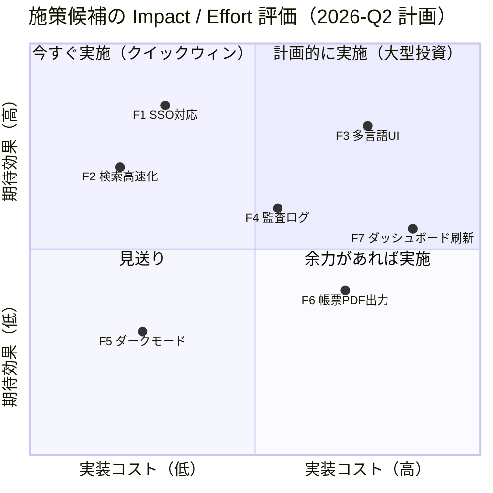
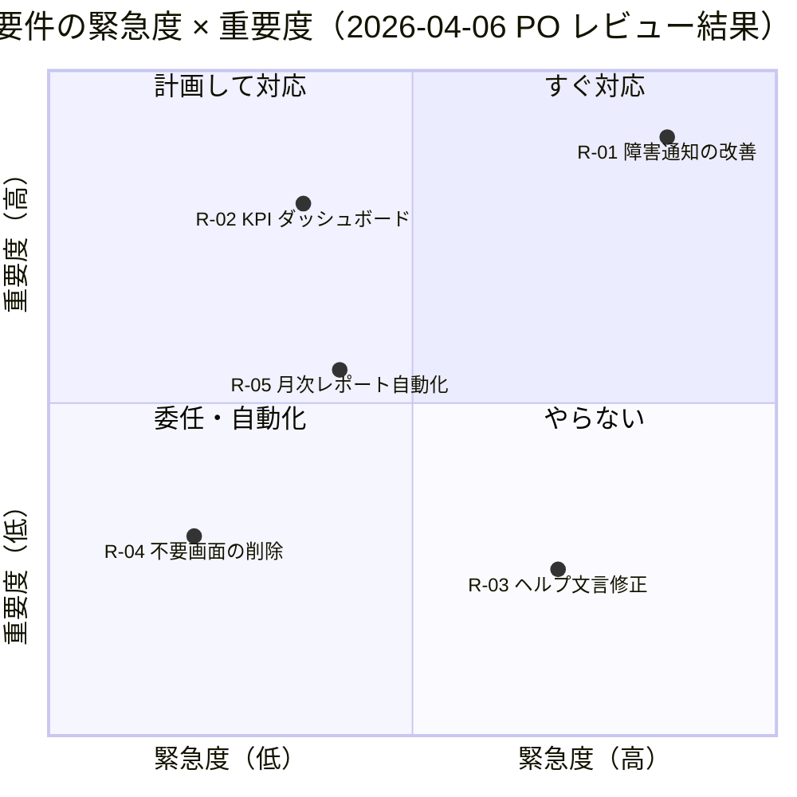
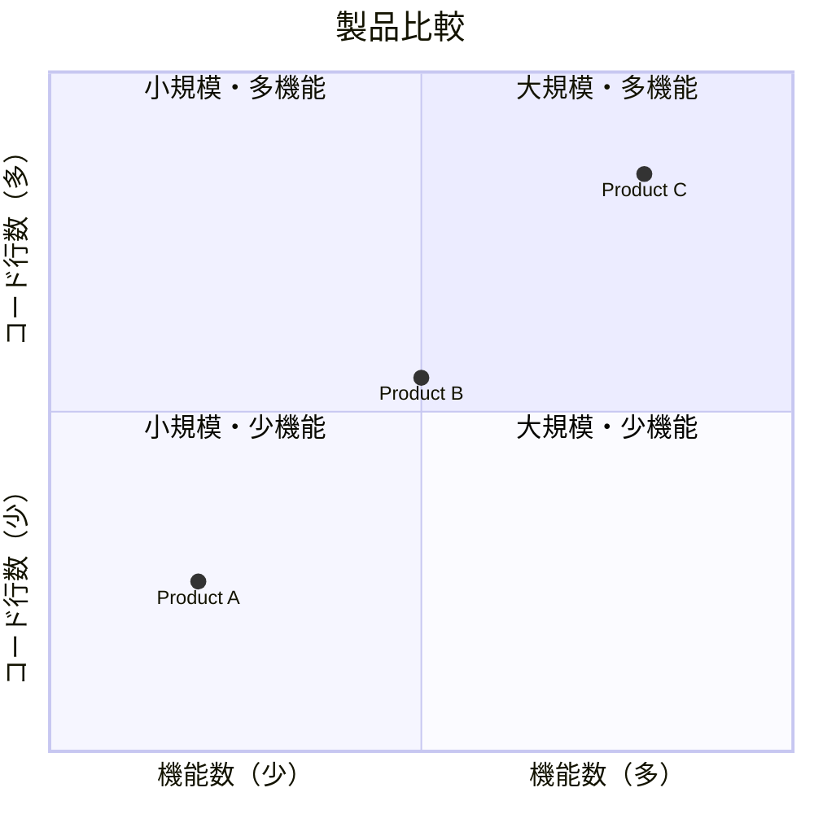

# 美しく読みやすい Mermaid Quadrant Chart 作成ルール

本ドキュメントは、要件定義書・基本設計書において Mermaid の **Quadrant Chart（四象限図 / 2x2 マトリクス）** を用いる際の指針をまとめたものである。Eisenhower マトリクス、Impact/Effort マトリクス、競合ポジショニングマップなど、定性的な意思決定支援図を読み手に正しく伝えることを目的とする。

---

## 1. 概要と用途

Quadrant Chart は、2 つの独立した評価軸を交差させ、対象（要件・機能・施策・競合製品など）を 4 つの象限に分類する図である。主な用途は以下のとおり。

- **優先度分析**: 緊急度 × 重要度（Eisenhower マトリクス）で要件を仕分けする
- **施策評価**: Impact（効果） × Effort（工数）で機能候補を取捨選択する
- **競合分析**: 価格 × 機能性、シェア × 成長率で自社／他社製品を位置づける
- **リスク分析**: 発生確率 × 影響度でリスクをマッピングする
- **技術選定**: 成熟度 × 適合度で候補技術を整理する

正確な数値ではなく、**相対的な位置関係**を可視化する点が要点である。

---

## 2. 軸の選び方（独立・直交・測定可能）

良い軸は次の 3 条件を満たす。

1. **独立している（直交）**: 2 軸が相関していると点が対角線上に偏り、4 象限化の意味が失われる
2. **測定または合意可能**: 完全な数値化が難しくても、相対比較できる基準であること
3. **意思決定に直結する**: その軸で分けた結果が、次の行動を変えるものであること

避けるべき例: 「機能数 × コード行数」（相関が強い）、「使いやすさ × 良さ」（曖昧で重複）。

---

## 3. 軸ラベルと象限ラベルの命名

- 軸ラベルは **名詞 + 方向（高 ⇔ 低）** を明示する（例: 「実装コスト（低 → 高）」）
- 象限ラベルは **アクション志向**で命名すると読み手の判断が早い
  - 例: 「今すぐ実施」「計画的に実施」「余力で実施」「見送り」
- 4 象限すべてにラベルを付ける。一部だけ命名すると読者が混乱する
- 日本語と英語が混在する場合、軸は日本語、象限は短い英語キャッチでも可

---

## 4. データ点の数の目安

- 推奨は **5〜15 点**。3 点未満では図にする価値が薄く、20 点を超えると過密で読めなくなる
- 過密になる場合は、(a) 上位のみ抽出する、(b) カテゴリ別に複数の図に分割する、(c) 表に切り替える、のいずれかを検討する
- 点同士が重なる場合は、ラベルを短縮するか凡例を別途用意する

---

## 5. 点のラベルと凡例

- 点ラベルは **8〜16 文字程度**に抑える。長い説明は本文か凡例に逃がす
- 多言語・略号を使う場合は図の直後に対応表を置く
- ID 方式（F1, F2, R3 …）にして、本文の表で詳細を記述するのも有効

---

## 6. 相対位置の意味付け

Quadrant Chart は **絶対値のグラフではない**。読み手が「0.73 だから高」と誤解しないよう、本文に次を明記する。

- 値は関係者の合意に基づく**相対評価**であること
- 軸の単位（円・人日・スコア等）が定まっている場合はその旨
- ただし図上には目盛りを描かない（0〜1 の内部座標は補助的に使うのみ）

---

## 7. 色・スタイルのカスタマイズ

Mermaid v10 以降では `quadrantChart` でテーマ変数や `classDef` 風の点スタイルを指定できる。

- 4 象限に薄い背景色（quadrant1Fill 等）を割り当て、優先度の高い象限を強調
- 自社製品は塗りつぶし、競合は枠線のみ、など意味のある区別を行う
- 多色を乱用しない。**3〜4 色まで**を目安に

---

## 8. 図の前後に置くべき文脈説明

図の直前に以下を記載する。

1. **目的**: 何を判断するための図か
2. **軸の定義**: 各軸が何を意味し、どう評価したか
3. **対象範囲**: どのリスト／候補から抽出した点か
4. **評価日と評価者**: いつ、誰の合意による位置づけか

直後には象限ごとの解釈と次アクションを箇条書きで添える。

---

## 9. アンチパターン

- 軸ラベルが曖昧で何を表すか分からない（例: 「良さ」「すごさ」）
- 2 軸が相関しており、点が対角線上に並ぶ
- 点が 30 個以上あり、ラベルが重なって読めない
- 象限ラベルが付いていない、または 1 つだけ命名されている
- 図に数値だけを書き、合意プロセスや基準を本文に書いていない
- 凡例なしで色分けされており、色の意味が不明
- タイトルに「最強の優先度マップ」など主観的な表現を使う

---

## 10. Good / Bad 例

### Bad 例 1: 軸が曖昧、象限ラベルなし、点が過密

```mermaid
quadrantChart
    title 機能評価
    x-axis Low --> High
    y-axis Low --> High
    quadrant-1
    quadrant-2
    quadrant-3
    quadrant-4
    機能A: [0.3, 0.6]
    機能B: [0.45, 0.23]
    機能C: [0.57, 0.69]
    機能D: [0.78, 0.34]
    機能E: [0.40, 0.34]
    機能F: [0.35, 0.78]
    機能G: [0.50, 0.50]
    機能H: [0.60, 0.55]
    機能I: [0.62, 0.52]
    機能J: [0.65, 0.48]
```

問題点: 軸が「Low/High」だけで何の指標か不明、象限ラベルが空、点が中心付近に密集している。

### Good 例 1: Impact / Effort マトリクス（施策の取捨選択）



良い点: 軸の単位が明確、象限はアクション志向、点数は 7 で過密ではない、ID + 短い名称で本文の詳細表と紐付け可能。

### Good 例 2: Eisenhower マトリクス（要件の優先度）



良い点: 評価日と評価者を題名に明記、要件 ID と短縮名を併用、各象限に明確なアクション。

### Bad 例 2: 軸が相関している



問題点: 機能数とコード行数は相関が強く、点が対角線上にしか並ばない。象限 2・4 は実質空となり 2x2 にする意味がない。Impact/Effort や 価格/機能性 など独立した軸へ置き換えるべき。

---

## 11. チェックリスト

- [ ] 2 軸は独立しており、相関していないか
- [ ] 軸ラベルに「何を、どの方向で」高低が示されているか
- [ ] 4 象限すべてにアクション志向のラベルがあるか
- [ ] 点は 5〜15 個に収まっているか
- [ ] 点のラベルは短く、必要なら ID + 表で補足しているか
- [ ] 図の前に目的・評価基準・評価者・日付を書いたか
- [ ] 図の後に象限ごとの解釈と次アクションを書いたか
- [ ] 相対評価であることを明記したか
