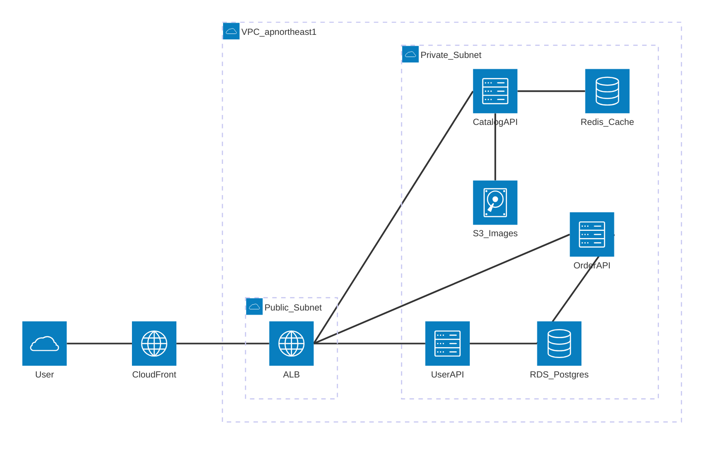

# AWS 上の EC サイト構成図

## 題材

AWS 上にデプロイされた EC サイトのバックエンド構成を可視化する。ALB 配下に複数の API コンテナを配置し、RDS / ElastiCache / S3 を利用する典型的な Web アプリケーション構成である。

## 前提

- クラウド: AWS (リージョン `ap-northeast-1`)
- 実行基盤: ECS on Fargate
- 利用者はブラウザから HTTPS で接続し、CloudFront 経由で配信される
- 本図では同期的なリクエスト経路のみを描き、非同期イベント / バッチ経路は別図とする

## 抽象度レベル

**L2: コンテナレベル** (C4 モデルの Container 図に相当)。デプロイ単位 (ALB / ECS サービス / マネージドデータストア) を 1 ノードとして配置し、内部のクラスやモジュールには立ち入らない。

## 構成図

## 解説

- **グルーピング**: `vpc` → `public_sn` / `private_sn` の 2 階層構成。VPC 境界とサブネット境界を視覚的に明示することで、セキュリティ境界が一目で把握できる。リージョンは図のキャプションおよび VPC ラベルで示し、ネストを浅く保っている (Mermaid `architecture-beta` の現行実装では 3 階層ネストが安定しないため)。
- **ラベル表記の制約**: `architecture-beta` のパーサはラベル `[...]` 内に CJK (日本語) 文字・空白・`/`・`.`・`-` を含めるとエラーになる。そのため `注文API` → `OrderAPI`、`RDS PostgreSQL` → `RDS_Postgres` のように ASCII のアンダースコア区切りで統一し、和名は図のキャプションや解説文側で補っている。日本語ラベルが必須の場合は flowchart で描き直すという代替手段を取る。
- **アイコンセットの統一**: 組み込みアイコン (`cloud` / `internet` / `server` / `database` / `disk`) のみを使用し、`logos:*` 等のベンダーアイコンと混在させていない。
- **サービス数**: 全 11 ノード (利用者・CloudFront・ALB・3 つの API・RDS・Redis・S3) で、推奨上限 15 ノードに収まっている。命名は `*_api` で揃えている。
- **方向統一**: 利用者リクエストの主方向を **L → R** に統一。CDN → ALB → API → データストアの順で視線が左から右へ流れるよう接続点 (`:R` / `:L`) を指定している。S3 への書き込みのみ性質が異なるため `B → T` を例外的に使用している。
- **抽象度**: すべてデプロイ単位 (コンテナ・マネージドサービス) で揃えており、ドメインクラスやコードレベルの要素は混在していない。L1 (システムコンテキスト) や L3 (コンポーネント) を見たい場合は別図を作成する。
- **対象外**: 非同期通信 (SQS / Worker / SES など) は本図に含めず、関心事別に図を分割する方針としている。
