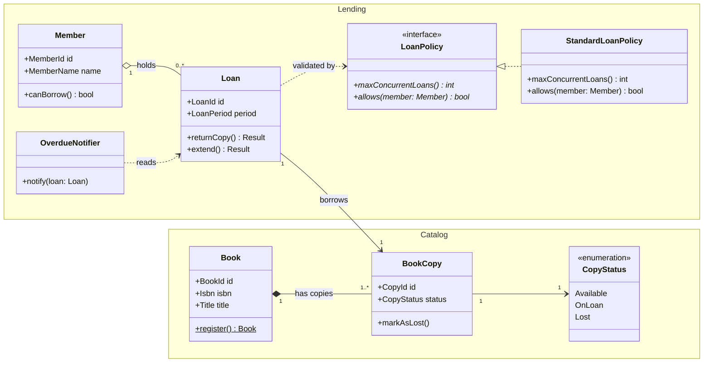

# 図書館書籍貸出ドメインのクラス図

## 題材

地域図書館システムにおける **書籍貸出 (Lending) ドメイン** と、それを支える **蔵書カタログ (Catalog) ドメイン** のモデルを示す。利用者 (Member) が書籍 (Book) の特定のコピー (BookCopy) を借り受け、貸出 (Loan) として記録する、という DDD 風のドメインモデルである。

## 前提

- 本図は **ドメイン層の静的構造** のみを示し、永続化やコントローラ層は含まない。
- 利用者・書籍・貸出の **公開 API と ID 属性** だけを載せ、メタ情報 (createdAt 等) は省略している。
- 同じ書籍 (Book) には複数の物理コピー (BookCopy) が存在する、という現実の図書館の不変条件をモデル化する。

## 解説

- **namespace によるグルーピング**: `Catalog` (蔵書) と `Lending` (貸出) という 2 つのサブドメインを `namespace` で囲み、責務境界を視覚化した。`Loan --> BookCopy` のように namespace をまたぐ関係はレビュー時の注目点となる。
- **継承/実現**: `LoanPolicy <|.. StandardLoanPolicy` は実現 (点線+白三角) で、インタフェース `<<interface>>` の実装関係を表す。本図には継承 (`<|--`) は登場しないが、抽象クラス階層を導入する場合は同じく矢の頭を「親側」に揃える。
- **コンポジション**: `Book "1" *-- "1..*" BookCopy` は強い所有を示す。Book の登録が削除されると、その物理コピーも論理的に存在しなくなるためコンポジションを選択している。多重度 `1..*` で「Book には必ず 1 冊以上のコピーが存在する」という不変条件を明示。
- **集約**: `Member "1" o-- "0..*" Loan` は弱い所有。Member が退会しても過去の Loan 記録は監査用途で残るため、コンポジションではなく集約 (白菱形) を用いる。
- **関連**: `Loan --> BookCopy`、`BookCopy --> CopyStatus` は単なる参照保持。Loan は BookCopy をフィールドとして持つが、その所有権は持たない。
- **依存**: `Loan ..> LoanPolicy` と `OverdueNotifier ..> Loan` は点線矢印で「一時的に使用するだけ」を表現。Loan は検証時にのみ LoanPolicy を呼び出し、OverdueNotifier は Loan を読み取るだけで保持しない。
- **可視性と型表記**: 公開メンバーのみを `+` で表示し、`register()$` は static、`maxConcurrentLoans()*` は abstract を示す。型は `属性名 型` 形式で Java 風に統一。
- **多重度**: 全ての関連線に `"1"` `"0..*"` `"1..*"` を付与し、`1:N` か `N:N` かが図だけで判断できるようにしている。
- **ステレオタイプ**: `<<interface>>` (LoanPolicy)、`<<enumeration>>` (CopyStatus) を明示し、通常クラスと一目で区別できるようにした。
- **矢の頭の統一**: 継承/実現系は常に「抽象側」、関連/依存系は「参照される側」に矢の頭を向け、図全体で方向を統一している。
