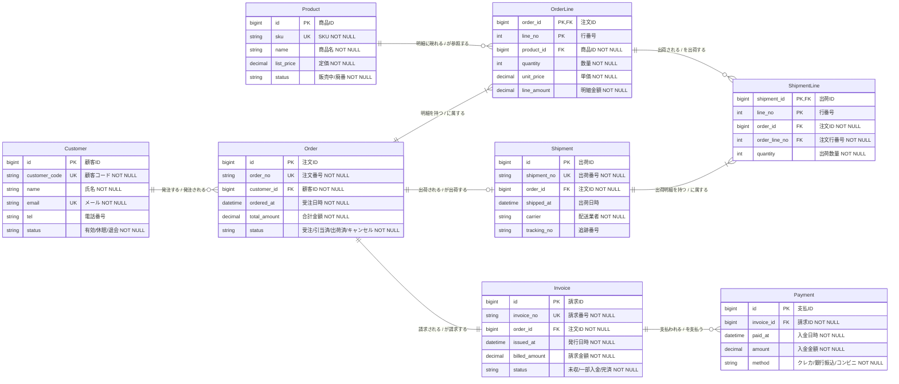

# ECサイト 受注ドメインの論理 ER 図

## 題材

中規模 EC サイトにおける **受注ドメイン (Sales Context)** のデータモデル。顧客が商品を発注し、注文明細・出荷・請求・支払までを 1 枚の論理 ER 図で俯瞰する。

## 前提

- 図の用途: **論理 ER 図** (基本設計書向け)。物理 DDL の直前ではない
- スコープ: 受注ドメインのみ。在庫マスタや会計仕訳は別図 (コンテキストマップで連携)
- 命名規則: エンティティは **単数形 PascalCase**、物理列名は snake_case
- 型は SQL 型 (`bigint`, `varchar`, `decimal`, `datetime`) で統一
- 監査列 (`created_at` / `updated_at` / `deleted_at`) は論理 ER 図のため省略
- 関係はすべて Crow's Foot 多重度 + 動詞句ラベル (両方向から読めるよう統一)

## 図

## 解説

### エンティティ構成 (8 個)

集約ルートである `Order` を中心に、上流に顧客マスタ (`Customer`) と商品マスタ (`Product`)、下流に出荷 (`Shipment` / `ShipmentLine`)、請求 (`Invoice`)、支払 (`Payment`) を配置している。エンティティ数は 8 で、論理 ER 図の上限 (10 程度) に収まるよう在庫や会計は意図的に切り出した。

### 多重度の意味

- `Customer ||--o{ Order`: 1 顧客は 0 件以上の注文を持つ。新規登録直後の未発注顧客も許容するため `o{`
- `Order ||--|{ OrderLine`: 注文には必ず 1 行以上の明細が必要 (`|{`)。空注文は業務上ありえない
- `Product ||--o{ OrderLine`: 商品は明細から参照されるだけで、未注文商品 (0 件) もある
- `Order ||--o| Shipment`: 1 注文に対し出荷は 0 または 1 (分割出荷は本スコープ外)
- `Order ||--|| Invoice`: 1 注文に対し請求は必ず 1 件発行される
- `Invoice ||--o{ Payment`: 分割入金を許容するため 0..多

### キー設計のポイント

- すべてのエンティティに代理キー `id PK` を置き、業務的な識別子は `UK` (`order_no`, `sku`, `email` 等) で重複防止
- `OrderLine` / `ShipmentLine` は **複合主キー** (`PK,FK` + `line_no`) で親に従属する識別関係を表現
- `ShipmentLine` は `OrderLine` を `(order_id, order_line_no)` の複合 FK で参照し、何の明細を出荷したかを追跡

### 関係ラベルの統一

すべての関係に `"左から読む / 右から読む"` 形式の動詞句ラベルを付与した。例えば `Customer ||--o{ Order : "発注する / 発注される"` は、左から読めば「顧客は注文を発注する」、右から読めば「注文は顧客から発注される」と双方向に成立する。これにより読者がどちら側から辿っても業務的意味が壊れない。

### この図に載せていないもの

監査列、住所マスタ、在庫引当、会計仕訳、配送先テーブルなどは意図的に省略している。これらは別のサブジェクトエリア図 (在庫管理 / 会計 / 顧客マスタ) に分離し、コンテキストマップで全体関係を別途示す方針である。論理 ER 図 1 枚に詰め込むと線が交差して読めなくなるためである。
