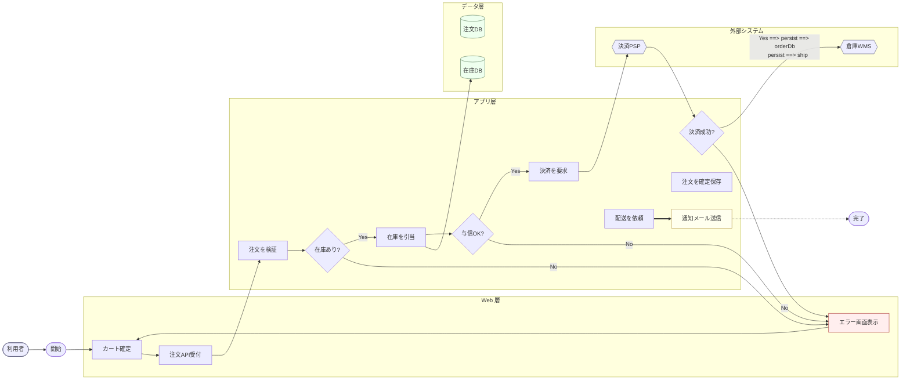

# ECサイト 注文処理フロー サンプル

## 図の題材

オンラインECサイトにおける「カート確定から注文完了まで」の処理フローを題材にする。利用者の操作起点で始まり、在庫引当・与信・決済・配送手配・通知までの一連の処理を 1 枚で俯瞰できることを狙う。

## 前提・コンテキスト

- 対象ドメインは BtoC のECサイト (中規模、月間注文 10 万件程度)
- アーキテクチャは Web 層 / アプリ層 / データ層の 3 層構成
- 決済は外部 PSP (Payment Service Provider) に委譲
- 配送指示は外部 WMS (倉庫管理システム) に連携
- 在庫が不足した場合や与信 NG の場合は、利用者にエラーを返してカート画面へ戻す
- 通知メールはハッピーパス完了時のみ非同期で送信

## フロー図

## 図の解説

### レイアウトとグルーピング

- 方向は **LR** を採用した。ノード数が 20 前後あり、横長のドキュメントで縦スクロールを抑えるため (ルール「方向 (TD / LR) の選び方」)。
- `subgraph` で「Web 層 / アプリ層 / データ層 / 外部システム」の 4 つに分割し、責務境界を視覚化した (ルール「subgraph によるグループ化」)。subgraph 名はすべて名詞で短く、内部は `direction TB` で縦に並べて層内のまとまりを強調している。
- ネストは 1 階層に留め、2 階層を超えていない。

### ノード形状の意味付け

- 開始/終了は角丸 `([ ])` で 1 組のみ (`start` と `done`)。
- 通常の処理は長方形 `[ ]`。
- 判定はすべてひし形 `{ }` で統一 (`stockChk`, `creditChk`, `payResult`)。長方形に「?」を入れて判定に使うアンチパターンを避けた。
- DB は円柱 `[( )]` で揃えた (`orderDb`, `stockDb`)。
- 外部システムは六角形 `{{ }}` (`psp`, `wms`)、外部利用者はスタジアム `([ ])` で表現。

### 色 (classDef) の使い方

- `classDef` を 4 種類だけ定義し、個別 `style` は使っていない (ルール「色・スタイルの指針」)。
  - `ext`: 外部 (利用者・PSP・WMS)
  - `store`: データストア
  - `danger`: エラー経路
  - `async`: 非同期処理 (通知メール)
- 色は意味の差異を示すためだけに使い、4 色以内に抑えている。中間トーンを選びダーク/ライト両モードでも読めるようにした。

### エッジの使い分け

- ハッピーパス (決済成功以降) は `==>` で太線にし、主経路を視覚的に強調 (ルール「矢印の種類は意味で使い分ける」)。
- 通知メールから完了への遷移は非同期なので `-.->` を使用。
- 判定ノードの出口にはすべて `Yes / No` ラベルを付与し、分岐の意味を明示。
- 戻り矢印 (`errView --> cart`) は左向きに 1 本だけ集約し、ジグザグや交差を避けた。

### 命名規則

- ノード ID は英数字 (`validateOrder` 系の命名)、ラベルだけ日本語にして差分管理しやすくした。
- ラベルはすべて 15 文字以内で、判定は疑問形 (「在庫あり?」「与信OK?」)、処理は「動詞 + 目的語」(「注文を検証」「在庫を引当」) に統一している。

### 規模感

- ノード 21、subgraph 4、エッジ 23 で、ルールの目安 (ノード 15 / subgraph 4 / エッジ 25) に概ね収まっている。これ以上ノードが増える場合は「俯瞰図」と「サービス別詳細図」に分割する方針が望ましい。

### 対応するルール項目

| 観点 | 適用したルール |
| --- | --- |
| 方向 | LR を選択 (横長ドキュメント向け) |
| グルーピング | 4 つの subgraph、ネスト 1 階層 |
| 形状 | 開始終了/処理/判定/DB/外部 を形状で区別 |
| 命名 | ID 英数字 + 日本語ラベル、スタイル統一 |
| 色 | classDef 4 種、意味の差異のみに使用 |
| エッジ | `==>` 主経路、`-.->` 非同期、Yes/No ラベル |
| 交差回避 | 戻り線を 1 本に集約、左→右一方向 |
| 規模 | 目安内に収め、凡例代わりに classDef で意味付け |
