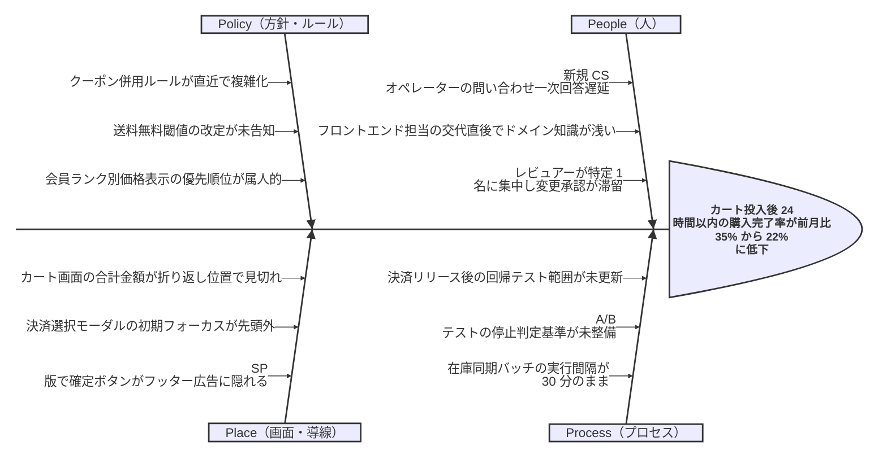
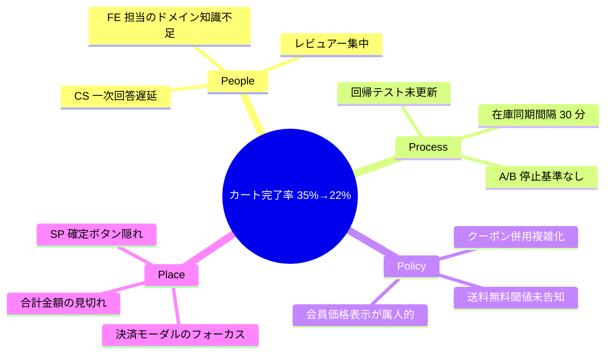

# ECサイトのカート離脱率上昇に関する特性要因図

## 題材

大手アパレル ECサイト「StyleMart」において、直近 1 か月でカート投入後の購入完了率が大きく低下している。マーケティング部門・開発部門合同のふりかえり会で、原因を網羅的に洗い出すために特性要因図を作成する。

## 特性（問題）の明確化

> **カート投入後 24 時間以内の購入完了率が、前月比で 35% から 22% に低下（p95 で計測、PC / SP 合算）**

- 観測可能・測定可能: GA4 のファネルレポートで日次計測済み
- 1 つに絞る: 「売上低下」「直帰率」等は別の図で扱う
- 症状ベース: 「決済が遅いから離脱する」等の原因は含めない
- 時制・対象を明示: 直近 1 か月、PC / SP 両チャネル、購入完了ファネル

## 採用フレームワーク

サービス業向けの **4P（People / Process / Policy / Place）** を採用する。実店舗を持たないオンライン EC では「Place」を「画面・導線（UI/UX 上の場所）」と読み替えて運用する。製造業向け 4M ではサービス特性を捉えにくいため、本図では 4P で統一する。

## Ishikawa 図（Mermaid v11.12.3+ 構文）

## mindmap 版（v11.12.3 未満のレンダラ向け代替）

## 解説

### カテゴリー統一

大骨はすべて 4P（People / Process / Policy / Place）で統一しており、独自軸や 4M を混在させていない。これにより議論軸が一意になり、レビュー時にも「どの大骨に該当するか」で迷いにくい。

### 2〜3 階層の因数分解

本図は **大骨（4P）→ 中骨（具体要因）** の 2 階層構成にとどめている。「なぜなぜ分析」を 1 段だけ深めた粒度であり、必要に応じて Place の「SP 版で確定ボタンがフッター広告に隠れる」だけを別図で 3 階層目まで深掘りする運用を想定する。これは Ishikawa ルールが推奨する「4 階層以上は別図に切り出す」方針に沿う。

### MECE への配慮

- 「レビュアーが特定 1 名に集中」は People に寄せ、Process（レビュー運用）には書かない（重複回避）。
- 「送料無料閾値」は Policy に置き、Place（表示位置）と切り分けている。
- 「在庫同期バッチ」は技術的事象だが、設定値の運用判断であるため Process に分類した。

### 解決策の非混入

「クーポン併用ルールを簡素化する」「SP 確定ボタンを固定表示にする」等の対策案は、本図には一切記載していない。これらは別途まとめる **対策表 / アクションリスト** 側で扱う。Ishikawa は「原因を MECE に列挙する」ためのものであり、解決策の場ではないというルールを徹底している。

### 特性の書き方

魚の頭にあたる特性は「カート離脱が増えた」のような曖昧表現を避け、**計測指標・期間・チャネル** を含めて 1 文で記述している。これにより、後日同じ指標で改善効果を測定できる。

### レビュー時のチェック結果

- 特性は 1 つで測定可能 ✔
- 4P で大骨統一 ✔
- 解決策の混入なし ✔
- 階層は 2 階層（3 階層以内）✔
- 重複要因なし ✔
- 骨の総数 12 本（30 本以内）✔
- すべて「原因」記述 ✔
- v11.12.3+ 構文と mindmap 代替を併記 ✔
