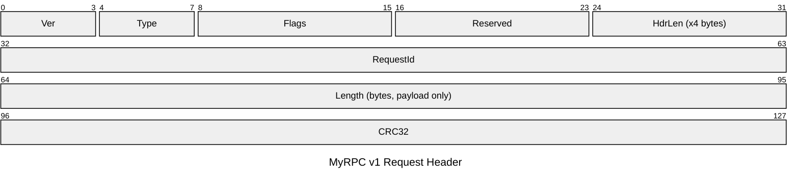

# MyRPC v1 リクエストヘッダ パケット図

## 題材

社内向け軽量 RPC プロトコル **MyRPC v1** のリクエストヘッダ (固定長 16 バイト = 128 bit)。ペイロード本体は別途 `Length` フィールドで示されるバイト数だけ後続する。

## 前提

- バイトオーダー: **big-endian (network byte order)**
- ビット番号付与: **MSB = 0** (RFC 流儀)
- 行幅: **32 bit/行で統一**
- ヘッダ全長: 128 bit (16 バイト) 固定
- バージョン: v1 (`Ver = 1`)

## パケット図

## フィールド補足表

| Offset (bit) | Field | Type | 説明 | 既定値 |
| --- | --- | --- | --- | --- |
| 0-3 | Ver (Version) | uint4 | プロトコルバージョン番号。現行は 1。 | 1 |
| 4-7 | Type (Message Type) | uint4 | メッセージ種別。0=Request, 1=Response, 2=Notify, 3=Ping, 4=Pong (5-15 は将来拡張用予約)。 | 0 |
| 8-15 | Flags | uint8 | ビットフラグ集合。bit8=COMPRESSED, bit9=ENCRYPTED, bit10=URGENT, bit11=TRACE, bit12-15=Reserved (MBZ)。 | 0x00 |
| 16-23 | Reserved | uint8 | 予約領域。送信側は 0 をセットし、受信側は無視する (MBZ: Must Be Zero)。 | 0x00 |
| 24-31 | HdrLen (Header Length) | uint8 | ヘッダ長を 4 バイト単位で表現。固定 16 バイトのため常に 4。将来の拡張ヘッダ導入時に変動する余地を残す。 | 4 |
| 32-63 | RequestId | uint32 | リクエスト識別子。クライアントがユニークに採番し、レスポンスで同値が返る。 | (採番) |
| 64-95 | Length (bytes) | uint32 | 後続ペイロードのバイト数 (ヘッダは含まない)。0 も許容。最大 2^32 - 1。 | 0 |
| 96-127 | CRC32 | uint32 | ヘッダ + ペイロードに対する CRC-32 (IEEE 802.3 多項式)。計算時 CRC32 フィールドは 0 として扱う。 | (計算値) |

### 略語展開

- **Ver**: Version
- **HdrLen**: Header Length
- **MBZ**: Must Be Zero
- **CRC32**: Cyclic Redundancy Check (32-bit, IEEE 802.3)
- **RPC**: Remote Procedure Call

## 解説

### 設計意図

- **32 bit 境界で完結**: 4 行 × 32 bit = 128 bit の固定長ヘッダとし、`Ver`/`Type`/`Flags`/`Reserved`/`HdrLen` を 1 行目に詰めた。ニブル境界 (4 bit) と バイト境界 (8 bit) のみを使い、境界をまたぐフィールドは作らない。これにより、図と表の区切りが完全一致する (Bad 例 2 で挙げられた事故を防ぐ)。
- **HdrLen を 4 バイト単位にした理由**: 現状は固定 16 バイト (= 4) だが、将来 TLV 形式の拡張ヘッダを追加する余地を残す。IPv4 の IHL と同じ思想。
- **Reserved の明示**: 8-15 bit 内の Flags 上位 4 bit と、16-23 bit の 1 バイト全体を予約領域として明示している。「あとで使うかもしれないから空けておく」を口頭ではなく図と表で合意する。
- **CRC32 をヘッダ末尾に配置**: 受信側はヘッダを読みきってから検証できる。CRC 計算時は CRC32 フィールドを 0 と見做す慣習に従う。

### バイトオーダーの注意

すべてのマルチバイト整数 (`RequestId`, `Length`, `CRC32`) は **big-endian** で送出する。x86 ホスト上で構造体をそのままメモリダンプすると little-endian になるため、シリアライズ時に必ず `htonl` 相当の変換を行うこと。

### 可変長ペイロードの扱い

ペイロードはこのヘッダの直後に `Length` バイト続くが、Packet 図には含めていない。可変長を Packet 図で誤魔化さない (作法書きのアンチパターン参照) ため、ペイロード構造は別ドキュメント (メッセージ別の TLV 仕様書) で規定する。

### チェックリストとの対応

- [x] title あり (対象・バージョン・全長を明示)
- [x] バイトオーダーと MSB/LSB の方向を冒頭で宣言
- [x] 行幅 32 bit で統一
- [x] Reserved を省略せず、MBZ ルールを表に記載
- [x] 可変長ペイロードはヘッダ図に含めず別途規定
- [x] 図直後に Offset / Field / Type / 説明 / 既定値 表
- [x] 略語を表で展開
- [x] 図と表の区切りが一致 (すべてニブル/バイト境界)
