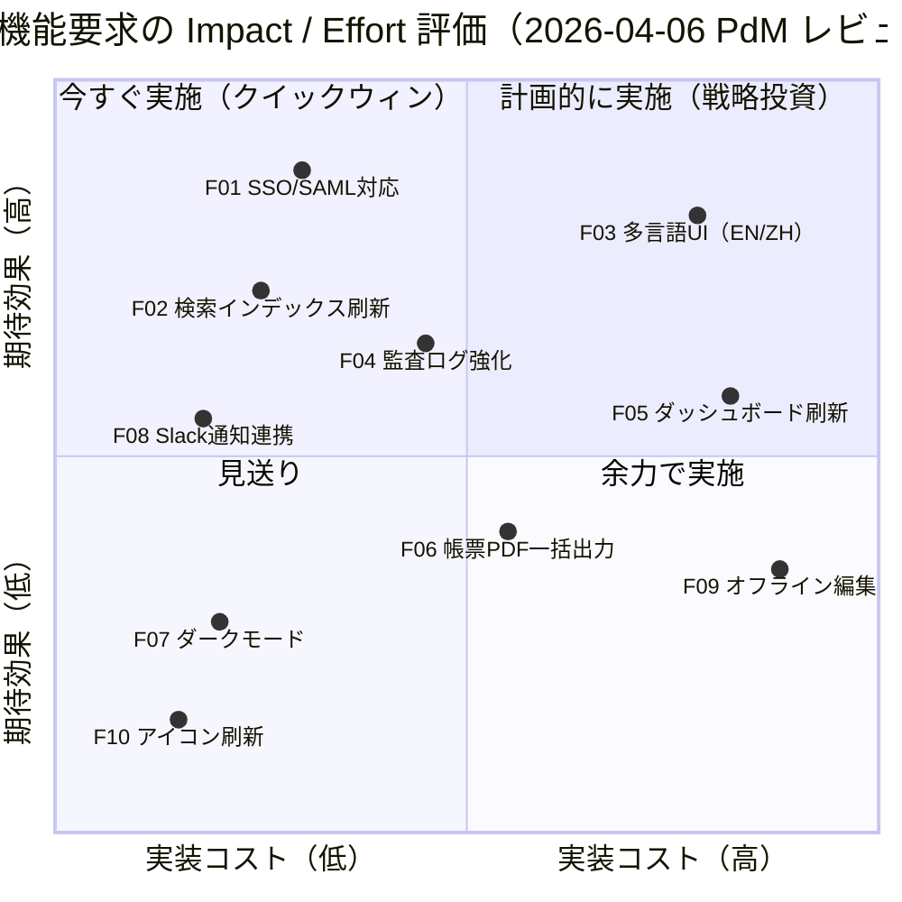

# 機能要求の Impact / Effort 分析

## 題材

社内向け業務 SaaS「Orbit」の 2026 年度上期バックログに積まれた機能要求 10 件について、開発工数と期待ビジネス効果の二軸で分類し、次スプリント以降の着手順位を決定する。

## 前提

- 評価日: 2026-04-06
- 評価者: PdM 1 名 + テックリード 2 名 + UX デザイナー 1 名（4 名合議）
- 対象範囲: プロダクトバックログのうち P1/P2 タグが付いた 10 件
- 数値は関係者合意による相対評価であり、絶対的な金額・人日ではない
- 既存契約上必須となる法令対応項目はこの分析の対象外とする

## 軸の定義と測定方法

| 軸 | 内容 | 測定方法 |
| --- | --- | --- |
| X 軸: 実装コスト | 設計・実装・テスト・リリースまでの総工数。インフラ追加や外部ベンダー調整も含む | T シャツサイズ（XS=0.1, S=0.25, M=0.45, L=0.7, XL=0.9）に換算 |
| Y 軸: 期待効果 | 売上貢献・解約率低下・運用コスト削減を統合した相対インパクト | 各観点を 5 段階で採点し平均を 0〜1 に正規化 |

二軸は独立で、低コストでも高効果な「クイックウィン」と、高コストかつ低効果な「見送り候補」を明確に切り分けられる。

## 図

## 解説

- **クイックウィン（左上）**: F01 SSO/SAML、F02 検索刷新、F08 Slack 連携、F04 監査ログ強化。低コストで効果が高いため、次スプリントから順次着手する。特に F01 はエンタープライズ商談 3 件の受注条件であり最優先。
- **戦略投資（右上）**: F03 多言語 UI、F05 ダッシュボード刷新。コストは大きいが効果も高いため、半期計画にロードマップ化し、設計フェーズを先行させる。F03 は翻訳 PoC を 2 週間で実施し再評価する。
- **余力で実施（右下）**: F06 帳票 PDF、F09 オフライン編集。要望はあるがコストに対して効果が限定的。エンジニア空き枠が出た場合のみ実施し、それまでは Backlog に保留。
- **見送り（左下）**: F07 ダークモード、F10 アイコン刷新。利用者要望は散発的で KPI への寄与が小さいため、今期はクローズし、次回再評価まで凍結する。

なお本図は相対評価であり、座標値そのものに意味はない。再評価は 2026-07 の中間レビューで実施し、市場・契約状況の変化に応じて点を動かす。
