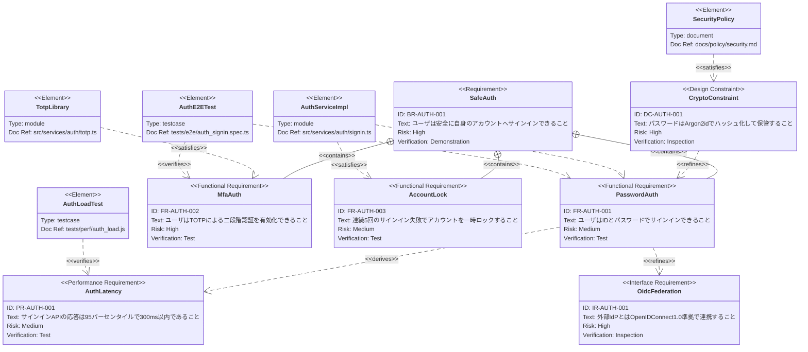

# 認証システムの要件トレーサビリティ

## 題材

社内 SaaS の **認証システム (AuthN/AuthZ)** を題材に、ビジネス要件から派生した機能要件・性能要件・インタフェース要件・設計制約を一枚に整理し、設計モジュールおよびテストケースとのトレーサビリティを示す。

## 前提

- 対象は Web ブラウザおよびモバイルアプリから利用される認証 API
- 個人情報保護法および社内セキュリティ規程の対象
- 要件 ID は採番台帳で一意管理されており、本図ではそのうち認証ドメインのものを抜粋
- `element` の `docref` はリポジトリ内の実在パスを指す
- 矢印の方向は「上位要件 → 下位要件」「element → 要件」に統一

## 解説

- **種別の使い分け**: 最上位の `BR-AUTH-001` のみ汎用 `requirement` とし、配下は `functionalRequirement` / `performanceRequirement` / `interfaceRequirement` / `designConstraint` で粒度を明示している。一枚に詰め込みつつも、種別で視覚的にレイヤを分離。
- **4 点セットの徹底**: すべての要件に `id` / `text` / `risk` / `verifymethod` を記入。`verifymethod` は、性能要件は `Test`、制約は `Inspection`、UX 系の最上位要件は `Demonstration` という定石に従う。
- **ID 命名規則**: `BR-` / `FR-` / `PR-` / `IR-` / `DC-` のプレフィックスでひと目で種別がわかり、`AUTH` ドメインを中段に置いて連番をゼロパディング。
- **関係の使い分け**:
  - `contains`: ビジネス要件 → 機能要件への分解
  - `derives`: 機能要件から論理的に導出された性能要件
  - `refines`: 設計制約による具体化、および外部連携仕様による詳細化
  - `satisfies`: 設計モジュールやポリシー文書が要件を充足
  - `verifies`: テストケースが要件を検証
- **方向の統一**: `contains` / `derives` / `refines` は上位 → 下位、`satisfies` / `verifies` は element → 要件で SysML 慣習にそろえている。
- **element と docref**: モジュール、テストケース、ポリシー文書の 3 種の `type` を用い、`docref` には実在するリポジトリ内パスを記載。これにより図がそのままトレーサビリティ索引として機能する。
- **規模管理**: 要件 7 件 + element 5 件に抑え、認可 (AuthZ) や監査ログ要件は別図に切り出す前提。30 件を超えそうになったらドメインで分割するという原則に従っている。
- **識別子の命名**: Mermaid の `requirementDiagram` パーサは要件名・element 名に日本語や空白を含めると関係定義側でトークン解釈に失敗するため、ノード名は ASCII 識別子 (`SafeAuth` / `PasswordAuth` / `MfaAuth` / `AuthLatency` / `OidcFederation` / `CryptoConstraint` / `AccountLock`、element は `AuthServiceImpl` / `TotpLibrary` / `AuthE2ETest` / `AuthLoadTest` / `SecurityPolicy`) に統一し、日本語の説明は各要件の `text` フィールドに寄せている。`id` / `text` / `docref` は明示的にダブルクオートで括り、パーサ互換性を確保している。
