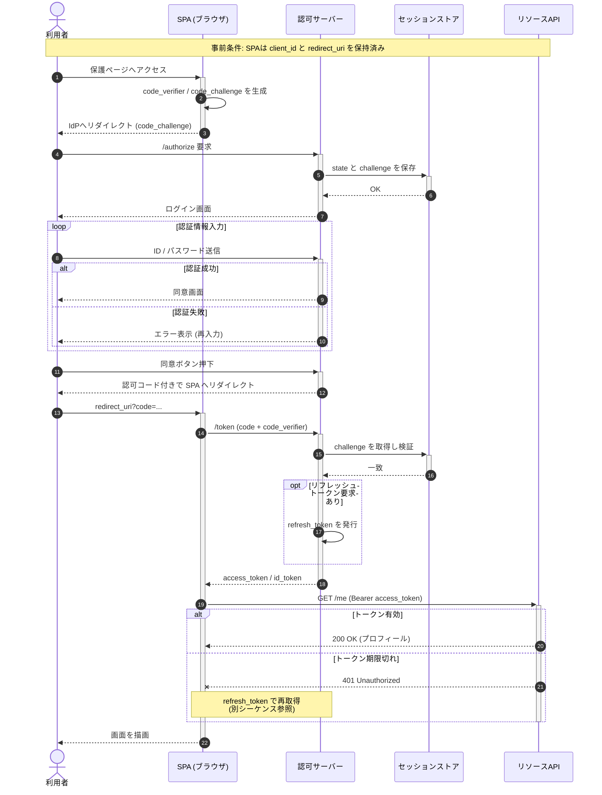

# OAuth2 認可コードフロー (PKCE 付き) シーケンス図

本ドキュメントでは、シングルページアプリケーション (SPA) が OAuth2 認可コードフロー + PKCE を用いて認可サーバーからアクセストークンを取得し、リソースサーバーの保護 API を呼び出す一連の流れを、Mermaid シーケンス図で示す。

## 前提

- 利用者はブラウザで SPA を操作する。
- 認可サーバー (IdP) は OpenID Connect 準拠で、PKCE (S256) をサポートする。
- リソースサーバーは Bearer トークンを検証して保護リソースを返す。
- セッションストア (Redis) は IdP 側でステート/PKCE 検証用に利用される。
- ネットワーク往復のうち、本筋に関係しないキャッシュ参照やログ書き込みは省略する。

## シーケンス図

## ルール適用解説

本図がスタイルガイドのどの項目をどう適用しているかを示す。

### 2. 参加者の並び順と命名
- 左から **利用者 → SPA → 認可サーバー → セッションストア → リソースAPI** の順で配置し、矢印の流れが基本的に左→右となるよう設計した (2.1)。
- 人間である利用者のみ `actor`、その他はシステムなので `participant` を使用 (2.2)。
- 役割名で命名し、`as` でエイリアス (`SPA`, `IdP`, `RS`) を付与して矢印行を短く保った (2.3)。参加者数は 5 で 7 個以下のチェックリスト項目を満たす。

### 3. メッセージ矢印種別
- 同期要求は `->>`、応答は `-->>` を基本とし、対で記述 (3 節)。
- トークン期限切れの応答無し失敗ケースでは `--x` を意図的に使用 (3 節 / 11.6 と同様)。

### 4. activate / deactivate
- ショートカット記法 `+` / `-` を用い、SPA、IdP、リソースAPI の同期入れ子を可視化。`activate`/`deactivate` の対は崩れないように記述している。

### 5. alt / opt / loop
- `loop 認証情報入力` で繰り返しを表現し、ラベルに意図を明記 (5 節)。
- 認証成功/失敗を `alt` … `else` で表現。
- リフレッシュトークン発行は任意処理なので `opt` を使用。
- 401 応答時の代替フローも `alt` … `else` で表現。
- ネストは最大 2 段 (loop の内側に alt) に抑えている。

### 6. Note
- `Note over U,RS` で事前条件を全体に明示。
- `Note over SPA,IdP` でリフレッシュフローへの参照を補足。Note は 2 個に抑え、5 個以下のガイドを遵守。

### 7. 自己呼び出し
- `SPA->>SPA: code_verifier / code_challenge を生成` は PKCE 仕様上意味のある業務処理なので自己呼び出しを許容 (7.1)。
- `IdP->>IdP: refresh_token を発行` も同様。

### 8. autonumber
- 仕様書本文から「(12) の /token 要求で…」のように参照可能とするため `autonumber` を有効化 (8 節)。

### 9. 大規模化への対処
- メッセージ数は約 22 で「20 メッセージ程度」の目安に収めている。
- リフレッシュトークンによる再取得フローは Note で別シーケンスへ委譲し、本図の責務を「初回認可コードフロー」に限定 (9.5)。

### 10. アンチパターン回避
- 参加者は 5 個 (≤7)。
- 矢印の逆流なし。
- 同期要求と応答が対になっている。
- `--x` を「タイムアウト/失敗」の意図でのみ使用。
- 実装名 (`SpaControllerImpl` 等) のリークなし。
- autonumber と手動番号の併用なし。
