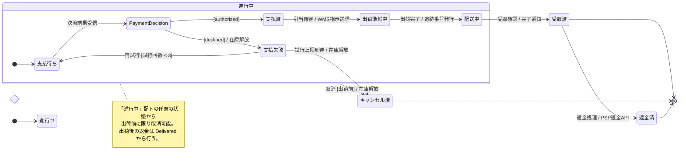

# 注文ライフサイクル ステート図サンプル

## 題材

EC サイトにおける「注文 (Order)」エンティティのライフサイクル。受注から出荷・配送・完了までの正常系と、キャンセル・支払失敗・返金等の例外系を 1 枚のステート図で表現する。

## 前提

- 主語は注文 1 件 (Order Aggregate)。
- イベントはユーザー操作 (注文確定・キャンセル) と外部システム連携 (決済 PSP、WMS、配送業者 Webhook) によって発生する。
- 「出荷前の処理中」をまとめる複合状態 `進行中` を設けることで、共通のキャンセル遷移を 1 本に集約する (アンチパターン 11.2 対策)。
- 状態数は 10、ネスト 1 階層、choice 1 とし、ルールの 15 状態 / 30 遷移以内に収める。
- 並行領域は本サンプルでは扱わず、可読性を優先する (並行領域の例はルール本文 6 章を参照)。
- 表記は `イベント [ガード] / アクション` の UML 標準形式に従う。

## 図



## 解説

- 開始 `[*] --> 進行中` と、3 つの終了 (`受取済 / キャンセル済 / 返金済 --> [*]`) を意味別に分離し、ライフサイクルの終端を明示している (ルール 2)。
- 状態は全て `state "日本語" as AsciiId` 形式で宣言し、図中の参照は ASCII の ID に統一。命名スタイルが揃うことで遷移行が読みやすくなる (ルール 3)。
- 状態名はすべて名詞句 (「支払済」「配送中」など) で揃え、動詞名や画面名を排除している (ルール 3)。
- 遷移ラベルは `イベント [ガード] / アクション` 形式を徹底し、列を揃えて記述することで grep もしやすい (ルール 4)。
- 共通の取消は `進行中 --> キャンセル済` の 1 本に集約し、「全状態からキャンセル」という遷移交差アンチパターン (11.2) を回避している。
- 複合状態は `進行中` の 1 階層のみとし、ネストを最小化 (ルール 5)。並行領域は意図的に省き、1 枚の図に詰め込みすぎないようにした (ルール 10)。
- `<<choice>>` の `支払判定` で `[authorized]` / `[declined]` の 2 分岐を表現 (ルール 7、3 分岐以内)。
- `direction LR` を採用し、ライフサイクルの時系列 (支払 → 出荷 → 配送 → 受取) を左→右に一直線に並べた (ルール 8)。
- `note` は「取消可能範囲」の 1 か所に限定し、補足に専念させた (ルール 9)。
- 状態数 10、遷移数 13、choice 1、ネスト 1 階層と、第 13 章チェックリストの全項目を満たす。
```

## 設計メモ: 旧版からの変更点

旧版は 1 枚に「進行中の複合状態」と「配送中の並行領域 (輸送状況 × 通知状況)」を同居させた結果、ネスト 2 階層・並行領域 2・cross-boundary 遷移が交差して視認性が落ちていた (ユーザー feedback: 「見づらい」)。本版では以下を改善した。

1. **並行領域を削除**: `配送中` 内の輸送/通知の並行領域はサンプル目的に対して情報量過多。並行領域の例はルール本文 6 章で十分説明されているため、サンプルからは外した。
2. **命名スタイルを統一**: 旧版は `state "..." as X` 形式と inline 日本語識別子 (`輸送中` 等) が混在していた。新版は全状態を ASCII ID + 表示名エイリアスに統一。
3. **cross-boundary 遷移を削減**: 旧版は `進行中 --> Cancelled` と `Paid --> Refunded` が複合状態の境界をまたいで交差していた。新版では `Refunded` は `Delivered` の後段に置き、返金を「受取後の正常な後処理」として直線上に配置。
4. **複合状態のネストを 1 階層に**: `進行中 > 配送中` の 2 階層をやめ、`配送中` をフラットに置いた。
