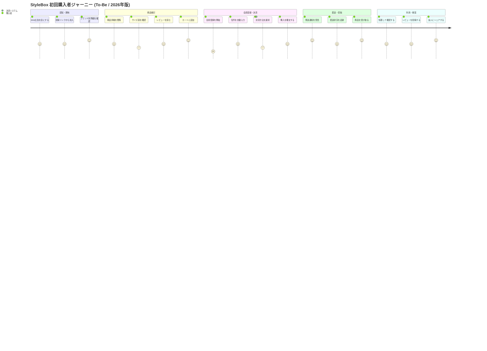

# オンラインショッピング初回購入体験ジャーニー (To-Be / 2026年版)

## 題材

アパレル EC サイト「StyleBox」における、SNS 広告で初めてブランドを知った 20 代女性が、商品をカートに入れて初回購入を完了し、商品到着後にレビューを投稿するまでの一連の体験を可視化する。新規ユーザの離脱要因を洗い出し、要件定義書 §3「想定利用シナリオ」の裏付けとして用いる。

## 前提

- 対象サイト: StyleBox EC (リニューアル後の To-Be 像)
- 調査出典: 2025 年 11 月 ユーザビリティテスト (N=18) + 既存購入ログ分析
- スコープ: 認知から初回レビュー投稿までの 1 サイクル (返品・再購入は対象外)
- デバイス: スマートフォン (iOS Safari) を主体とする
- 図のタスクは「初回購入者が一息で語れる行動」の単位で記述する

## ペルソナ

| 項目         | 内容                                                                 |
| ------------ | -------------------------------------------------------------------- |
| 氏名         | 佐藤 美咲 (仮名)                                                     |
| 年齢・職業   | 26 歳・都内 IT 企業の事務職                                          |
| ITリテラシー | スマホ中心。Amazon・楽天は週次利用、新規 EC は年数回                 |
| 動機         | Instagram 広告で気になるワンピースを見つけ、週末のデートに着たい     |
| 不安         | 初めてのサイトでの会員登録・決済、サイズ感、配送日数                 |

主役アクターは「購入者」で統一する。支援アクターとして必要に応じ「カスタマーサポート」「決済システム」を登場させるが、合計 3 種類以内に収める。

## スコア基準 (1〜5)

| スコア | 意味           | 目安                                       |
| ------ | -------------- | ------------------------------------------ |
| 5      | 快適・歓喜     | 期待を超え、友人に勧めたくなる             |
| 4      | 満足           | 想定通りスムーズで迷いがない               |
| 3      | 中立           | 可もなく不可もなし。我慢の許容範囲         |
| 2      | 不満           | 手間や不安を感じ離脱リスクあり             |
| 1      | 強い不満・離脱 | 購入を諦めるか、二度と使わないと感じる     |

本ドキュメント内のすべての User Journey 図は同じ基準を用いる。

## ジャーニー図

## 解説

### 着目ポイント

- **最低点は「会員登録を開始」(スコア 2)**: 初回購入者がメールアドレス確認やパスワード設定で離脱しやすい。テストでも 18 名中 4 名がここで一度離脱した。
- **谷の二番手は「サイズ表を確認」「決済方法を選択」(スコア 3)**: サイズ不安と、見慣れない決済オプション (BNPL 等) への戸惑いが原因。
- **山は「ブランド世界観を確認」「カートに追加」「発送通知」「商品受取」「シェア」(スコア 5)**: ブランド体験と物流体験が購入者の満足度を牽引している。

### 改善仮説と要件リンク

- 会員登録の谷 → 要件 **FR-021 (SNS 連携ワンタップ登録)** によりフォーム入力を撤廃し、スコア 2 → 4 を目標とする。
- サイズ表の中立 → 要件 **FR-034 (AI サイズレコメンド)** で過去購入履歴と身長体重から推奨サイズを提示し、3 → 4 を目標とする。
- 決済の中立 → 要件 **FR-042 (決済方法の比較ツールチップ)** で BNPL の手数料・支払日を可視化し、3 → 4 を目標とする。

### 留意事項

- 本図は To-Be 像であり、現行 (As-Is) との比較図は別途 §3.2 に掲載する。section 名とアクター名は As-Is 図と完全一致させ、左右比較を可能にしている。
- スコアはユーザビリティテスト (N=18) の発話プロトコル分析に基づく定性スコアであり、定量 KPI (CVR・離脱率) は別表 §3.3 を参照のこと。
