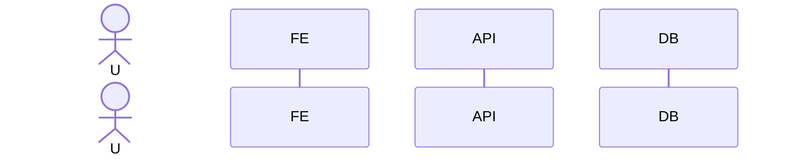
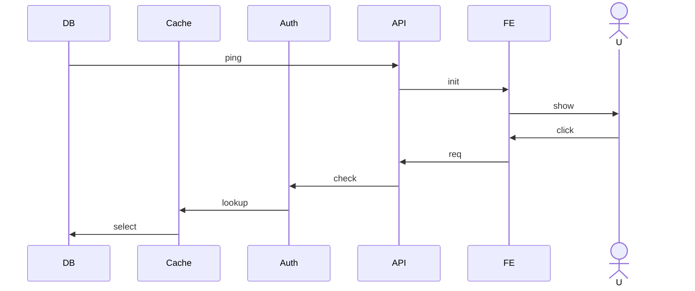
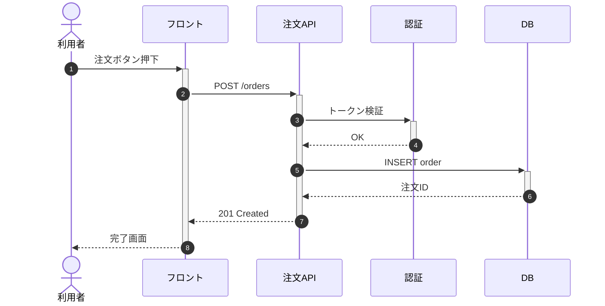
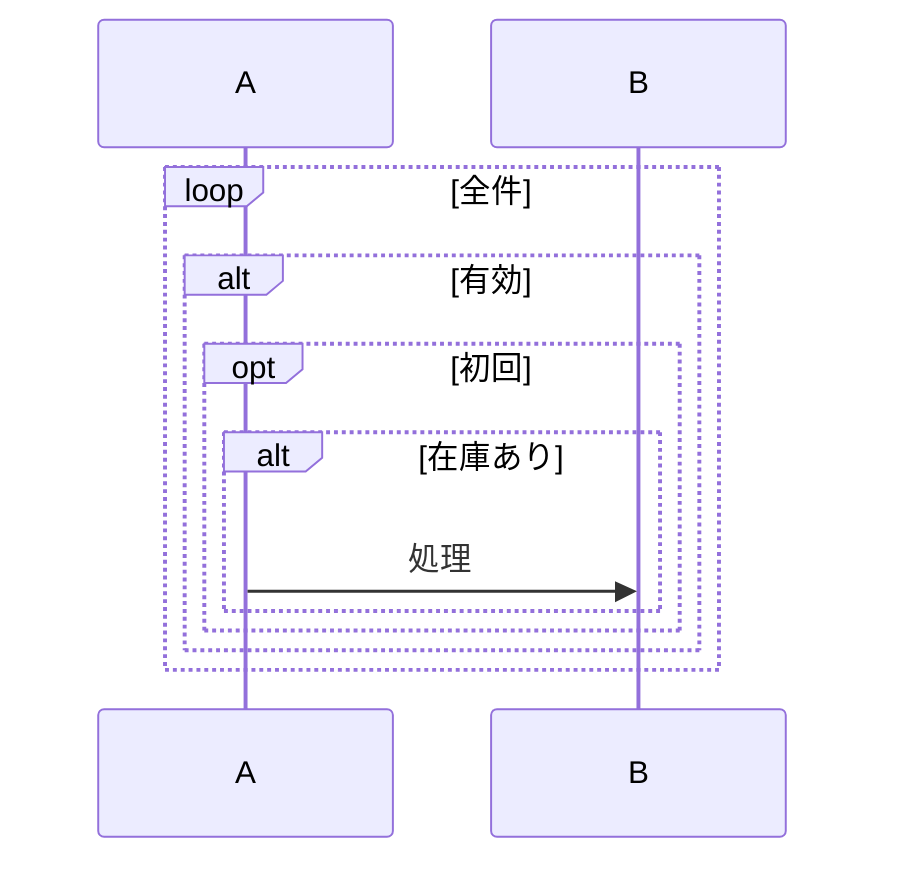
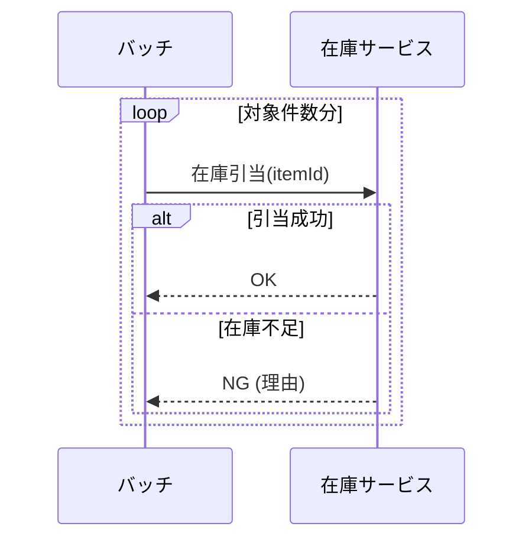
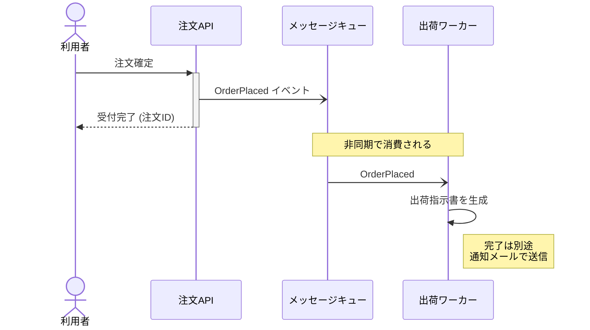
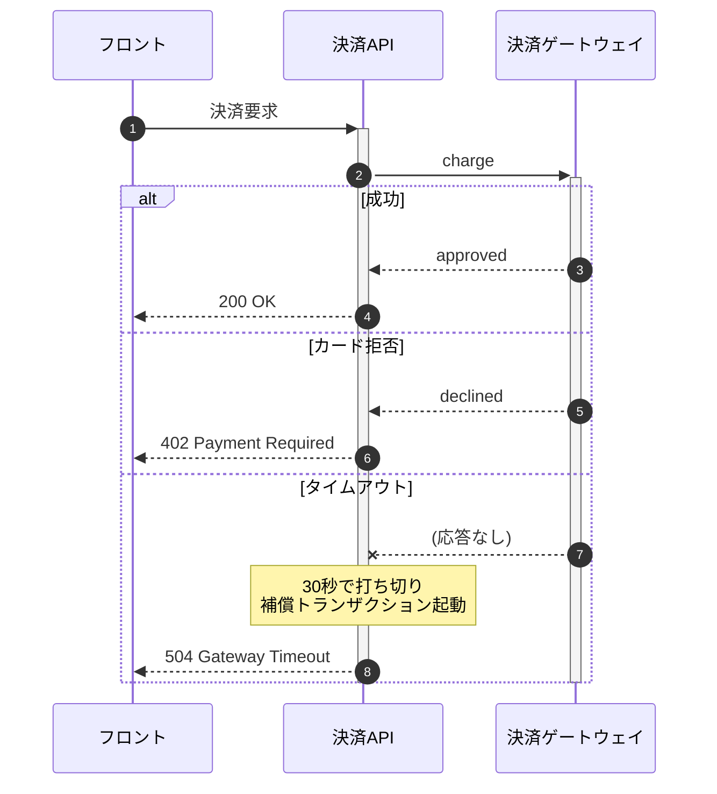

# 美しい Mermaid シーケンス図のためのルール

要件定義書・基本設計書など日本語ドキュメントに、大規模かつ可読性の高い Mermaid シーケンス図を埋め込むためのスタイルガイド。

---

## 1. 概要と用途

シーケンス図は、複数のアクター/コンポーネント間で **時系列に沿ったメッセージのやり取り** を表現する図である。Mermaid の `sequenceDiagram` を用いると、テキストで版管理可能な形式で記述できる。

主な用途:

- ユースケースのシナリオ記述 (正常系/異常系)
- API 呼び出しシーケンス、認証フロー
- 非同期メッセージング、イベント駆動の流れ
- 障害時のフェイルオーバーやリトライ手順

「**いつ**」「**誰が**」「**誰に**」「**何を**」伝えるかを明確にする図であり、状態や構造を表すには適さない (それぞれ状態遷移図/クラス図を使う)。

---

## 2. アクター/参加者の並び順と命名

### 2.1 並び順

- **左から右へ「起点 → 終点」の流れ** で配置する。ユーザー/外部システムを最左、データストアを最右に置くのが定石。
- 矢印が **基本的に左→右** に流れるよう参加者順を設計する。逆流が多い場合は順序を見直す。
- 参加者は明示的に最初に宣言する。Mermaid は登場順に自動配置するため、宣言順 = 表示順となる。

### 2.2 actor と participant の使い分け

| 種別 | 表示 | 用途 |
|---|---|---|
| `actor` | 棒人間 | 人間 (利用者・運用者・承認者など) |
| `participant` | 矩形 | システム・サービス・コンポーネント・DB |

### 2.3 命名規約

- 参加者名は **役割で命名** する (`User`, `OrderService`, `PaymentGateway`)。実装名 (`OrderServiceImpl`) は避ける。
- 日本語表記を使う場合は ``participant 注文サービス as OS`` のように **エイリアス** を付け、矢印行は短く保つ。
- 1 つの図の中で命名スタイル (英語/日本語、サフィックスの有無) を混在させない。

---

## 3. メッセージ矢印種別の使い分け

| 記法 | 意味 | 用途 |
|---|---|---|
| `->>` | 実線 + 開矢印 | 同期的な要求 (REST 呼び出しなど) |
| `-->>` | 破線 + 開矢印 | 応答 (return) |
| `->` | 実線 + 矢じり無し | 通知のみ (ほぼ非推奨) |
| `-->` | 破線 + 矢じり無し | 弱い通知 |
| `-x` | 実線 + ×印 | 同期だが応答無し/失敗 |
| `--x` | 破線 + ×印 | 非同期で応答無し/失敗 |
| `-)` | 実線 + 開矢印 (非同期) | 非同期メッセージ (fire-and-forget) |
| `--)` | 破線 + 開矢印 (非同期) | 非同期応答 (コールバック) |

ルール:

- **要求は `->>`、応答は `-->>`** を基本とする。これだけで 8 割の図はカバーできる。
- 非同期 (キュー、イベント) は `-)` を使い、同期と視覚的に区別する。
- `-x` は「タイムアウト」「失敗」「ack 不要の片道」など **意図がある場合のみ** 用いる。装飾目的で使わない。

---

## 4. activate / deactivate とライフライン

- `activate X` / `deactivate X` でライフライン上に **アクティベーションバー** (実行中ブロック) を表示する。
- ショートカットとして矢印末尾に `+` / `-` を付ける記法もある (`A->>+B: req` / `B-->>-A: res`)。
- 使用方針:
  - **同期呼び出しの入れ子構造を可視化したいときに使う**。単純な 1 往復だけなら省略してよい。
  - 必ず対で書く。`activate` が deactivate されないと図が崩れる。
  - 多重 activate (再入) は避ける。可読性が著しく落ちる。

---

## 5. alt / opt / loop / par / critical / break

| ブロック | 用途 |
|---|---|
| `alt` … `else` | 条件分岐 (どちらか一方を実行) |
| `opt` | 任意実行 (条件成立時のみ) |
| `loop` | 繰り返し |
| `par` … `and` | 並列実行 |
| `critical` … `option` | 例外/補償処理付きクリティカルセクション |
| `break` | 早期離脱 (異常時の中断) |

ガイドライン:

- **ネストは最大 2 段まで**。3 段以上になったら図を分割する。
- ブロックラベルは「日本語の短い動詞句」で書く (`alt 在庫あり` / `else 在庫なし`)。
- `opt` を「else 無しの alt」として使うのは可だが、本当に任意なのか (実行されないことがあるのか) を確認する。
- `loop` の終了条件は **ラベルに必ず明記** する (`loop 全件処理するまで`)。
- `par` は本当に並列なときだけ使う。順不同を表したいだけなら注釈で十分。

---

## 6. Note over / left of / right of

- `Note over A,B: ...` は **複数参加者にまたがる前提条件・補足** に使う。
- `Note left of A` / `Note right of A` は単一参加者のメモ。
- 用途例:
  - 事前条件、事後条件の明示
  - データ形式・プロトコルの補足
  - 「ここでタイムアウト 30 秒」などの非機能要件
- 装飾用途で乱用しない。**1 図あたり Note は 5 個程度まで** が目安。

---

## 7. 自己呼び出しと非同期メッセージ

### 7.1 自己呼び出し

- `A->>A: 内部処理` で自己ループを表現できる。
- ただし **業務上意味のある内部処理** (ハッシュ計算、バリデーションなど) のみに限定する。実装の細部は書かない。

### 7.2 非同期メッセージ

- メッセージキュー、Pub/Sub、Webhook には `-)` を使用する。
- 応答が後から非同期で返る場合は、`Note` で「コールバック先 URL」「相関 ID」などを補足する。
- **同一の実線矢印で同期/非同期を混在させない**。混乱の元となる。

---

## 8. autonumber の利用指針

- `autonumber` を冒頭に書くと、各メッセージに連番が振られる。
- 利用すべき場面:
  - 仕様書本文から「(3) のメッセージで…」のように **本文と相互参照** したい場合
  - レビューで「3 番目の矢印が…」と議論したい場合
- 利用しないほうがよい場面:
  - 図が小さく一目で全体把握できる場合 (ノイズになる)
  - 番号が頻繁に変動するドラフト段階
- `autonumber 10 10` のように開始値・増分を指定できる。章ごとに番号空間を分けると参照しやすい。

---

## 9. 大規模化への対処

シーケンス図は規模が大きくなると一気に読めなくなる。以下の方針で抑制する。

1. **図の分割**: 1 つの図は **20 メッセージ程度まで**。それ以上は「正常系」「異常系」「非同期通知」などで分割する。
2. **抽象度を揃える**: 同一図内で「HTTP リクエスト粒度」と「メソッド呼び出し粒度」を混ぜない。
3. **往復回数を減らす**: 図の主旨に関係ない補助的な往復 (キャッシュ確認、ログ書き込み) は省略するか Note にまとめる。
4. **参加者の集約**: マイクロサービス群は 1 つの `participant 〇〇基盤` に集約し、別図でドリルダウンする。
5. **共通シーケンスの切り出し**: 認証など繰り返し登場する流れは別図にして「(認証シーケンス参照)」と Note で参照する。

---

## 10. アンチパターン

- **参加者過多**: 1 図に 8 個以上の参加者があると線が交差して読めない。
- **深すぎるネスト**: `alt` 内の `loop` 内の `alt` …。3 段以上は禁止。
- **矢印の逆流**: 右の参加者から左へ呼び出しが連続する。参加者順の設計ミス。
- **応答の省略**: 同期呼び出しなのに `-->>` を書かない。読者は「結果はどうなったのか」と迷う。
- **Note の本文化**: ビジネスロジックを長文 Note に書く。本文ドキュメント側に書くべき。
- **実装名のリーク**: `OrderControllerImpl#createV2` のような実装識別子をそのまま参加者名に使う。
- **autonumber と手動番号の併用**: ラベル冒頭に `1.` `2.` を書きつつ autonumber も有効化する。
- **同期/非同期の混同**: 全部 `->>` で書いてしまい、どこが非同期か分からない。

---

## 11. Good / Bad の例

### 11.1 Bad: 参加者過多・逆流・応答省略

問題点: 並びが右→左で逆流、応答矢印が一切なし、参加者過多。

### 11.2 Good: 同じ流れを整理

### 11.3 Bad: ネストが深すぎる

### 11.4 Good: 分岐をフラット化

### 11.5 Good: 非同期と Note の活用

### 11.6 Good: alt と Note で異常系を表現

---

## 12. チェックリスト

- [ ] 参加者は 7 個以下か
- [ ] 矢印は基本的に左→右に流れているか
- [ ] 同期要求 `->>` と応答 `-->>` が対になっているか
- [ ] 非同期は `-)` で区別されているか
- [ ] ネストは 2 段以下か
- [ ] `alt` `loop` のラベルは日本語で意図が分かるか
- [ ] Note は 5 個以下、かつ補足に徹しているか
- [ ] autonumber の有無は文章からの参照要否と整合しているか
- [ ] メッセージ数は 20 以下か (超える場合は分割)
- [ ] actor / participant の使い分けが正しいか
