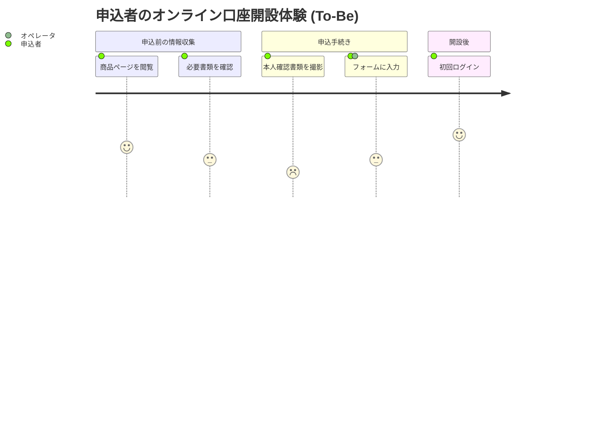
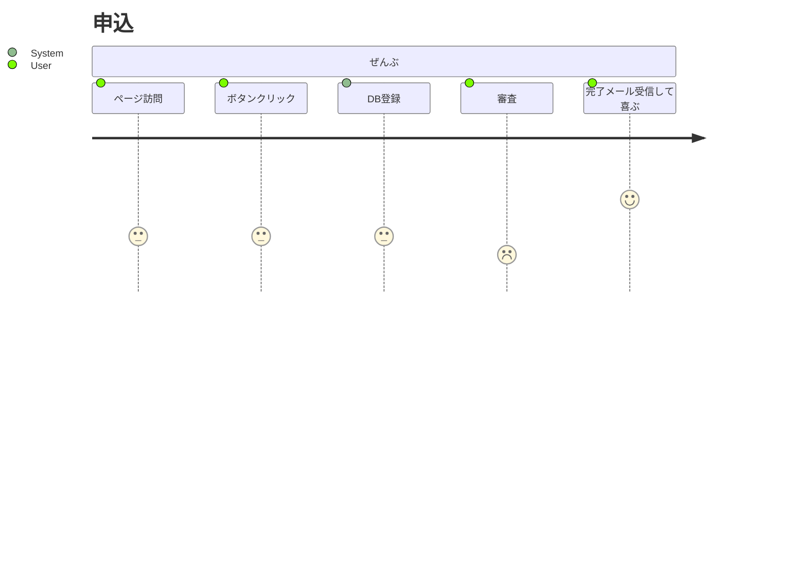
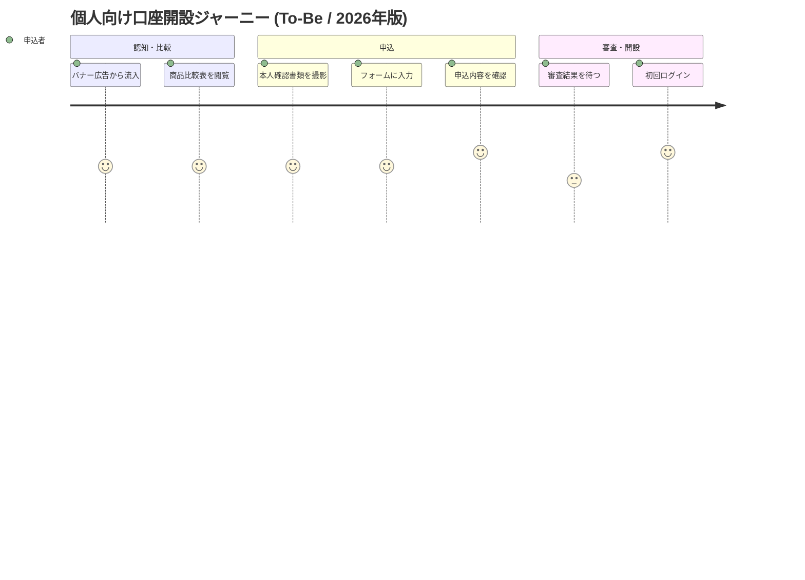
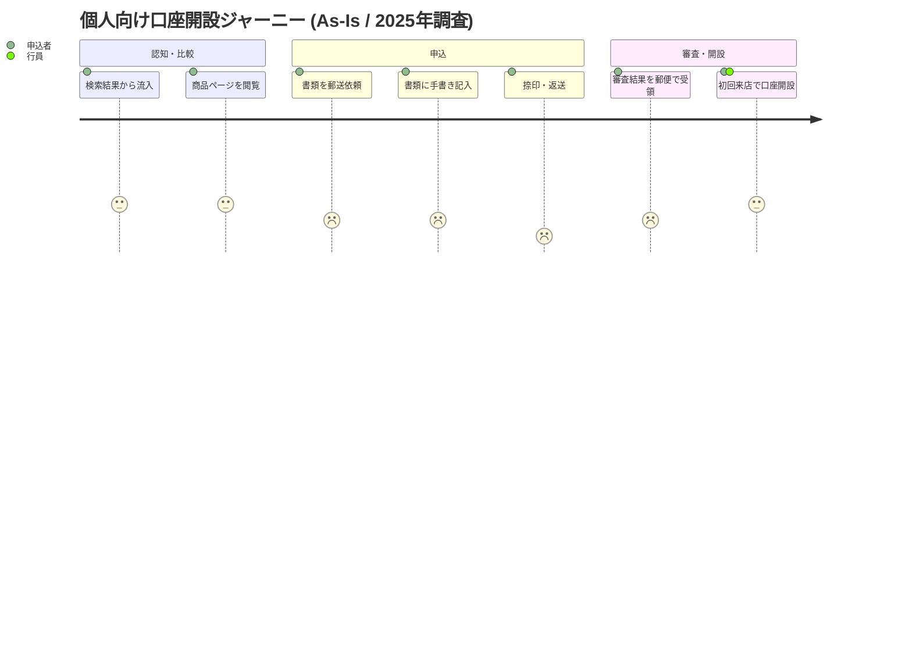
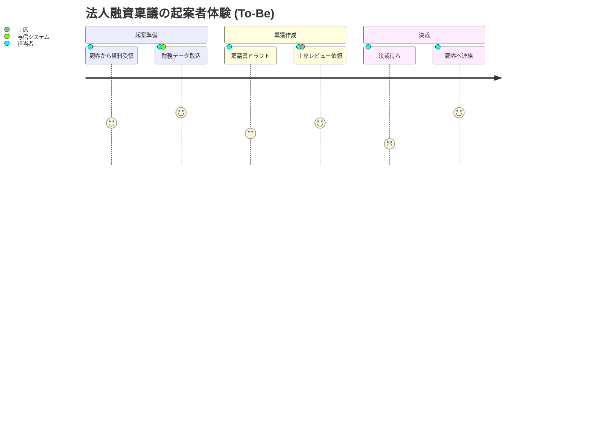

# 美しく読みやすい Mermaid User Journey 図の原則

## 1. 概要と用途

User Journey 図 (ユーザージャーニー図) は、特定のペルソナがある目的を達成するまでに辿る一連のタスクを時系列で並べ、各タスクの体験品質を 1〜5 のスコアで可視化する図である。要件定義書では以下の用途で特に有効である。

- ペルソナの体験全体を一枚で俯瞰し、関係者の共通理解を作る
- 「どこで顧客がつまずくか (低スコア)」を明示し、課題の優先順位付けに使う
- As-Is と To-Be を比較し、システム導入の効果を定性的に示す
- 業務フロー (sequenceDiagram) や機能一覧 (table) では捉えにくい "感情の起伏" を補完する

要件定義書本文の「背景・課題」「想定利用シナリオ」章に添えると、後続の機能要件の必然性を裏付けやすい。

## 2. 基本構造: title / section / task



- `title` は「誰の」「何の」「As-Is/To-Be」が一目で分かる名詞句にする
- `section` はフェーズの境界を示す見出し
- `task` は `タスク名: スコア: アクター` の形式

## 3. スコアリング (1〜5) の意味付け

スコアは恣意的になりがちなため、図の凡例 (本文側) で必ず基準を統一する。推奨基準:

| スコア | 意味             | 目安                                       |
| ------ | ---------------- | ------------------------------------------ |
| 5      | 快適・歓喜       | 期待を超え、推奨したくなる                 |
| 4      | 満足             | 想定通りスムーズ                           |
| 3      | 中立             | 可もなく不可もなし。我慢の許容範囲         |
| 2      | 不満             | 手間や混乱を感じ離脱リスクあり             |
| 1      | 強い不満・離脱   | 業務停止または顧客喪失レベル               |

ルール:

- 1 つのドキュメント内では基準を変えない (As-Is と To-Be で同じ基準を使う)
- スコアの根拠 (アンケート N=○、ヒアリング、推定) を図のキャプションで明示する
- 「3 が連発する」場合は基準が荒い兆候。実体験のエピソードに照らして再評価する

## 4. アクターの指定方針

`task: score: actor1, actor2` のようにカンマ区切りで複数アクターを書ける。方針:

- アクターは 2〜3 種類程度に絞る (申込者・行員・システム など)
- 主体となるペルソナは必ず先頭に置く
- システムやサードパーティを混ぜる場合は人間と区別がつく名前 (例: `eKYCシステム`) にする
- アクターの表記揺れ (申込者 / お客様 / ユーザ) を禁止し、用語集と一致させる

## 5. section の粒度: 時系列かフェーズか

- 業務フロー型 (申込・審査・契約) はフェーズ単位で 4〜6 個に収める
- カスタマージャーニー型 (認知・検討・購入・利用・推奨) は AIDMA/AARRR 等の既存モデルを流用すると共通理解が早い
- 1 つの section に 2〜6 タスクを入れるのが読みやすい上限。1 タスクしかない section は隣に統合する
- section 数が 7 を超えると横に伸びすぎて判読性が落ちるため、図を分割する

## 6. タスク記述の粒度と命名

- 1 タスク = 「申込者が一息で語れる行動の単位」
- 動詞で終える (「フォームに入力する」「書類を撮影する」)。体言止めは避ける
- システム内部処理 (「DB に保存」など) はジャーニーには書かない。それは sequenceDiagram の領域
- タスク名の長さは全角 15 文字以内を目安にする (Mermaid のレンダリング幅対策)

## 7. 複数ペルソナの扱い

原則として **ペルソナごとに別図** を作る。理由:

- スコアの意味がペルソナによって異なるため重ねると混乱する
- アクター列が肥大化し、誰の体験か追えなくなる

例外的に同一図で扱ってよいケース:

- 同じタスクを同時に複数アクターが行い、体験差が論点になる場合 (例: 窓口担当者と申込者の温度差)
- その場合でもタスクは申込者基準で並べ、もう一方のアクターは "支援者" として補足する

## 8. 読み手への示唆の書き添え方

Mermaid 図にはコメントや凡例を埋め込めないため、図の前後の本文で必ず以下を書き添える。

- 図のキャプション: 出典 (調査名・日付・N 数)
- 着目ポイント: スコアが落ち込む山谷を箇条書きで指摘
- 改善仮説: 低スコアタスクに対する施策候補と要件 ID へのリンク

```text
図 3-2 のとおり、「本人確認書類を撮影」(スコア 2) が体験の最低点である。
要件 FR-012 (eKYC 自動補正) によりこの落ち込みを 4 まで引き上げることを目標とする。
```

## 9. 大規模化への対処

- タスクが 25 を超えたら必ず分割する。基準は section 単位、またはチャネル別 (Web / 店舗)
- フェーズ別に複数枚に分け、本文の章構成と 1:1 対応させる
- 「全体俯瞰用 (粗) + フェーズ詳細 (細)」の 2 段構えにする
- 同じペルソナで As-Is / To-Be を比較するときは 2 図を縦に並べ、section 名を一致させる

## 10. アンチパターン

| アンチパターン                       | 何が悪いか                                   | 対処                                       |
| ------------------------------------ | -------------------------------------------- | ------------------------------------------ |
| スコア基準が章ごとに違う             | 比較ができず議論が空転する                   | 基準表をドキュメント冒頭に固定             |
| タスクが粒度バラバラ (UI操作 + 業務) | 体験のリズムが読めない                       | 「ペルソナの一動作」に粒度を揃える         |
| section が 8 個以上ある              | 横に間延びし PDF 化で潰れる                  | フェーズで束ねるか図を分割                 |
| アクターが 5 種類以上                | 凡例が複雑化し誰の体験か不明                 | 主役 1 + 支援者 1 程度に絞る               |
| スコアが全部 3                       | 何も語っていない図になる                     | エピソードに基づき山谷を作る               |
| システム内部処理をタスクに含める     | ジャーニー図ではなくフロー図化する           | sequenceDiagram に移す                     |
| 図だけ載せて本文で言及しない         | 読み手が示唆を拾えない                       | キャプションと示唆の段落を必ず添える       |

## 11. Good / Bad 具体例

### Bad 例 1: 粒度バラバラ・基準不明



問題: section が 1 つしかない / DB 登録がタスクに混入 / アクター名が英語混在 / スコアが軒並み 3。

### Good 例 1: フェーズと示唆が明確 (To-Be)



### Good 例 2: As-Is と問題点の可視化



本文側の示唆例:

> As-Is では「捺印・返送」がスコア 1 となり、ここで全申込者の 38% が離脱している (2025 年 9 月顧客調査, N=212)。
> To-Be では eKYC 化により本フェーズを撤廃し、申込全体のスコア中央値を 2 → 4 に改善する。

### Good 例 3: 支援アクターを含む業務系ジャーニー



ポイント: 主役は「担当者」、支援アクターは限定し、「決裁待ち」の谷を要件で解消する根拠として使う。

## 12. チェックリスト

- [ ] title にペルソナと As-Is/To-Be が含まれているか
- [ ] スコア基準表をドキュメント冒頭に置いたか
- [ ] section は 3〜6 個に収まっているか
- [ ] 1 section あたり 2〜6 タスクか
- [ ] アクター表記が用語集と一致しているか
- [ ] 図の前後に出典と示唆の段落があるか
- [ ] 低スコアタスクに対応する要件 ID をリンクしたか
- [ ] As-Is と To-Be で section 名・アクター名が一致しているか
