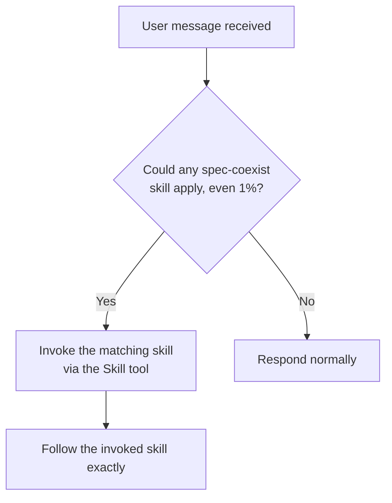
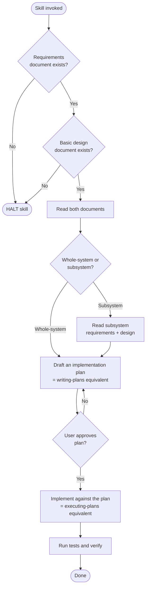
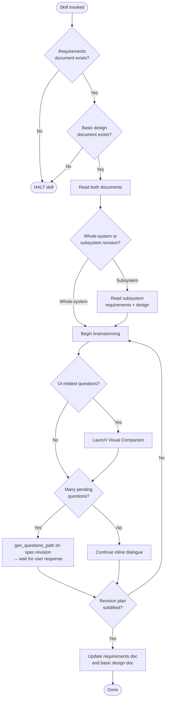
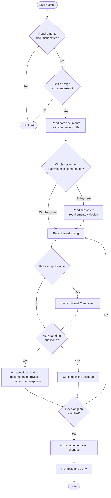
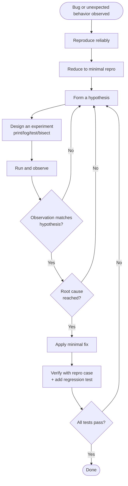

# spec-coexist Skill Suite — Creation Specification

This document is a specification to be handed off to the `skill-creator` skill. It describes six skills (one trigger skill + five functional skills) to be created under the `spec-coexist` namespace.

## Conformance Keywords

The key words **MUST**, **MUST NOT**, **REQUIRED**, **SHALL**, **SHALL NOT**, **SHOULD**, **SHOULD NOT**, **RECOMMENDED**, **MAY**, and **OPTIONAL** in this document are to be interpreted as described in [RFC 2119](https://www.rfc-editor.org/rfc/rfc2119) and [RFC 8174](https://www.rfc-editor.org/rfc/rfc8174) when, and only when, they appear in all capitals, as shown here.

Every generated `SKILL.md` **MUST** include this same conformance paragraph and **MUST** use these capitalized keywords when stating rules, so that skill discipline is enforced unambiguously.

## Independence From `superpowers`

Each skill in this suite **MUST NOT** invoke, delegate to, or otherwise depend on any `superpowers:*` skill at runtime (including but not limited to `superpowers:brainstorming`, `superpowers:writing-plans`, `superpowers:executing-plans`, `superpowers:systematic-debugging`, and `superpowers:using-superpowers`). Each skill **MUST** implement its own self-contained equivalent of any behavior it needs. References in this document to "equivalent of `superpowers:X`" are descriptive only and **MUST NOT** be interpreted as a license to call those skills.

---

## 0. Common Requirements

### 0.1 Skill Location
All skills **MUST** be placed project-locally:

```
.claude/skills/spec-coexist/{skill-name}/SKILL.md
.claude/skills/spec-coexist/{skill-name}/references/...
.claude/skills/spec-coexist/{skill-name}/scripts/...
```

### 0.2 Skill Inventory

| # | Skill name | Role |
|---|------------|------|
| 0 | `using-spec-coexist` | Trigger skill (equivalent to `superpowers:using-superpowers`) |
| 1 | `creating-requirements` | Create a new requirements document |
| 2 | `creating-basic-design` | Create a new basic design document |
| 3 | `implementing-from-spec` | Implement from requirements + basic design |
| 4 | `revising-spec` | Revise the requirements and/or basic design |
| 5 | `revising-implementation` | Revise the implementation after a spec change |
| 6 | `systematic-debugging` | Systematic debugging |

### 0.3 Brainstorming (Embedded Per Skill)
Each skill **MUST NOT** delegate to `superpowers:brainstorming`. Instead, each skill **MUST** embed its own brainstorming flow with the following common rules:

- The agent **MUST** ask one question per message.
- The agent **SHOULD** prefer multiple-choice questions; open-ended questions **MAY** be used when needed.
- When the number of pending questions is large, the agent **MUST** write them out to `docs/spec-coexist/{YYMMDDHHmmss}-{purpose}-questions.md` and **MUST** halt brainstorming until the user explicitly states the questions have been answered.
- When the number of pending questions is small, the agent **MAY** continue inline dialogue without writing a question file.
- The agent **MAY** launch the **Visual Companion** (equivalent to `superpowers:brainstorming`'s `visual-companion.md`) when UI-related discussion would benefit from visual treatment.
- Consent to launch the Visual Companion **MUST** be requested exactly once, in its own standalone message.

### 0.4 Shared Scripts
The following utility scripts **MUST** be placed under `.claude/skills/spec-coexist/_shared/scripts/` and **SHOULD** be invoked from each skill rather than reimplemented inline:

| Script | Role |
|--------|------|
| `gen_questions_path.sh <purpose>` | Generates the path `docs/spec-coexist/{YYMMDDHHmmss}-{purpose}-questions.md` and creates the parent directory. |
| `next_subsystem_id.sh` | Scans `docs/subsystems/` for `{id}_*` directories, returns `max(id)+1` zero-padded to 3 digits. Returns `001` if no subsystems exist. |
| `ensure_subsystem_dir.sh <subsystem-name>` | Allocates an id via `next_subsystem_id.sh`, creates `docs/subsystems/{id}_{subsystem-name}/`, and prints the resulting path. |
| `check_doc_exists.sh <path>` | Exits 0 if the document exists (signal to halt the skill); exits 1 otherwise. |

### 0.5 File Path Conventions

| Artifact | Whole-system | Subsystem |
|----------|--------------|-----------|
| Requirements document | `docs/main-requirements.md` | `docs/subsystems/{id}_{name}/{name}-requirements.md` |
| Basic design document | `docs/main-basic-design.md` | `docs/subsystems/{id}_{name}/{name}-design.md` |
| Question file | `docs/spec-coexist/{YYMMDDHHmmss}-{purpose}-questions.md` | (same) |

---

## 1. `using-spec-coexist` (Trigger Skill)

This skill plays the same role as `superpowers:using-superpowers`. It **MUST** be invoked at the start of every conversation and **MUST** instruct the agent that "if there is even a 1% chance any spec-coexist skill applies, the matching skill MUST be invoked."

### Required Content
- A list of all six functional skills under `spec-coexist` and their trigger conditions.
- The "1% rule": if a skill might apply, it **MUST** be invoked.
- Priority order: user instructions > skills > default system prompt.

### Flow


---

## 2. `creating-requirements`

### 2.1 Constraints
- The skill **MUST NOT** update an existing requirements document. It **MUST** only create new ones.
- If the user supplies a draft file path at skill invocation, the skill **MUST** read it before brainstorming.

### 2.2 References Bundled With the Skill
The following project files **MUST** be copied into `creating-requirements/references/`:
- `docs/main-requirements-template.md`
- `docs/main-requirements-template-rules.md`
- `docs/subsystem-requirements-template.md`
- `docs/subsystem-requirements-template-rules.md`

### 2.3 Invocation Arguments
The user **MAY** pass a draft file path when invoking the skill. The skill **MUST** accept and read it when present.

### 2.4 Flow

```mermaid
flowchart TD
    Start([Skill invoked]) --> Q1{docs/main-requirements.md<br/>exists?}
    Q1 -- Yes --> R1[Read it]
    Q1 -- No --> R2[Create empty file]
    R1 --> Q2
    R2 --> Q2
    Q2{Draft file path<br/>provided as argument?}
    Q2 -- Yes --> R3[Read draft]
    Q2 -- No --> Q3
    R3 --> Q3
    Q3{Whole-system or<br/>subsystem?}
    Q3 -- Whole-system --> Q4A{main-requirements.md<br/>already has content?}
    Q3 -- Subsystem --> S1[Allocate id via<br/>next_subsystem_id.sh OR<br/>select existing subsystem]
    S1 --> Q4B{Target<br/>{name}-requirements.md<br/>exists?}
    Q4A -- Yes --> Stop([HALT skill])
    Q4A -- No --> BS[Begin brainstorming]
    Q4B -- Yes --> Stop
    Q4B -- No --> BS
    BS --> VC{UI-related<br/>questions ahead?}
    VC -- Yes --> VCStart[Launch Visual Companion]
    VC -- No --> QCount
    VCStart --> QCount
    QCount{Many pending<br/>questions?}
    QCount -- Yes --> WriteQ[Write questions file via<br/>gen_questions_path.sh requirements<br/>→ wait for user response]
    QCount -- No --> Continue[Continue inline dialogue]
    WriteQ --> Clear
    Continue --> Clear
    Clear{Requirements<br/>solidified?}
    Clear -- No --> BS
    Clear -- Yes --> Write[Write the requirements doc<br/>following the template]
    Write --> End([Done])
```

### 2.5 Scripted Steps
The skill **MUST** use the shared scripts for the following:
- Existing-document checks → `check_doc_exists.sh`
- Subsystem id allocation and directory creation → `next_subsystem_id.sh`, `ensure_subsystem_dir.sh`
- Question file path generation → `gen_questions_path.sh requirements`

---

## 3. `creating-basic-design`

### 3.1 Constraints
- The skill **MUST NOT** update an existing basic design document. It **MUST** only create new ones.
- If `docs/main-requirements.md` does not exist, the skill **MUST** halt immediately.

### 3.2 References Bundled With the Skill
The following project files **MUST** be copied into `creating-basic-design/references/`:
- `docs/main-basic-design-template.md`
- `docs/main-basic-design-template-rules.md`
- `docs/subsystem-basic-design-template.md`
- `docs/subsystem-basic-design-template-rules.md`

### 3.3 Flow

```mermaid
flowchart TD
    Start([Skill invoked]) --> Q1{docs/main-requirements.md<br/>exists?}
    Q1 -- No --> Stop([HALT skill])
    Q1 -- Yes --> R1[Read requirements]
    R1 --> Q2{Whole-system or<br/>subsystem?}
    Q2 -- Whole-system --> Q3A{docs/main-basic-design.md<br/>exists?}
    Q2 -- Subsystem --> S1[Select subsystem OR<br/>allocate via next_subsystem_id.sh]
    S1 --> Q3B{Target<br/>{name}-design.md exists?}
    Q3A -- Yes --> Stop
    Q3A -- No --> BS[Begin brainstorming]
    Q3B -- Yes --> Stop
    Q3B -- No --> BS
    BS --> VC{UI-related questions?}
    VC -- Yes --> VCStart[Launch Visual Companion]
    VC -- No --> QCount
    VCStart --> QCount
    QCount{Many pending<br/>questions?}
    QCount -- Yes --> WriteQ[gen_questions_path.sh basic-design<br/>→ wait for user response]
    QCount -- No --> Continue[Continue inline dialogue]
    WriteQ --> Clear
    Continue --> Clear
    Clear{Design solidified?}
    Clear -- No --> BS
    Clear -- Yes --> Write[Write the basic design doc<br/>following the template]
    Write --> End([Done])
```

### 3.4 Scripted Steps
The skill **MUST** use:
- `check_doc_exists.sh`
- `next_subsystem_id.sh`, `ensure_subsystem_dir.sh`
- `gen_questions_path.sh basic-design`

---

## 4. `implementing-from-spec`

This skill embeds the equivalent of `superpowers:writing-plans` followed by `superpowers:executing-plans`.

### 4.1 Constraints
- If either `docs/main-requirements.md` or `docs/main-basic-design.md` is missing, the skill **MUST** halt.
- For subsystem implementation, both `{name}-requirements.md` and `{name}-design.md` **MUST** exist; otherwise the skill **MUST** halt.
- The agent **MUST NOT** start implementation before receiving user approval on the plan.

### 4.2 Flow



### 4.3 Scripted Steps
- Input document existence check → `check_doc_exists.sh`

---

## 5. `revising-spec`

### 5.1 Constraints
- If either `docs/main-requirements.md` or `docs/main-basic-design.md` is missing, the skill **MUST** halt.
- The skill **MUST** update both the requirements and basic design documents in lockstep when a change affects both.

### 5.2 Flow



### 5.3 Scripted Steps
- `check_doc_exists.sh`
- `gen_questions_path.sh spec-revision`

---

## 6. `revising-implementation`

### 6.1 Constraints
- If either the requirements document or the basic design document is missing, the skill **MUST** halt.
- The agent **MUST** read recent diffs of the spec documents (e.g., `git log -p`) to understand what changed before brainstorming.

### 6.2 Flow



### 6.3 Scripted Steps
- `check_doc_exists.sh`
- `gen_questions_path.sh implementation-revision`

---

## 7. `systematic-debugging`

This is a project-local equivalent of `superpowers:systematic-debugging`.

### 7.1 Principles
- The agent **MUST** proceed via a hypothesis → experiment → observation loop. It **MUST NOT** apply fixes based on guesses.
- The agent **MUST** identify the root cause before applying any fix.
- The agent **MUST NOT** stop at "appears to be fixed." A reproducing test case **MUST** pass and a regression test **SHOULD** be added.

### 7.2 Flow



### 7.3 Scripted Steps
None — debugging steps are inherently codebase-specific.

---

## 8. Hand-off Checklist for `skill-creator`

The `skill-creator` skill **MUST** perform the following when consuming this specification:

- [ ] Create six `SKILL.md` files under `.claude/skills/spec-coexist/{skill-name}/SKILL.md`.
- [ ] Each `SKILL.md` **MUST NOT** reference or invoke any `superpowers:*` skill at runtime; required behavior **MUST** be implemented directly inside the skill.
- [ ] Create the four shared scripts under `.claude/skills/spec-coexist/_shared/scripts/`.
- [ ] Copy the four requirements template files into `creating-requirements/references/`.
- [ ] Copy the four basic-design template files into `creating-basic-design/references/`.
- [ ] Each `SKILL.md` frontmatter `description` field **MUST** state trigger conditions strong enough to fire under the "1% rule."
- [ ] Each `SKILL.md` **MUST** include the RFC 2119 / RFC 8174 conformance paragraph from the top of this document and **MUST** use the capitalized keywords when stating rules.
- [ ] `using-spec-coexist`'s `SKILL.md` **MUST** be modeled on `superpowers:using-superpowers`.
- [ ] Each skill's flow Mermaid diagram **MUST** be embedded verbatim in its `SKILL.md`.
